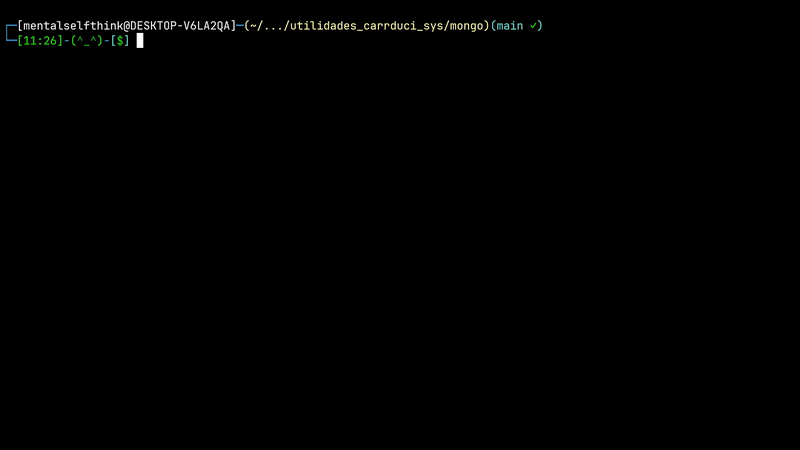

### [< Directorio](../directorio.md)
# Restaurar respaldos

Para restaurar la base de datos e imágenes, lo ideal es buscar el último respaldo generado. para ello hay dos opciones, copiar el respaldo desde Windows al servidor y luego restaurarlo (en caso de que no haya respaldos disponibles en este mismo) u obtener el último respaldo y restaurarlo.

#### 1. Copiar desde Windows y restaurar 

Es necesario utilizar el comando `scp` que se refiere en inglés a **Secure Copy**. Este comando nos permite copiar archivos a través de una conexión remota a Linux, pero si se debe hacer desde Windows, es requerido usar el subsistema de Linux (wsl) y  es preferible que el servidor al que se va a conectar tenga una ip fija.

Asumiendo que ya está abierta una instancia de wsl y que la carpeta a la que se va a copiar está lista, hay que escribir un comando con la siguiente estructura:
```
scp <archivo_a_copiar> <usuario_linux>@<direccion_ip_computadora>:<direccion_carpeta_respaldos>
```

Este ejemplo asumo que la carpeta que va a recibir los respaldos tiene los permisos de escritura correspondientes para poder copiar desde una fuente externa:
```
scp /mnt/d/RESPALDOS_CSYS/respaldo_carrduci_sys_bd-1698775200_10-31-23_12.10.tgz carrduci@192.168.1.149:~/respaldos_csys/
```

>En este caso se accede a la carpeta `/mnt/d` porque se requiere acceder al disco D: de la computadora donde se realizó la muestra. Lo importante es poner el directorio donde estén almacenados los respaldos y que estos sean accesibles. El nombre del archivo `.tgz` también puede cambiar dependiendo de la fecha en que se haya generado el respaldo. La carpeta `~/respaldos_csys/ ` es la que se va a generar siempre que se **despliegue CARRDUCIsys correctamente**.

Una vez copiado el archivo, hay que asegurarse que sea el único en la carpeta del servidor Linux en la que se acaba de copiar.

Por último, para restaurar, ver la opción **2**.

#### 2. Obtener el último respaldo y restaurarlo

Para esto hay que recurrir nuevamente a `utilidadades_carrrduci`.  Basta con ejecutar lo siguiente:
```
~/utilidades_carrduci_sys/mongo/restaurar_respaldo.sh ~/respaldos_csys
```

Lo que debe tener un resultado algo así:


```
 ===> Borrando carpeta anterior de respaldos ('/respaldos')
 ===> Copiando ultimo respaldo encontrado en '/home/mentalselfthink/respaldos_csys/'
Successfully copied 2.24GB to carrduci-sys-db:/respaldos
 ===> Extrayendo contenidos del respaldo 'respaldo_carrduci_sys_bd-1698429600_10-31-23_12.10.tgz'
      total de archivos: 11145
 ===> Limpiando base de datos registrada
 { ok: 1, dropped: 'carrduci' }
 ===> Restaurando base de datos mongo. . .
      archivo a restaurar: respaldo_carrduci_sys_bd-1698429600.gz
      2023-11-01T17:27:16.751+0000      341759 document(s) restored successfully. 0 document(s) failed to restore.
 -----------------------------------------------
 ===> fin script
```

> Los números pueden variar

