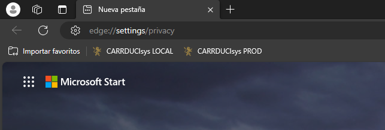
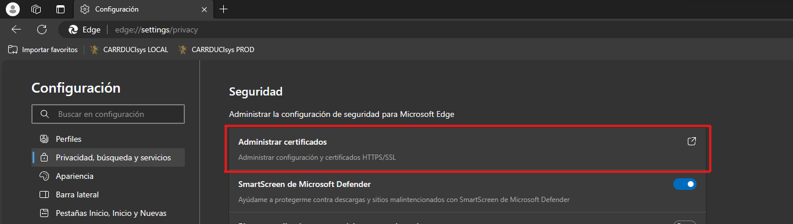
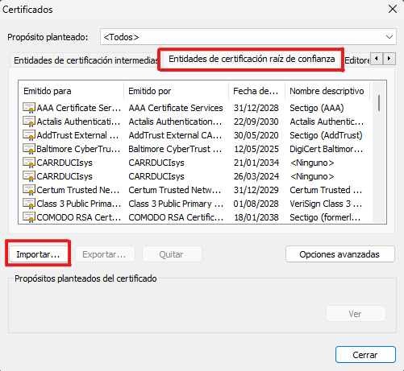
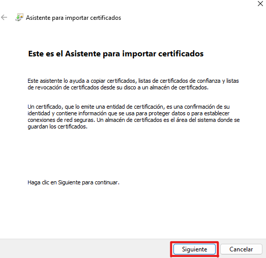
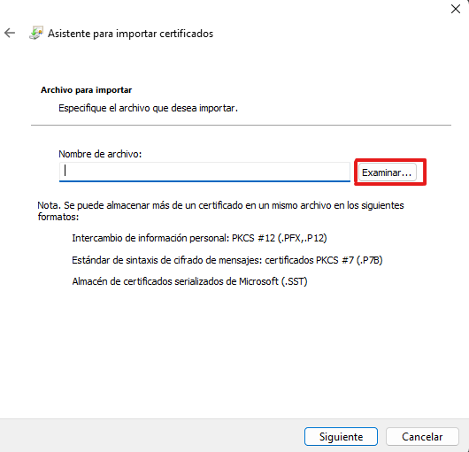
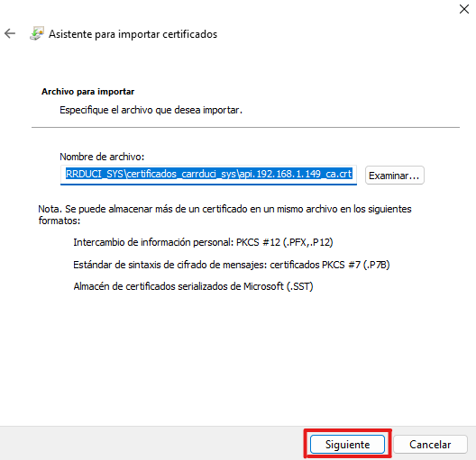
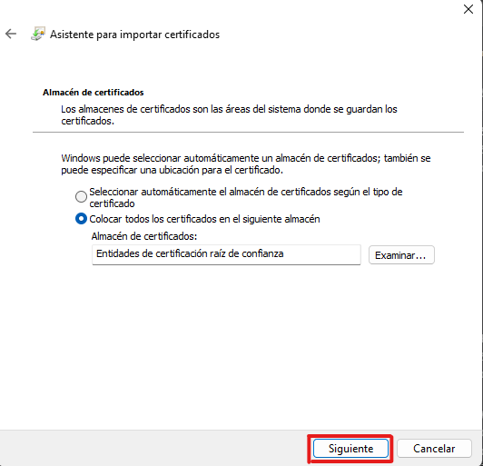
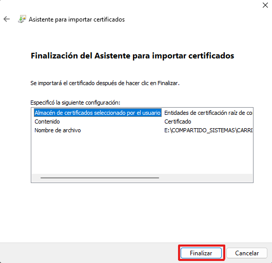
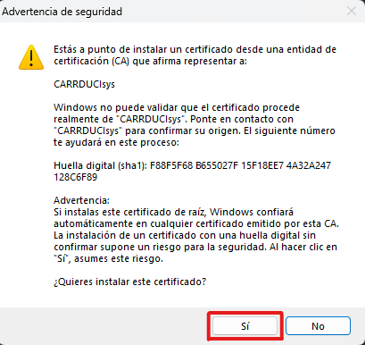
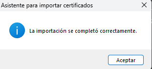

### [< Directorio](../directorio.md)

Antes se debió seguir [generación certificados](./1-generacion-certificados.md).
# Instalar certificado de CARRDUCIsys en computadora de usuario
De preferencia, CARRDUCIsys debe ser usado en navegadores basados en Chromium: **Chrome**, **Edge**, **Brave**. La instalación es muy similar en los 3, pero solo se mostrará cómo hacerlo en Edge.
## Instalación en Edge
Una vez abierto el navegador, agregar la siguiente url en la barra de direcciones:
```
<navegador>://settings/privacy
```
Reemplazar la primera palabra dependiendo del navegador:
- Chrome: `chrome`
- Edge `edge`
- Brave: `brave`



Moverse hacia abajo hasta la parte de **Seguridad** y dar clic en **Administrar certificados**.



Se debe abrir un recuadro. En ese recuadro, asegurarse de tener seleccionada la pestaña **`Entidades de certificación raíz de confianza`**. Luego dar clic en **Importar**. 



Luego aparece esta otro recuadro. Dar clic en siguiente.



En el siguiente recuadro, dar clic en **Examinar**.



Una vez seleccionado el archivo, dar clic en siguiente.



En la siguiente vista dejar todo igual y dar clic en siguiente.



Y dar clic en finalizar.certificado_edge_instalar_si.png



Después debe aparecer este recuadro. Va a preguntar si instalar certificado. Asegurarse que diga "CARRDUCIsys" y dar clic en sí.



Se mostrará entonces una confirmación de que se completó el proceso. Dar clic en aceptar.



De vuelta al recuadro de Certificados, solo falta comprobar que en la tabla de la pestaña **`Entidades de certificación raíz de confianza`** halla una fila que diga **CARRDUCIsys**.


Entonces se puede dar clic en **Cerrar**, quedando completado este procedimiento.