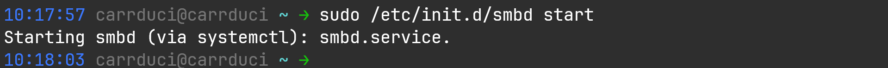
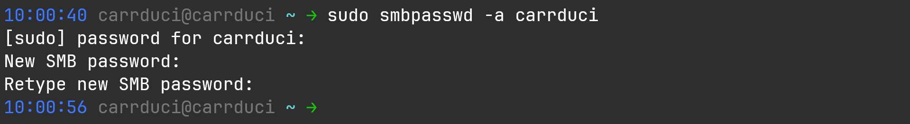
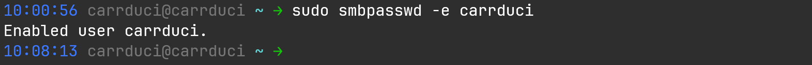
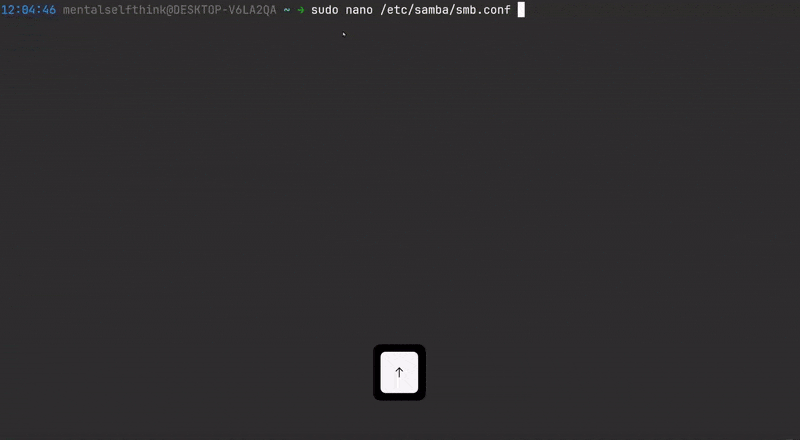
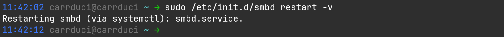
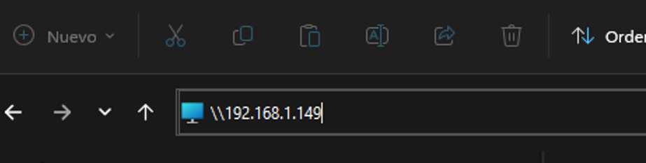
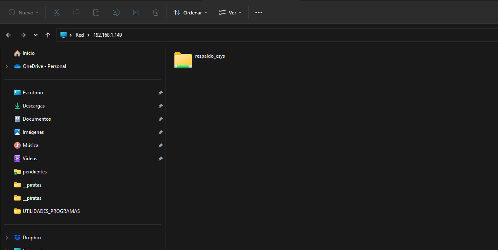

### [< Directorio](../directorio.md)

# Desplegar servidor Samba en Ubuntu

Para establecer una carpeta de red en un servidor Linux y que sea accesible desde 
Windows, es necesario utilizar una herramienta llamada Samba.

## Requerimientos

1. Instalar el Sub Sistema  de Linux

Ver [Subsistema De Linux](https://learn.microsoft.com/es-es/windows/wsl/install).

2.  Saber establecer una conexión ssh a un equipo remoto con Linux

  >En este caso es `ubuntu server`

Ver [coneccion-ssh.md](../ubuntu-serverr/conexion-ssh.md) y [configurar-ubuntu-server.md](../ubuntu-serverr/configurar-ubuntu-server.md)
## Procedimiento

### 1. Establecer conexión con el servidor
> Para este paso ya debe existir un servidor configurado (con ip fija) y tener acceso a la red 
> interna. El equipo desde el que se hará el procedimiento también debe contar con acceso a la
> red.

Asegurarse de que el equipo esté en la misma red que el servidor de CARRDUCIsys e ingresar el 
siguiente comando en la terminal de wsl:

```
ssh <usuario_servidor>@<direccion.ip.servidor>
```

Ejemplo: `ssh carrduci@192.168.149`

A continuación nos pedirá la contraseña que el usuario al que estamos accediendo tiene.
### 2. Instalar y desplegar Samba

Ejecutar:

```
sudo apt install samba
```

Luego es necesario iniciar el servicio de la siguiente forma:
```
sudo /etc/init.d/smbd start
```

Que se debe ver algo así:



Agregar un usuario para poder acceder a la carpeta. 

> Se recomienda usar el mismo nombre que el del usuario actual de Linux.

```
sudo smbpasswd -a <nombre_usuario>
```

Ingresar, de ser necesario, la contraseña del usuario actual y la contraseña para
el nuevo usuario de samba (si se quiere dejar sin contraseña, solo presionar ENTER).

Este es un ejemplo:



Ahora es necesario habilitar el usuario. Se recomienda usar el mismo nombre que el del 
usuario actual de Linux.

```
sudo smbpasswd -e <nombre_usuario>
```

Y debe arrojar lo siguiente:



Editar el archivo `smb.conf` con el comando `sudo nano /etc/samba/smb.conf` y agregar
las siguientes líneas al final del archivo (Verificar que no esté ya una tarea con el
mismo [nombre]):

```
[respaldo_csys]
comment = Respaldos de la bd y fotos de carrduci sys
path = /home/carrduci/respaldos_csys
guest ok = yes
writeable = no
browseable = yes
read only = yes
create mask = 0755
```



Solo resta reiniciar samba para terminar


## Visualizar carpeta de red en Windows

### Probar conexión

Para comprobar que el servidor Samba se ha desplegado correctamente solo hay que escribir
lo siguiente en la barra de direcciones del explorador de archivos:

```
\\<ip_servidor_linux>
```
por ejemplo: `\\192.168.1.149`





> Para ver el detalle completo de la conexión remota y copia de respaldo desde Windows
> ir [aquí](../windows/establecer-copia-automatica-de-respaldos.md)