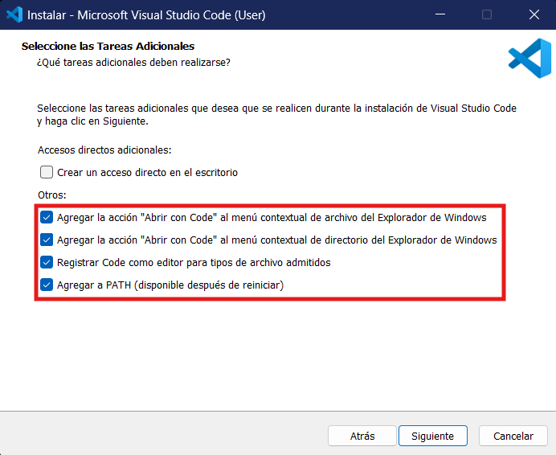
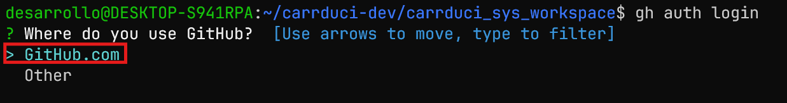
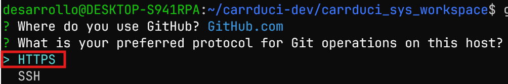
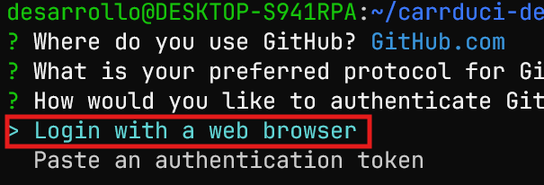
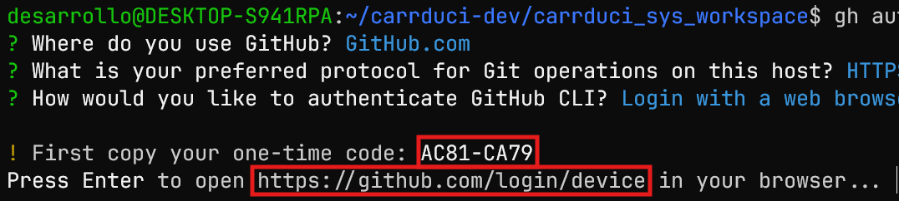
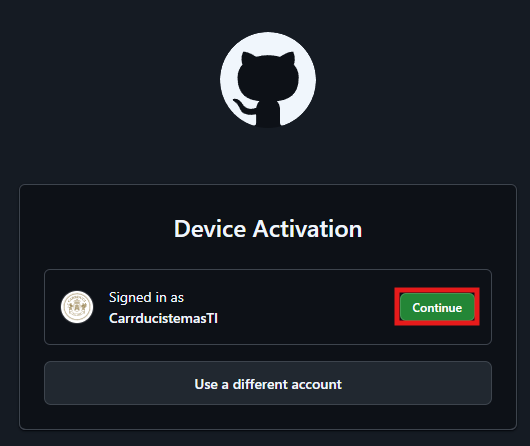
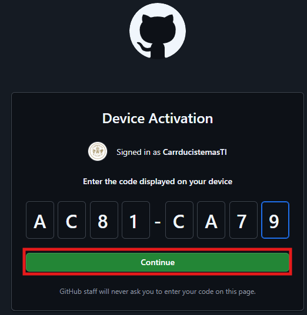
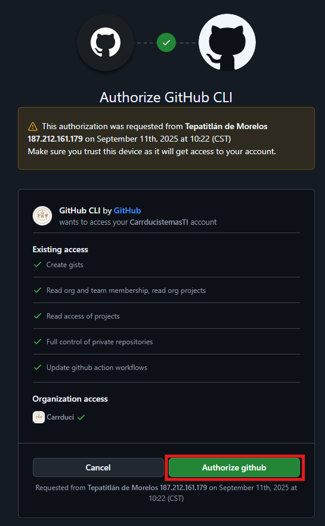
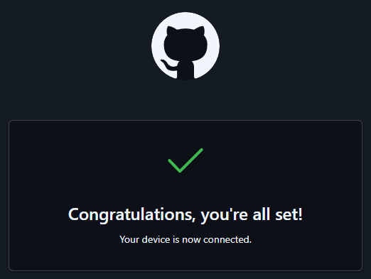
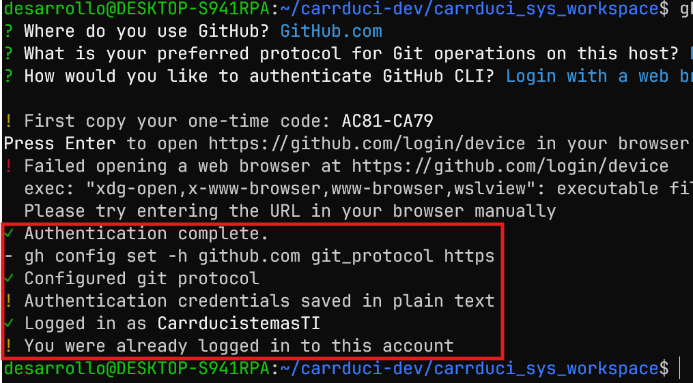

# Desplegar el entorno de desarrollo de CARRDUCI sys

Para poder desarrollar sobre el código de carrduci sys, es necesario llevar a cabo los siguientes pasos.

## 1. Instalar VsCode en Windows

Descargar el instalable desde la [página oficial](https://code.visualstudio.com/docs/?dv=win64user).

Ejecutar el instalador y seguir los pasos de instalación, pero al llegar al punto de "Seleccione las Tareas Adicionales", asegurarse de que estas 4 opciones estén marcadas.



Al finalizar, ejecutar VsCode al menos una vez, y cerrarlo.

## 2. Instalar el Subsistema de Linux en Windows

Ver [Instalación WSL](./docs/windows/instalacion-wsl.md).

## 3. Instalar el GitHub CLI (Command Line) e iniciar sesión

!> Debes tener una cuenta de GitHub y debe estar añadida a la organización (Carrduci). Inicia sesión con esa cuenta en el navegador principal de la computadora (puedes cambiar el navegador principal si quieres).

Ejecutar el siguiente comando

```sh
(type -p wget >/dev/null || (sudo apt update && sudo apt install wget -y)) \
	&& sudo mkdir -p -m 755 /etc/apt/keyrings \
	&& out=$(mktemp) && wget -nv -O$out https://cli.github.com/packages/githubcli-archive-keyring.gpg \
	&& cat $out | sudo tee /etc/apt/keyrings/githubcli-archive-keyring.gpg > /dev/null \
	&& sudo chmod go+r /etc/apt/keyrings/githubcli-archive-keyring.gpg \
	&& sudo mkdir -p -m 755 /etc/apt/sources.list.d \
	&& echo "deb [arch=$(dpkg --print-architecture) signed-by=/etc/apt/keyrings/githubcli-archive-keyring.gpg] https://cli.github.com/packages stable main" | sudo tee /etc/apt/sources.list.d/github-cli.list > /dev/null \
	&& sudo apt update \
	&& sudo apt install gh -y
```

Luego comprobar que se instaló el cli ejecutando:

```sh
gh version
```

Y debe arrojar un resultado similar al siguiente:

```
gh version 2.54.0 (2024-08-01)
https://github.com/cli/cli/releases/tag/v2.54.0
```

Ahora hay que autenticarse en GitHub con el siguiente comando:

```
gh auth login
```

Y se abrirá una terminal interactiva. Ahí, seleccionar las siguientes opciones:







Copiar el código usando `Ctrl` + `Shift` + `C` y dar `Ctrl` + `Click` en la url que se muestra.



En el navegador se abrirá esta página. Dar click en "Continue".



En la siguiente vista pegar el código copiado y dar click en "Continue".



Luego pedirá que se autentique de nuevo la cuenta. Al terminar de autenticar, dar click en autorizar.



Al terminar, dar `ENTER` en la consola. Debe aparecer esto en la página.



Y en la terminal se debe ver así.



## 4. Añadir usuario a git

Para poder hacer commits, es necesario indicarle a git el correo y usuario.

!> Deben ser los mismos que se tienen en la guenta de GitHub que usaras

Ejecutar los siguientes comandos (reemplazando `<correo>` y `<usuario>` por los tuyos, dejando las comillas):

```
git config --global user.email "<correo>"
git config --global user.name "<usuario>"
```

## 5. Ejecutar la script de despliegue

!> Antes debiste haber iniciado sesión con GitHub CLI

Ejecutar el siguiente script en la terminal de subsistema. Puede tardar varios minutos. Esto instalará todo lo necesario
para empezar a desarrollar. Podría pedirte la contraseña del usuario de subsistema que se creó anteriormente de nuevo.

```sh
code --version && sudo curl -s -H "Authorization: token $(gh auth token)" -H "Accept: application/vnd.github.v3.raw" https://api.github.com/repos/Carrduci/utilidades_carrduci_sys/contents/instalar-dev-carrdyci-sys.sh | bash
```


