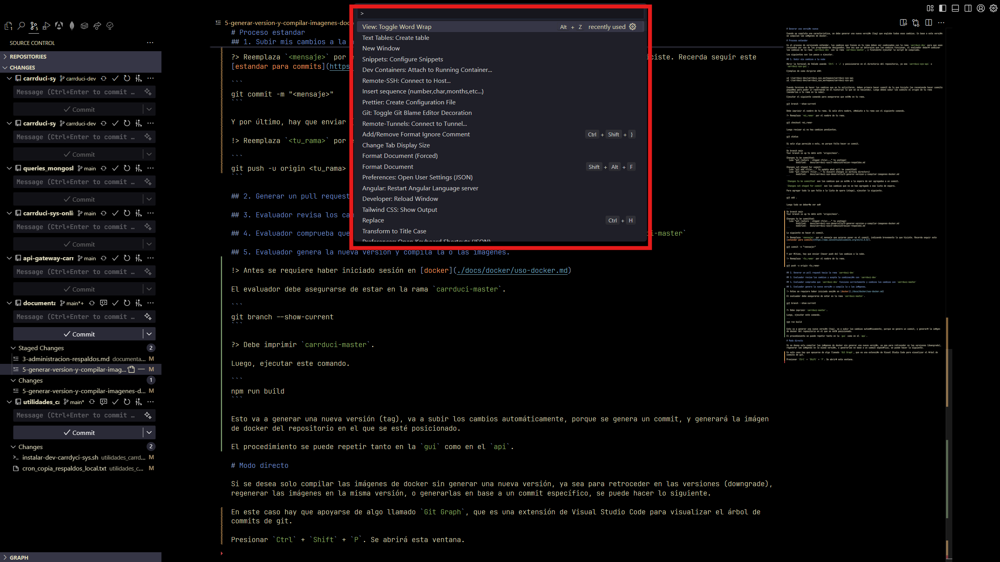
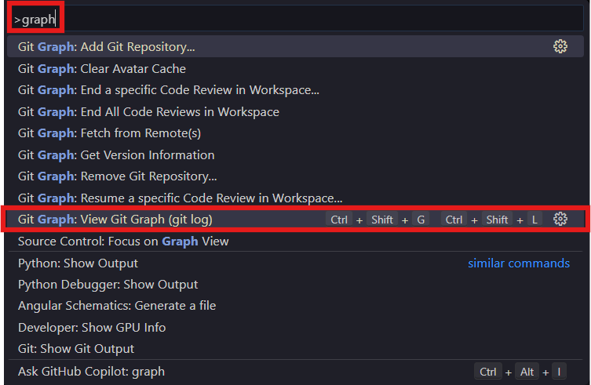
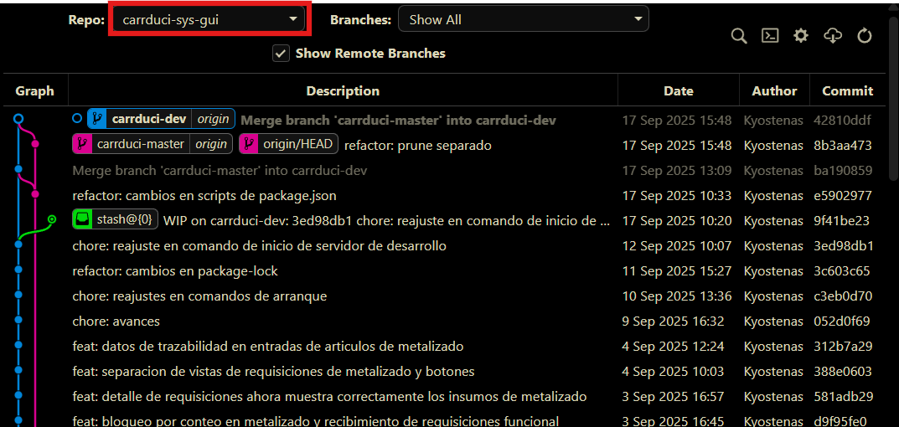
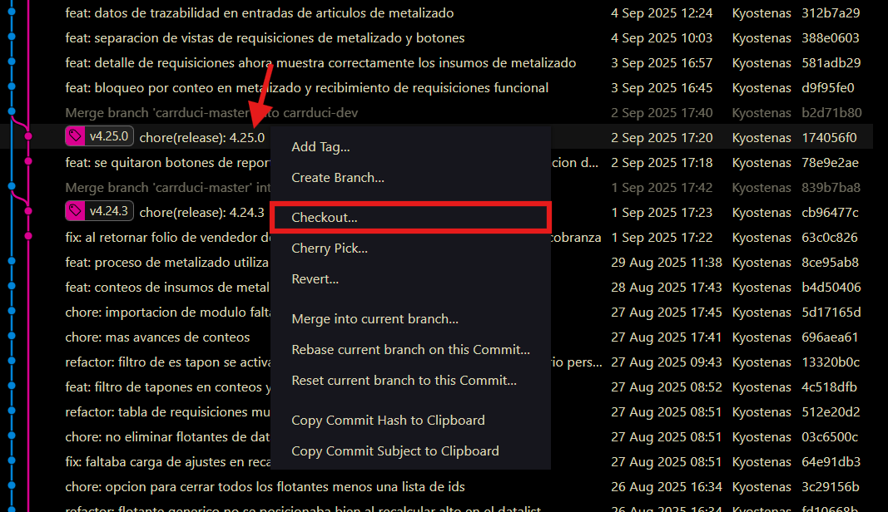
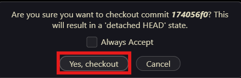
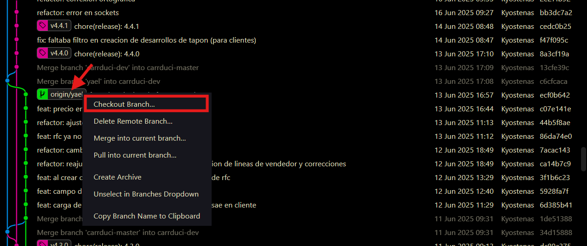
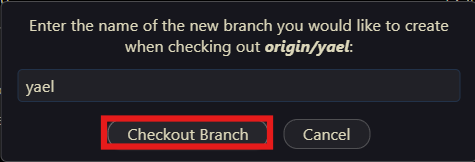

# Generar una versión nueva

Cuando se completa una caracteristica, se debe generar una nueva versión (tag) que englobe todos esos cambios. En base a esta versión se compilan las imágenes de docker.

# Proceso estandar

En el proceso de versionado estandar, los cambios que tienes en tu rama deben ser combinados con la rama `carrduci-dev` para que sean revisados por uno de los programadores designados. Una vez que se determine que los cambios funcionan, el evaluador deberá combinar los cambios de la rama `carrduci-dev` con la rama `carrduci-master`, y finalmente ejecutar la script de compilado.

Los siguientes son los pasos a ejecutar.

## 1. Subir mis cambios a la nube

Abrir la terminal de VsCode usando `Ctrl` + `J` y posicionarse en el directorio del repositorio, ya sea `carrduci-sys-api` o `carrduci-sys-gui`.

Ejemplos de como dirgirse ahí:

```sh
cd ~/carrduci-dev/carrduci_sys_workspace/carrduci-sys-api
cd ~/carrduci-dev/carrduci_sys_workspace/carrduci-sys-gui
```

Cuando termines de hacer los cambios que se te solicitaron, debes primero hacer commit de lo que hiciste (se recomienda hacer commits pequeños para poder ir rastreando en el historial lo que se va haciendo). Luego debes subir los commits al origen de tu rama (mandarlos a tu rama en la nube).

Ejecutar el siguiente comando para asegurarse que estás en tu rama.

```sh
git branch --show-current
```

Debe imprimir el nombre de tu rama. Si sale otro nombre, cámbiate a tu rama con el siguiente comando.

?> Reemplaza `<mi_rama>` por el nombre de tu rama.

```sh
git checkout <mi_rama>
```

Luego revisar si no hay cambios pendientes.

```sh
git status
```

Si sale algo parecido a esto, es porque falta hacer un commit.

```
On branch main
Your branch is up to date with 'origin/main'.

Changes to be committed:
  (use "git restore --staged <file>..." to unstage)
        modified:   docs/carrduci-sys/3-administracion-respaldos.md

Changes not staged for commit:
  (use "git add <file>..." to update what will be committed)
  (use "git restore <file>..." to discard changes in working directory)
        modified:   docs/carrduci-sys-desarrollo/5-generar-version-y-compilar-imagenes-docker.md
```

`Changes to be committed` son los cambios que ya están a la espera de ser agregados a un commit.

`Changes not staged for commit` son los cambios que no se han agregado a esa lista de espera.

Para agregar todo lo que falta a la lista de spera (stage), ejecutar lo siguiente.

```sh
git add .
```

Luego todo se debería ver así

```
On branch main
Your branch is up to date with 'origin/main'.

Changes to be committed:
  (use "git restore --staged <file>..." to unstage)
        modified:   docs/carrduci-sys-desarrollo/5-generar-version-y-compilar-imagenes-docker.md
        modified:   docs/carrduci-sys/3-administracion-respaldos.md
```

Lo siguiente es hacer el commit.

?> Reemplaza `<mensaje>` por el mensaje que quieras poner en el commit, indicando brevemente lo que hiciste. Recerda seguir este [estandar para commits](https://www.conventionalcommits.org/en/v1.0.0/).

```sh
git commit -m "<mensaje>"
```

Y por último, hay que enviar (hacer push de) los cambios a la nube.

!> Reemplaza `<tu_rama>` por el nombre de tu rama.

```sh
git push -u origin <tu_rama>
```

## 2. Evaluador combina los cambios con la rama dev y master.

!> Este paso solo lo debe hacer una persona autorizada.

La persona autorizada (evaluador) debe combinar los cambios que se hicieron de la siguiente forma.

?> Reemplazar `<rama_del_programador>` con el nombre de la rama del usuario que hizo los cambios.

```sh
git pull
git checkout <rama_del_programador>
git pull
git checkout carrduci-dev
get merge <rama_del_programador>
git push -u origin carrduci-dev
```

Si hay más cambios por combinar en otras ramas, repetir el proceso hasta que no haya conflictos de git. Hacer esto en ambos repositorios (`api` y `gui`) de ser necesario.

Entonces será necesario levantar el servidor local de carrduci-sys, asegurándose que ambos repositorioes estén en la rama `carrduci-dev` y comprobar que las nuevas características funcionen. También es buena práctica revisar otras partes del sistema que se sospechen puedan ser afectadas.

Una vez que se llega a la conclusión de que el nuevo código es funcional, hay que combinar los cambios con la rama `carrduci-master`.

```sh
git checkout carrduci-master
git pull
git merge carrduci-dev
git push -u origin carrduci-master
```

Detener el servidor local (`api` y `gui`) con `Ctrl` + `C` y volver a levantarlo, solo para comprobar que se inicie corréctamente.

Si todo sale bien hasta este punto, ya se pueden compilar las imágenes.

Detener los servidores locales, y moverse al siguiente paso.

## 3. Evaluador genera la nueva versión y compila la o las imágenes.

!> Este paso solo lo debe hacer una persona autorizada.

!> Antes se requiere haber iniciado sesión en [docker](./docs/docker/uso-docker.md).

El evaluador debe asegurarse de estar en la rama `carrduci-master`.

```sh
git branch --show-current
```

?> Debe imprimir `carrduci-master`.

Si no aparece `carrduci-master`, ejecutar:

```sh
git checkout carrduci-master
```

Luego, ejecutar este comando. Se puede ejecutar tanto en `carrduci-sys-api` como en `carrduci-sys-gui`, en 1 o en ambos, según se requiera.

```sh
npm run build
```

Esto va a generar una nueva versión (tag), va a subir los cambios automáticamente, porque se genera un commit, y generará la imágen de docker del repositorio en el que se esté posicionado. Puede tardar varios minutos.

# Modo directo

!> Antes se requiere haber iniciado sesión en [docker](./docs/docker/uso-docker.md).

Si se desea solo compilar las imágenes de docker sin generar una nueva versión, ya sea para retroceder en las versiones (downgrade), regenerar las imágenes en la misma versión, o generarlas en base a un commit específico, se puede hacer lo siguiente.

En este caso hay que apoyarse de algo llamado `Git Graph`, que es una extensión de Visual Studio Code para visualizar el árbol de commits de git.

Presionar `Ctrl` + `Shift` + `P`. Se abrirá esta ventana.



Ahí, escribir "graph". Luego seleccionar la siguiente opción.



Y se abrirá esta vista. Ahí hay que seleccionar el repositorio deseado en el desplegable que se marca en la imágen.



En seguida hay que hacer checkout en el commit o rama que se desee, por ejemplo, supongamos que se desea ir a la versión `4.25.0` porque la nueva versión dió error, entonces hay que dar click derecho en la línea (commit) de esa versión y seleccionar la opción `checkout`.





O en caso de querer seleccionar una rama.



Si la rama no existe en local, aparecerá este recuadro. Presionar "Checkout Branch".



Y entonces ejecutar.

```sh
npm run build-solo-imgs
```

# Al final de las compilaciones

Se puede entender que la compilación de las imágenes fue exitosa si cualquiera de estas dos líneas aparece al final (no tienen que ser exactamente igual, solo parecidas).

```
api: digest: sha256:a59f85b393a8d9063b7915ed230e09780f966c11f091111ad0239f036c27bdb6 size: 4729
```

```
gui: digest: sha256:27fcce140a2dc54a40a876ea70ecdf17227b58ae4a7cbae4507b9ccaedbf374c size: 2197
```

Cada vez que se generan imágenes, se van guardando las capas y los contenedores creados. Esto puede ir consumiendo espacio. Para liberar ese espacio, usar el siguiente comando.

```sh
docker system prune --volumes --all --force
```
