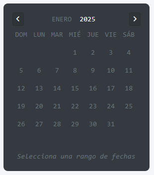
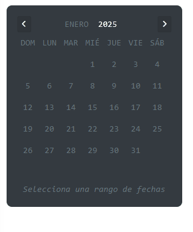

# Calendario genérico

Ahora mismo este componente podría ser más genérico, porque lo único que permite hacer es seleccionar un rango entre dos fechas.

Importar en el módulo del componente que se está trabajando el módulo del calendario genérico.

```ts
    ...
    import { CalendarioGenericoModule } from 'src/app/components/utiles/calendario-generico/calendario-generico.module';

    @NgModule(
        declarations: [...]
        imports: [
            CommonModule,
            CalendarioGenericoModule,
        ],
        export: [...],
    )
```

En ejemplo como este:

```html
<div class="row">
    <div class="col-3">
        <div class="card bg-dark">
            <div class="card-body">
                <app-calendario-generico
                    [year]="2025"
                    [mes]="0"
                    [nombreCortoDias]="true"
                    (fechasSeleccionadas)="(null)"
                ></app-calendario-generico>
            </div>
        </div>
    </div>
</div>
```

mostrará el siguiente resultado:



Explicación de las propeidades.

| PROPIEDAD               | I/O    | TIPO    | DESCRIPCIÓN                                                                                                                            |
| ----------------------- | ------ | ------- | -------------------------------------------------------------------------------------------------------------------------------------- |
| `[year]`                | INPUT  | number  | Indica el año a mostrar.                                                                                                               |
| `[mes]`                 | INPUT  | number  | Indica el mes a mostrar (0-11).                                                                                                        |
| `[nombreCortoDias]`     | INPUT  | boolean | Si se marca como falso, se usarán nombres largos en cada día. <span style='color: red; font-weight: 900'>POR AHORA NO FUNCIONA</span>. |
| `(fechasSeleccionadas)` | OUTPUT | objeto  | Cuando se hace una selección de rango, emite las fechas seleccionadas.                                                                 |

Para seleccionar un rango, basta con dar click en alguno de los días del mes, y luego dar click en otro o el mismo.



Por ejemplo, con esta configuración:

```html
<app-calendario-generico
    [year]="2025"
    [mes]="0"
    [nombreCortoDias]="true"
    (fechasSeleccionadas)="obtenerRangoFechas($event)"
></app-calendario-generico>
```

Y en el controlador:

```ts
obtenerRangoFechas(rango: any) {
    console.log(rango)
}
```

Al seleccionar un rango de fechas (al seleccionar la segunda fecha), en la consola se imprimirá el siguiente objeto:

```json
{
    "fechaInicial": "2025-01-08T06:00:00.000Z",
    "fechaFinal": "2025-01-31T06:00:00.000Z"
}
```
