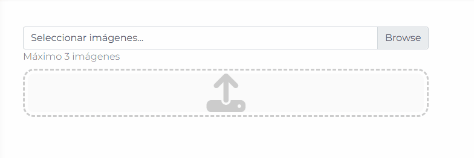

# Carga de imágenes

La carga de imágenes implica el uso de un componente en la GUI y un servicio en el API.

<hr class='hr-secundario'>

## Componente de la GUI.

Para usar el input de carga de imágenes, importarlo en el módulo del componente en el que se está trabajando.

```ts
import { CalendarioGenericoModule } from 'src/app/components/utiles/calendario-generico/calendario-generico.module';

@NgModule({
    declarations: [TalComponenteComponent],
    imports: [CommonModule, CalendarioGenericoModule],
    export: [TalComponenteComponent]
})
export class TalComponenteModule {}
```

Y usar el componente de la siguiente manera. En la vista (`.html`) llamar al selector así.

```html
<app-carga-de-imagenes
    [transformarFileAObjetoPlano]="true"
    [limiteImagenes]="3"
    (imagenesParaSubir)="datosImagenes($event)"
    (error)="errorImagenes($event)"
></app-carga-de-imagenes>
```

En el controlador (`.ts`) estarían las siguientes funciones:

```ts
import { Component } from '@angular/core';
import { CargaDeImagenesTransporte } from './carga-de-imagenes-transporte';

@Component({
    // ...
})
class TalCmponent {
    // ...

    datosImagenes(imagenes: CargaDeImagenesTransporte[]) {
        console.log(imagenes);
    }

    errorImagenes(err: any) {
        console.log(err);
    }
}
```

Explicación de las propiedades:

| PROPIEDAD                       | I/O    | TIPO                          | VALORES ACEPTADOS                                                       | DESCRIPCIÓN                                                                                                                           |
| :------------------------------ | :----- | :---------------------------- | :---------------------------------------------------------------------- | :------------------------------------------------------------------------------------------------------------------------------------ |
| `[activeColor]`                 | INPUT  | string                        | Cadena para [color](./docs/carrduci-sys-desarrollo/css/colores-css.md). | <span class='text-warning'>NO USADO</span>                                                                                            |
| `[baseColor]`                   | INPUT  | string                        | Cadena para [color](./docs/carrduci-sys-desarrollo/css/colores-css.md). | Cambia el color del recuadro y símbolo del recuadro de carga de imágenes.                                                             |
| `[overlayColor]`                | INPUT  | string                        | Cadena para [color](./docs/carrduci-sys-desarrollo/css/colores-css.md). | <span class='text-warning'>NO USADO</span>                                                                                            |
| `[multiple]`                    | INPUT  | boolean                       | `true`, `false`. Por defecto `true`.                                    | Si es verdadero, se permite seleccionar varias imágenes.                                                                              |
| `[limiteImagenes]`              | INPUT  | number                        | Número del 1 en adelante.                                               | Si es múltiple, limita la cantidad de imágenes seleccionables. <span class='text-info'>SE RECOMIENDA SIEMPRE USAR ESTA OPCIÓN</span>. |
| `[transformarFileAObjetoPlano]` | INPUT  | boolean                       | `true`, `false`                                                         | Convierte el objeto de la imágen a un JSON plano. <span class='text-info'>SE RECOMIENDA SIEMPRE USAR ESTA OPCIÓN</span>.              |
| `(error)`                       | OUTPUT | string                        |                                                                         | Emite una cadena de texto describiendo posibles errores.                                                                              |
| `(imagenesParaSubir)`           | OUTPUT | `CargaDeImagenesTransporte[]` |                                                                         | Emite un objeto o un arreglo de objetos que describen la imágen.                                                                      |
| `(esteComponente)`              | OUTPUT | `CargaDeImagenesComponent`    |                                                                         | Emite la clase misma del componente por si se desea acceder a sus métodos o propiedades.                                              |

Este es un ejemplo visual del componente.

<figure>
  
  <figcaption>No se pueden cargar más imágenes de las permitidas</figcaption>
</figure>

Y este es un ejemplo de arreglo que el componente emite:

```json
[
    {
        "file": {
            "lastModified": 1711491528372,
            "name": "660791 - copia.jpg",
            "size": 377638,
            "type": "image/jpeg",
            "webkitRelativePath": ""
        },
        "src": "data:image/jpeg;base64,/9j/4AAQSkZJRgABAQAAAQABAAD/2wBDAAgGBgcGBQg..."
    },
    {
        "file": {
            "lastModified": 1711491999000,
            "name": "45412.jpg",
            "size": 2540812,
            "type": "image/jpeg",
            "webkitRelativePath": ""
        },
        "src": "data:image/jpeg;base64,/9j/4AAQSkZJRgABAQAAAQABAAD/2wBDAAIBAQEBAQIB..."
    },
    {
        "file": {
            "lastModified": 1741722504615,
            "name": "aurora-borealis-beautiful-4k-2c.jpg",
            "size": 2526714,
            "type": "image/jpeg",
            "webkitRelativePath": ""
        },
        "src": "data:image/jpeg;base64,/9j/4AAQSkZJRgABAQEBLAEsAAD/4SXqRXhpZgAASUkqAAgAAAANAA4BA..."
    }
]
```

Este objeto debe ser pasado a un servicio que acepte un objeto con un campo de imágenes parecido al siguiente.

```ts
import {CargaDeImagenesTransporte} from "./carga-de-imagenes-transporte";

export class UnModeloCualquiera {
    // ...
    imagenes: CargaDeImagenesTransporte[]

    // ...

    constructor(params: ParamsUnModeloCualquiera) {
        /...
    }
}

export interface ParamsUnModeloCualquiera {
    // ...
    imagenes: CargaDeImagenesTransporte[]
    // ...
}
```

y en el servicio se debe esperar recibir esta misma clase

```ts
import { Injectable } from '@angular/core';

@Injectable({
    // ...
})
class AlgunServicioService {
    crearDocumentoConImagenes(documento: UnModeloCualquiera) {
        // ...
    }
}
```

<hr class='hr-secundario'>

## Crear un tipo de imágen

Las imágenes se clasifican por tipo, dependiendo de a qué módulo están relacionadas.

Para guardar imágenes de un nuevo tipo, hay que registrarlo en varios lugares.

Suponiendo que se tiene el siguiente modelo en el API.

```js
/* IMPORTACIONES EXTERNAS */
const Mongoose = require('mongoose');
const Schema = Mongoose.Schema;
const ObjectId = Schema.Types.ObjectId;
const UNIQUE_VALIDATOR = require('mongoose-unique-validator');
const AUTO_INCREMENT = require('mongoose-sequence')(Mongoose);

/* UTILIDADES */
const HISTORIAL = require('.../plugins/historial/historial.plugin');
const BUSQUEDA = require('.../plugins/busqueda-texto/busqueda-texto.plugin');
const UTILES = require('.../utils/varios');
const CAMPOS_BUSQUEDA = require('.../utils/camposBusquedaTodosLosModelos.utils');

const UN_ELEMENTO_SCHEMA = Mogoose.Schema(
    {
        folio: {
            type: Number,
            unique: true,
            inmutable: true,
            min: [0, 'El mínimo posible del folio es 0']
        },
        busqueda: String,

        nombre: String,
        descripcion: String,
        imagenes: [
            {
                fecha: Date,
                imagen: String
            }
        ]
    },
    {
        collection: 'elementos',
        timestamps: true
    }
);

UN_ELEMENTO_SCHEMA.plugin(AUTO_INCREMENT, {
    id: 'elemento',
    inc_field: 'folio'
});
UN_ELEMENTO_SCHEMA.plugin(UNIQUE_VALIDATOR, {
    message: "El campo '{PATH}' debe ser único."
});
UN_ELEMENTO_SCHEMA.plugin(BUSQUEDA.text_search_index, {
    fields: CAMPOS_BUSQUEDA.ELEMENTOS
});
UN_ELEMENTO_SCHEMA.plugin(HISTORIAL.hystory_log_plugin);

const ELEMENTO_MODEL = Mongoose.model('Elemento', UN_ELEMENTO_SCHEMA);
module.exports = ELEMENTO_MODEL;
ELEMENTO_MODEL.createCollection();
```

### 1. En el servicio de imágenes (API)

En el archivo `imagenesAdministracion.service.js` es el primer lugar donde agregar el nuevo tipo.

```js
// ...

const SERVICIO = {};

SERVICIO.RELACION_CARPETAS_COLECCIONES = {
    // ...

    // La relación de la carpeta del nuevo tipo con su colección.
    // Aquí se usa el nombre de la colección del modelo mencionado anteriormente.
    elementos: 'elementos'
};

// No tocar esto
SERVICIO.DIRECTORIO_IMGS = '/carrduci-sys-app-data/uploads';

SERVICIO.DIRECTORIOS_IMAGENES = {
    // ...

    // El nombre de la carpeta que se usará.
    elementos: `${SERVICIO.DIRECTORIO_IMGS}/elementos`
};

SERVICIO.TIPOS = {
    // ...

    // El nombre del nuevo tipo.
    elementos: 'elementos'
};

// ...
```

### 2. Importar el modelo en el servicio de imágenes

En el mismo archivo `imagenesAdministracion.service.js`, agregar la importación del modelo al inicio:

```js
// ... otras importaciones
const ELEMENTO = require('../../models/elementos/elemento.model');
```

### 3. Crear función para obtener imágenes del nuevo modelo

Agregar una función que obtenga las imágenes usando agregación de MongoDB:

```js
async function obtenerImagenesElementos() {
    return await ELEMENTO.aggregate([
        {
            $project: {
                imagen: '$imagenes.imagen'
            }
        },
        {
            $unwind: {
                path: '$imagen',
                preserveNullAndEmptyArrays: false
            }
        }
    ]);
}
```

### 4. Registrar la función en `obtenerTodosLosIdsImagenes`

Dentro de la función `obtenerTodosLosIdsImagenes`, agregar la llamada a la nueva función:

```js
async function obtenerTodosLosIdsImagenes() {
    return [
        ...(await obtenerImagenesEmpleados()),
        ...(await obtenerImagenesBitacoraMantenimiento()),
        // ... otras funciones
        ...(await obtenerImagenesElementos())  // Agregar esta línea
    ];
}
```

<hr class='hr-secundario'>

## Uso del servicio del API

### Guardar imágenes

En el API, suponiendo que ya está lista una ruta y un controlador, hay que crear el documento y guardar las imágenes de la siguiente forma.

#### Importar el servicio de imágenes

Al inicio del archivo del servicio, importar el servicio de administración de imágenes:

```javascript
const SERVICIO_IMAGENES = require('../../services/imagenesAdministracion/imagenesAdministracion.service');
```

#### Guardar imágenes al crear un documento

```javascript
const Mongoose = require('mongoose');
const ObjectId = Mongoose.Types.ObjectId;
const ELEMENTO_MODEL = require('../../models/elementos/elemento.model');
const SERVICIO_IMAGENES = require('../../services/imagenesAdministracion/imagenesAdministracion.service');

const SERVICIO = {};

SERVICIO.crearDocumentoConImagenes = async function ({
    nombre,
    descripcion,
    imagenes,
    idUsuario
}) {
    // Generar un ObjectId para el nuevo documento
    const OBJECT_ID = new ObjectId();
    
    // Guardar las imágenes en el sistema de archivos
    let imagenesGuardadas = [];
    if (imagenes?.length > 0) {
        imagenesGuardadas = await SERVICIO_IMAGENES.cargarGrupoDeImagenes(
            imagenes,
            SERVICIO_IMAGENES.TIPOS.elementos,
            OBJECT_ID.toHexString()
        );
    }
    
    // Crear el documento con las referencias a las imágenes
    let nuevoElemento = new ELEMENTO_MODEL({
        _id: OBJECT_ID,
        nombre: nombre,
        descripcion: descripcion,
        imagenes: imagenesGuardadas.map(nombreImagen => ({
            fecha: new Date(),
            imagen: nombreImagen
        }))
    });
    
    // Agregar metadata para historial
    nuevoElemento.metadata = {
        idUsuario: idUsuario,
        descripcion: 'Elemento creado'
    };
    
    // Guardar en la base de datos
    return await nuevoElemento.save();
};
```

#### Modificar documento (actualizar campos, agregar y/o eliminar imágenes)

```javascript
SERVICIO.modificarElemento = async function ({
    folioDocumento,
    nombre,
    descripcion,
    imagenes,
    imagenesEliminar,
    idUsuario
}) {
    // Buscar el documento existente
    const ELEMENTO_EXISTENTE = await ELEMENTO_MODEL.findOne({
        folio: folioDocumento
    }).lean();
    
    if (!ELEMENTO_EXISTENTE) {
        throw new Error('El documento no existe');
    }
    
    // Guardar las nuevas imágenes usando el ID del documento existente
    let imagenesGuardadas = [];
    if (imagenes?.length > 0) {
        imagenesGuardadas = await SERVICIO_IMAGENES.cargarGrupoDeImagenes(
            imagenes,
            SERVICIO_IMAGENES.TIPOS.elementos,
            ELEMENTO_EXISTENTE._id
        );
    }
    
    // Mapear las nuevas imágenes con fecha y combinar con existentes
    imagenesGuardadas = [
        ...imagenesGuardadas.map(nombreImagen => ({
            imagen: nombreImagen,
            fecha: new Date()
        })),
        ...(ELEMENTO_EXISTENTE.imagenes ?? [])
    ];
    
    // Eliminar imágenes si se especificaron
    if (imagenesEliminar?.length > 0) {
        const NOMBRES_ELIM = imagenesEliminar.map(img => img.imagen);
        imagenesGuardadas = imagenesGuardadas.filter(
            imgGuardada => !NOMBRES_ELIM.includes(imgGuardada.imagen)
        );
        
        let grupoAEliminar = imagenesEliminar.map(img => ({
            imagen: img.imagen,
            carpeta: 'elementos'
        }));
        
        await SERVICIO_IMAGENES.eliminarGrupoDeImagenes(grupoAEliminar);
    }
    
    // Actualizar usando findOneAndUpdate (campos + imágenes)
    return await ELEMENTO_MODEL.findOneAndUpdate(
        {
            folio: folioDocumento
        },
        {
            $set: {
                nombre: nombre,
                descripcion: descripcion,
                imagenes: imagenesGuardadas
            }
        },
        {
            runValidators: true,
            new: true,
            lean: true,
            context: 'query',
            metadata: {
                idUsuario: idUsuario,
                descripcion: 'Elemento modificado'
            }
        }
    );
};
```

?> **NOTA**: Esta función permite modificar **todos los aspectos** del documento en una sola operación: actualizar campos normales, agregar nuevas imágenes y eliminar imágenes existentes.

#### Parámetros de `cargarGrupoDeImagenes`

| Parámetro | Tipo | Descripción |
|-----------|------|-------------|
| `imagenes` | `CargaDeImagenesTransporte[]` | Arreglo de imágenes en formato base64 proveniente del componente de la GUI |
| `tipo` | `string` | Tipo de imagen definido en `SERVICIO_IMAGENES.TIPOS` (determina la carpeta de guardado) |
| `idDocumentoPadre` | `string` | ID del documento al que pertenecen las imágenes (se usa para nombrar los archivos) |

#### Retorno de `cargarGrupoDeImagenes`

La función retorna un arreglo de strings con los nombres de las imágenes guardadas:

```javascript
// Ejemplo de retorno
[
    '507f1f77bcf86cd799439011-1711491528372_5847.jpg',
    '507f1f77bcf86cd799439011-1711491999000_3921.png',
    '507f1f77bcf86cd799439011-1741722504615_7234.jpeg'
]
```

**Formato del nombre**: `${idDocumento}-${timestamp}_${numeroAleatorio}.${extension}`

#### Compresión automática

?> El servicio utiliza la librería `sharp` para comprimir automáticamente las imágenes con calidad del 70%, reduciendo el espacio de almacenamiento sin perder demasiada calidad visual.

### Eliminar imágenes

Para eliminar imágenes del sistema de archivos, utilizar la función `eliminarGrupoDeImagenes`.

#### Eliminar imágenes al actualizar un documento

```javascript
SERVICIO.eliminarImagenDeDocumento = async function ({
    folioDocumento,
    nombreImagen,
    idUsuario
}) {
    // Buscar el documento
    const ELEMENTO = await ELEMENTO_MODEL.findOne({
        folio: folioDocumento
    }).lean();
    
    if (!ELEMENTO) {
        throw new Error('El documento no existe');
    }
    
    // Eliminar la imagen del sistema de archivos
    await SERVICIO_IMAGENES.eliminarGrupoDeImagenes([
        {
            carpeta: 'elementos',
            imagen: nombreImagen
        }
    ]);
    
    // Filtrar la imagen del arreglo
    const imagenesActualizadas = ELEMENTO.imagenes.filter(
        img => img.imagen !== nombreImagen
    );
    
    // Actualizar usando findOneAndUpdate
    return await ELEMENTO_MODEL.findOneAndUpdate(
        {
            folio: folioDocumento
        },
        {
            $set: {
                imagenes: imagenesActualizadas
            }
        },
        {
            runValidators: true,
            new: true,
            lean: true,
            context: 'query',
            metadata: {
                idUsuario: idUsuario,
                descripcion: 'Imagen eliminada'
            }
        }
    );
};
```

#### Eliminar todas las imágenes al eliminar un documento

```javascript
SERVICIO.eliminarDocumentoConImagenes = async function ({
    idDocumento,
    idUsuario
}) {
    // Buscar el documento
    const ELEMENTO = await ELEMENTO_MODEL.findById(idDocumento);
    if (!ELEMENTO) {
        throw new Error('El documento no existe');
    }
    
    // Preparar el arreglo de imágenes para eliminar
    const IMAGENES_A_ELIMINAR = ELEMENTO.imagenes.map(img => ({
        carpeta: 'elementos',
        imagen: img.imagen
    }));
    
    // Eliminar las imágenes del sistema de archivos
    if (IMAGENES_A_ELIMINAR.length > 0) {
        await SERVICIO_IMAGENES.eliminarGrupoDeImagenes(IMAGENES_A_ELIMINAR);
    }
    
    // Eliminar el documento de la base de datos
    return await ELEMENTO_MODEL.findByIdAndDelete(idDocumento);
};
```

#### Parámetros de `eliminarGrupoDeImagenes`

La función espera un arreglo de objetos con la siguiente estructura:

```javascript
[
    {
        carpeta: 'elementos',  // Nombre de la carpeta donde está la imagen
        imagen: 'nombre-archivo.jpg'  // Nombre del archivo a eliminar
    }
]
```

#### Retorno de `eliminarGrupoDeImagenes`

```javascript
{
    eliminados: 3  // Cantidad de archivos eliminados exitosamente
}
```

<hr class='hr-secundario'>

## Manejo de errores

El servicio de imágenes incluye validaciones y manejo de errores que deben considerarse.

### Errores comunes

#### 1. Tipo de imagen no registrado

```javascript
// Error
throw new Error('No existe el tipo de imágen elementos');
```

**Solución**: Verificar que el tipo esté registrado en `SERVICIO_IMAGENES.TIPOS` y `SERVICIO_IMAGENES.DIRECTORIOS_IMAGENES`.

#### 2. Extensión no válida

```javascript
// Error
throw new Error('gif no es una extensión de imágen válida');
```

**Solución**: Solo se permiten las extensiones definidas en `extencionesFicherosValidas.utils.js`. Extensiones válidas: `jpg`, `jpeg`, `png`, `webp`.

#### 3. Formato de imagen incorrecto

```javascript
// Error desde el componente GUI
this.error.emit('No es un formato valido');
```

**Solución**: Asegurarse de que el archivo sea realmente una imagen (pattern `/image-*/`).

### Ejemplo de manejo de errores

```javascript
SERVICIO.crearDocumentoConImagenes = async function ({
    nombre,
    descripcion,
    imagenes,
    idUsuario
}) {
    const OBJECT_ID = new ObjectId();
    let imagenesGuardadas = [];
    
    try {
        // Guardar las imágenes primero
        if (imagenes?.length > 0) {
            try {
                imagenesGuardadas = await SERVICIO_IMAGENES.cargarGrupoDeImagenes(
                    imagenes,
                    SERVICIO_IMAGENES.TIPOS.elementos,
                    OBJECT_ID.toHexString()
                );
            } catch (errorImagenes) {
                throw new Error(`Error al guardar imágenes: ${errorImagenes.message}`);
            }
        }
        
        // Crear el documento
        let nuevoElemento = new ELEMENTO_MODEL({
            _id: OBJECT_ID,
            nombre: nombre,
            descripcion: descripcion,
            imagenes: imagenesGuardadas.map(nombreImagen => ({
                fecha: new Date(),
                imagen: nombreImagen
            }))
        });
        
        nuevoElemento.metadata = {
            idUsuario: idUsuario,
            descripcion: 'Elemento creado'
        };
        
        return await nuevoElemento.save();
        
    } catch (error) {
        // Si falla el guardado del documento, limpiar las imágenes guardadas
        if (imagenesGuardadas.length > 0) {
            try {
                await SERVICIO_IMAGENES.eliminarGrupoDeImagenes(
                    imagenesGuardadas.map(img => ({
                        carpeta: 'elementos',
                        imagen: img
                    }))
                );
            } catch (errorLimpieza) {
                console.error('Error al limpiar imágenes:', errorLimpieza);
            }
        }
        throw error;
    }
};
```

<hr class='hr-secundario'>

## Mejores prácticas

### 1. Generar ObjectId antes de guardar imágenes

✅ **Correcto**:
```javascript
const OBJECT_ID = new ObjectId();
const imagenes = await SERVICIO_IMAGENES.cargarGrupoDeImagenes(
    imagenesBase64,
    SERVICIO_IMAGENES.TIPOS.elementos,
    OBJECT_ID.toHexString()  // ID conocido antes de guardar
);
```

❌ **Incorrecto**:
```javascript
const nuevoElemento = await ELEMENTO_MODEL.create({ nombre: 'test' });
// Las imágenes no tendrán el ID correcto si algo falla
```

### 2. Usar el operador opcional chaining para verificar imágenes

```javascript
if (imagenes?.length > 0) {
    // Procesar imágenes
}
```

### 3. Usar `toHexString()` solo al crear documentos

```javascript
// Al CREAR (con nuevo ObjectId)
const OBJECT_ID = new ObjectId();
await SERVICIO_IMAGENES.cargarGrupoDeImagenes(
    imagenes,
    SERVICIO_IMAGENES.TIPOS.elementos,
    OBJECT_ID.toHexString()  // Usar .toHexString()
);

// Al ACTUALIZAR (con documento existente)
const ELEMENTO = await ELEMENTO_MODEL.findOne({ folio }).lean();
await SERVICIO_IMAGENES.cargarGrupoDeImagenes(
    imagenes,
    SERVICIO_IMAGENES.TIPOS.elementos,
    ELEMENTO._id  // NO usar .toHexString(), pasar directamente el ObjectId
);
```

### 4. Mapear correctamente las imágenes guardadas

```javascript
// Al crear documento
imagenes: imagenesGuardadas.map(nombreImagen => ({
    fecha: new Date(),
    imagen: nombreImagen  // Solo el nombre del archivo
}))

// Al actualizar documento (combinar nuevas con existentes)
imagenesGuardadas = [
    ...imagenesGuardadas.map(nombreImagen => ({
        imagen: nombreImagen,
        fecha: new Date()
    })),
    ...(ELEMENTO_EXISTENTE.imagenes ?? [])
];
```

### 5. Limpiar imágenes huérfanas

Si un documento falla al guardarse después de cargar imágenes, eliminar las imágenes del sistema de archivos:

```javascript
try {
    const nuevoDoc = await documento.save();
} catch (error) {
    // Limpiar imágenes si falla el guardado
    await SERVICIO_IMAGENES.eliminarGrupoDeImagenes(
        imagenesGuardadas.map(img => ({
            carpeta: 'elementos',
            imagen: img
        }))
    );
    throw error;
}
```

### 6. Validar límite de imágenes en el componente

```html
<app-carga-de-imagenes
    [limiteImagenes]="5"
    [transformarFileAObjetoPlano]="true"
></app-carga-de-imagenes>
```

### 7. Usar `transformarFileAObjetoPlano` para HTTP

```html
<!-- Siempre usar esto para enviar por HTTP -->
<app-carga-de-imagenes
    [transformarFileAObjetoPlano]="true"
></app-carga-de-imagenes>
```

Esto convierte el objeto `File` (que no es serializable) a un objeto plano que puede enviarse por HTTP.

### 8. Usar `findOneAndUpdate` en lugar de `.save()` para actualizaciones

✅ **Correcto**:
```javascript
return await ELEMENTO_MODEL.findOneAndUpdate(
    { folio: folioDocumento },
    { $set: { imagenes: imagenesGuardadas } },
    {
        runValidators: true,
        new: true,
        lean: true,
        context: 'query',
        metadata: {
            idUsuario: idUsuario,
            descripcion: 'Elemento actualizado'
        }
    }
);
```

❌ **Incorrecto**:
```javascript
const elemento = await ELEMENTO_MODEL.findOne({ folio });
elemento.imagenes = imagenesGuardadas;
elemento.metadata = { idUsuario, descripcion: 'actualizado' };
return await elemento.save();  // NO usar .save() para actualizaciones
```

?> **IMPORTANTE**: El `metadata` se pasa en las **opciones** de `findOneAndUpdate`, no en el objeto de actualización.

<hr class='hr-secundario'>

## Ejemplo completo de implementación

### Modelo (API)

```javascript
/* IMPORTACIONES EXTERNAS */
const Mongoose = require('mongoose');
const Schema = Mongoose.Schema;
const AUTO_INCREMENT = require('mongoose-sequence')(Mongoose);

/* UTILIDADES */
const HISTORIAL = require('../../plugins/historial/historial.plugin');
const BUSQUEDA = require('../../plugins/busqueda-texto/busqueda-texto.plugin');
const CAMPOS_BUSQUEDA = require('../../utils/camposBusquedaTodosLosModelos.utils');

const PRODUCTO_SCHEMA = Mongoose.Schema(
    {
        folio: {
            type: Number,
            unique: true,
            inmutable: true
        },
        busqueda: String,
        nombre: {
            type: String,
            required: [true, 'El nombre es obligatorio']
        },
        descripcion: String,
        imagenes: [
            {
                fecha: {
                    type: Date,
                    default: Date.now
                },
                imagen: {
                    type: String,
                    required: true
                }
            }
        ]
    },
    {
        collection: 'productos',
        timestamps: true
    }
);

PRODUCTO_SCHEMA.plugin(AUTO_INCREMENT, {
    id: 'producto',
    inc_field: 'folio'
});
PRODUCTO_SCHEMA.plugin(BUSQUEDA.text_search_index, {
    fields: CAMPOS_BUSQUEDA.PRODUCTOS
});
PRODUCTO_SCHEMA.plugin(HISTORIAL.hystory_log_plugin);

const PRODUCTO_MODEL = Mongoose.model('Producto', PRODUCTO_SCHEMA);
module.exports = PRODUCTO_MODEL;
PRODUCTO_MODEL.createCollection();
```

### Servicio (API)

```javascript
const Mongoose = require('mongoose');
const ObjectId = Mongoose.Types.ObjectId;
const PRODUCTO_MODEL = require('../../models/productos/producto.model');
const SERVICIO_IMAGENES = require('../imagenesAdministracion/imagenesAdministracion.service');

const SERVICIO = {};

// Crear producto con imágenes
SERVICIO.crear = async function ({ nombre, descripcion, imagenes, idUsuario }) {
    const OBJECT_ID = new ObjectId();
    
    let imagenesGuardadas = [];
    if (imagenes?.length > 0) {
        imagenesGuardadas = await SERVICIO_IMAGENES.cargarGrupoDeImagenes(
            imagenes,
            SERVICIO_IMAGENES.TIPOS.productos,
            OBJECT_ID.toHexString()
        );
    }
    
    let nuevoProducto = new PRODUCTO_MODEL({
        _id: OBJECT_ID,
        nombre: nombre,
        descripcion: descripcion,
        imagenes: imagenesGuardadas.map(img => ({
            fecha: new Date(),
            imagen: img
        }))
    });
    
    nuevoProducto.metadata = {
        idUsuario: idUsuario,
        descripcion: 'Producto creado'
    };
    
    return await nuevoProducto.save();
};

// Modificar producto (campos + imágenes)
SERVICIO.modificarProducto = async function ({ 
    folioProducto,
    nombre,
    descripcion,
    imagenes, 
    imagenesEliminar,
    idUsuario 
}) {
    const PRODUCTO = await PRODUCTO_MODEL.findOne({ folio: folioProducto }).lean();
    if (!PRODUCTO) throw new Error('Producto no encontrado');
    
    // Guardar nuevas imágenes
    let imagenesGuardadas = [];
    if (imagenes?.length > 0) {
        imagenesGuardadas = await SERVICIO_IMAGENES.cargarGrupoDeImagenes(
            imagenes,
            SERVICIO_IMAGENES.TIPOS.productos,
            PRODUCTO._id
        );
    }
    
    // Combinar nuevas imágenes con existentes
    imagenesGuardadas = [
        ...imagenesGuardadas.map(img => ({
            imagen: img,
            fecha: new Date()
        })),
        ...(PRODUCTO.imagenes ?? [])
    ];
    
    // Eliminar imágenes si se especificaron
    if (imagenesEliminar?.length > 0) {
        const NOMBRES_ELIM = imagenesEliminar.map(img => img.imagen);
        imagenesGuardadas = imagenesGuardadas.filter(
            imgGuardada => !NOMBRES_ELIM.includes(imgGuardada.imagen)
        );
        
        let grupoAEliminar = imagenesEliminar.map(img => ({
            imagen: img.imagen,
            carpeta: 'productos'
        }));
        
        await SERVICIO_IMAGENES.eliminarGrupoDeImagenes(grupoAEliminar);
    }
    
    // Actualizar con findOneAndUpdate (todos los campos)
    return await PRODUCTO_MODEL.findOneAndUpdate(
        { folio: folioProducto },
        { 
            $set: { 
                nombre: nombre,
                descripcion: descripcion,
                imagenes: imagenesGuardadas 
            } 
        },
        {
            runValidators: true,
            new: true,
            lean: true,
            context: 'query',
            metadata: {
                idUsuario: idUsuario,
                descripcion: 'Producto modificado'
            }
        }
    );
};

// Eliminar una imagen específica
SERVICIO.eliminarImagen = async function ({ folioProducto, nombreImagen, idUsuario }) {
    const PRODUCTO = await PRODUCTO_MODEL.findOne({ folio: folioProducto }).lean();
    if (!PRODUCTO) throw new Error('Producto no encontrado');
    
    // Eliminar del sistema de archivos
    await SERVICIO_IMAGENES.eliminarGrupoDeImagenes([
        {
            carpeta: 'productos',
            imagen: nombreImagen
        }
    ]);
    
    // Filtrar la imagen del arreglo
    const imagenesActualizadas = PRODUCTO.imagenes.filter(
        img => img.imagen !== nombreImagen
    );
    
    // Actualizar con findOneAndUpdate
    return await PRODUCTO_MODEL.findOneAndUpdate(
        { folio: folioProducto },
        { $set: { imagenes: imagenesActualizadas } },
        {
            runValidators: true,
            new: true,
            lean: true,
            context: 'query',
            metadata: {
                idUsuario: idUsuario,
                descripcion: 'Imagen eliminada'
            }
        }
    );
};

// Eliminar producto con todas sus imágenes
SERVICIO.eliminar = async function ({ folioProducto }) {
    const PRODUCTO = await PRODUCTO_MODEL.findOne({ folio: folioProducto }).lean();
    if (!PRODUCTO) throw new Error('Producto no encontrado');
    
    // Preparar imágenes para eliminar del sistema de archivos
    const IMAGENES_A_ELIMINAR = PRODUCTO.imagenes.map(img => ({
        carpeta: 'productos',
        imagen: img.imagen
    }));
    
    if (IMAGENES_A_ELIMINAR.length > 0) {
        await SERVICIO_IMAGENES.eliminarGrupoDeImagenes(IMAGENES_A_ELIMINAR);
    }
    
    // Eliminar el documento
    return await PRODUCTO_MODEL.findOneAndDelete({ folio: folioProducto });
};

module.exports = SERVICIO;
```

### Componente (GUI)

```typescript
import { Component, OnInit, TemplateRef, ViewChild } from '@angular/core';
import { Validators } from '@angular/forms';
import { ProductoService } from '../../services/producto.service';
import { CargaDeImagenesTransporte } from '../../components/utiles/carga-de-imagenes/carga-de-imagenes-transporte';
import { ManejoMensajesService } from '../../services/manejo-mensajes.service';
import {
    CampoFormulario,
    CLASES_ESPECIALES_FORM_DINAMICO,
    ControlesFormularioDinamico,
    EspecificacionFormularioDinamico
} from 'src/app/components/utiles/formulario-dinamico/formulario-dinamico.model';

@Component({
    selector: 'app-crear-producto',
    templateUrl: './crear-producto.component.html'
})
export class CrearProductoComponent implements OnInit {
    
    @ViewChild('cargaImagenesTemplate') cargaImagenesTemplate!: TemplateRef<any>;
    
    formularioProducto!: EspecificacionFormularioDinamico<
        ReturnType<typeof this.camposFormulario>
    >;
    controlesFormulario!: ControlesFormularioDinamico<
        ReturnType<typeof this.camposFormulario>
    >;
    imagenes: CargaDeImagenesTransporte[] = [];
    
    constructor(
        private productoService: ProductoService,
        private mensajesService: ManejoMensajesService
    ) {}
    
    ngOnInit() {
        setTimeout(() => {
            this.crearFormulario();
        }, 0);
    }
    
    camposFormulario = () => {
        return {
            nombre: new CampoFormulario({
                tipo: 'text',
                claseColumna: 'col-12 col-lg-6',
                orden: 1,
                label: 'Nombre del Producto',
                placeholder: 'Ingrese el nombre del producto',
                validadores: [Validators.required]
            }),
            descripcion: new CampoFormulario({
                tipo: 'TEXTAREA',
                claseColumna: 'col-12',
                orden: 2,
                label: 'Descripción',
                placeholder: 'Ingrese una descripción (opcional)'
            }),
            componenteImagenes: new CampoFormulario({
                tipo: '__COMPONENTE',
                claseColumna: 'col-12',
                orden: 3,
                claseEspecial: {
                    template: this.cargaImagenesTemplate
                }
            })
        };
    };
    
    crearFormulario() {
        this.formularioProducto = new EspecificacionFormularioDinamico(
            this.camposFormulario(),
            false,  // mostrarBotonOnReset
            true,   // mostrarBotonSubmit
            true,   // resetOnSubmit
            false   // showValidationOnInvalidSubmit
        );
    }
    
    subscribirseACambiosDeFormulario(
        controles: ControlesFormularioDinamico<any>
    ) {
        this.controlesFormulario = controles;
    }
    
    recibirImagenes(imagenes: CargaDeImagenesTransporte[]) {
        this.imagenes = imagenes;
    }
    
    errorImagenes(error: string) {
        this.mensajesService.mostrarError(error);
    }
    
    onSubmit(formulario: any) {
        const datos = {
            nombre: formulario.nombre,
            descripcion: formulario.descripcion,
            imagenes: this.imagenes
        };
        
        this.productoService.crear(datos).subscribe({
            next: (respuesta) => {
                this.mensajesService.mostrarExito('Producto creado exitosamente');
                this.limpiarFormulario();
            },
            error: (error) => {
                this.mensajesService.mostrarError('Error al crear producto');
                console.error(error);
            }
        });
    }
    
    limpiarFormulario() {
        this.imagenes = [];
        this.crearFormulario();
    }
}
```

### Vista (GUI)

```html
<!-- Formulario dinámico (incluye sus propios botones de submit/reset) -->
<app-formulario-dinamico
    *ngIf="formularioProducto"
    [especificacionFormulario]="formularioProducto"
    (controlesFormulario)="subscribirseACambiosDeFormulario($event)"
    (onSubmit)="onSubmit($event)"
></app-formulario-dinamico>

<!-- Template para el componente de carga de imágenes -->
<ng-template #cargaImagenesTemplate>
    <div class="row">
        <div class="col-12">
            <label class="form-label">Imágenes del Producto (máximo 5)</label>
            <app-carga-de-imagenes
                [transformarFileAObjetoPlano]="true"
                [limiteImagenes]="5"
                [multiple]="true"
                (imagenesParaSubir)="recibirImagenes($event)"
                (error)="errorImagenes($event)"
            ></app-carga-de-imagenes>
        </div>
    </div>
</ng-template>
```

?> **USO DE `__COMPONENTE`**: El tipo `'__COMPONENTE'` permite insertar templates personalizadas dentro del formulario dinámico. Se pasa el `TemplateRef` en la propiedad `claseEspecial.template`. El template se renderiza en el orden especificado junto con los demás campos.

!> **PENDIENTE**: El tipo nativo `'IMAGENES'` aún NO está implementado (líneas 607-609 de `formulario-dinamico.component.html`). Por ahora, usa `'__COMPONENTE'` para integrar el componente de carga de imágenes dentro del formulario.

<hr class='hr-secundario'>

## Notas adicionales

### Extensiones de imagen válidas

Las extensiones permitidas están definidas en `extencionesFicherosValidas.utils.js`:

- `jpg`
- `jpeg`
- `png`
- `webp`

!> **IMPORTANTE**: Las extensiones `gif`, `bmp`, `tiff` y `svg` **NO** están permitidas por razones de seguridad y compatibilidad con la compresión de Sharp.

### Almacenamiento de imágenes

- **Ruta base**: `/carrduci-sys-app-data/uploads/`
- **Estructura**: `/carrduci-sys-app-data/uploads/[tipo]/[imagen]`
- **Ejemplo**: `/carrduci-sys-app-data/uploads/productos/507f1f77bcf86cd799439011-1711491528372_5847.jpg`

### Compresión con Sharp

La librería `sharp` comprime automáticamente las imágenes:
- **Calidad**: 70%
- **Formato**: Se mantiene el formato original (jpg, png, webp)
- **Conversión**: Si la extensión es `jpg`, se convierte a `jpeg` internamente

### Consideraciones de rendimiento

- Las imágenes se procesan de forma **secuencial** (una por una)
- La compresión puede tomar tiempo con imágenes muy grandes
- Se recomienda validar el tamaño de las imágenes en el cliente antes de subirlas
- El componente GUI convierte automáticamente a base64, lo que aumenta el tamaño en ~33%
