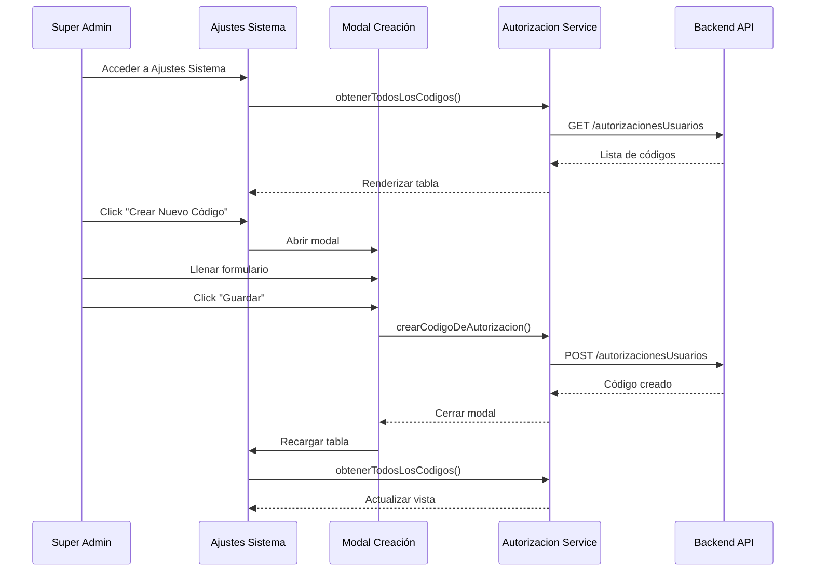
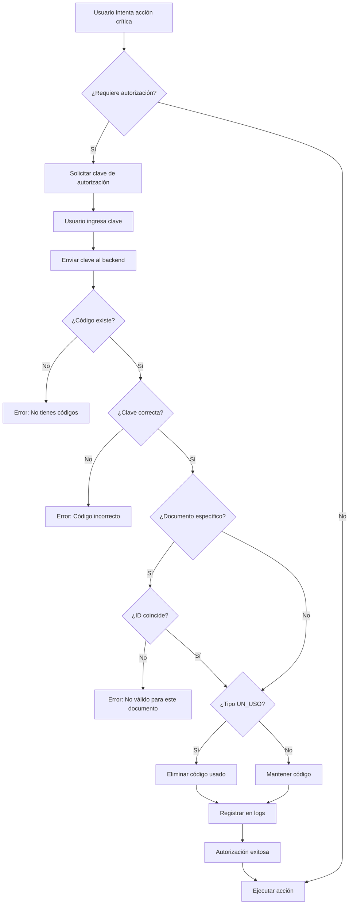

# Claves de Autorización de Usuario Simples

## Descripción

El sistema de **Claves de Autorización de Usuario Simples** permite crear y gestionar códigos numéricos de autorización asociados a usuarios específicos. Estos códigos permiten autorizar acciones críticas en el sistema de forma segura mediante una validación adicional.

### Características principales

-   **Códigos numéricos**: Claves numéricas hasheadas con bcrypt
-   **Asociados a usuarios**: Cada código pertenece a un usuario específico
-   **Tipos de código**: Permanentes o de un solo uso
-   **Usos específicos**: Definidos por tipo de acción que autorizan
-   **Trazabilidad**: Registro de creador y modificador
-   **Documentos específicos**: Opcional, para vincular a un documento concreto

<hr class='hr-principal'>

## Casos de Uso

### 1. Reservas en Almacén de Producto Terminado

Autorización para realizar reservas en el almacén de producto terminado.

### 2. Autorización de Líneas de Conteos

Autorización para aprobar o modificar líneas en conteos de inventario.

?> **EXTENSIBLE**: Se pueden agregar nuevos usos modificando `USOS_CODIGOS_NUMERICOS_AUTORIZACION` en `/carrduci-sys-api/utils/varios.js`

<hr class='hr-secundario'>

## Estructura del Sistema

### Backend (API)

#### Modelo de Datos

```javascript
{
    usuario: ObjectId,              // Usuario que usará la clave
    creador: ObjectId,              // Usuario que creó la clave
    modificador: ObjectId,          // Usuario que modificó la clave (opcional)
    clave: String,                  // Valor numérico hasheado (bcrypt)
    tipo: String,                   // 'PERMANENTE' | 'UN_USO'
    uso: String,                    // 'RESERVAS_ALMACEN_PRODUCTO_TERMINADO' | 'LINEAS_CONTEOS'
    documentoEspecifico: ObjectId,  // ID de documento específico (opcional)
    coleccionDocumentoEspecifico: String  // Nombre de colección (opcional)
}
```

#### Ubicación de Archivos

```
carrduci-sys-api/
├── models/supervision/
│   └── autorizacionDeUsuarioSimple.model.js
├── services/supervision/
│   └── autorizacionDeusuarioSimple.service.js
├── routes/supervision/
│   ├── autorizacionDeUsuarioSimple.route.js
│   └── autorizacionDeUsuarioSimple.controller.js
└── utils/
    └── varios.js  (contiene USOS_CODIGOS_NUMERICOS_AUTORIZACION)
```

### Frontend (GUI)

#### Ubicación de Archivos

```
carrduci-sys-gui/src/app/
└── services/supervision/autorizacion-usuario-simple/
    └── autorizacion-usuario-simple.service.ts
```

<hr class='hr-principal'>

## Implementación en el Backend (API)

### Contexto: Autenticación JWT

!> **IMPORTANTE**: En todas las rutas protegidas del sistema, el objeto `req.user` es poblado **automáticamente** por el middleware de autenticación JWT (`express-jwt`).

Este middleware:

1. Extrae el token JWT del header `Authorization: Bearer <token>`
2. Verifica y decodifica el token
3. Agrega la información del usuario autenticado a `req.user`

Por lo tanto, **NO necesitas** pasar manualmente `req.user` - ya está disponible en el contexto de la petición.

```javascript
// El middleware JWT ya se encarga de esto automáticamente:
// req.user = {
//     _id: '507f1f77bcf86cd799439012',
//     nombre: 'Juan Pérez',
//     email: 'juan@carrduci.com',
//     permissions: [...]
// }
```

### Paso 1: Crear un Código de Autorización

#### Ejemplo en un Controlador (Uso Real)

```javascript
// routes/supervision/autorizacionDeUsuarioSimple.controller.js
const SERVICIO_AUTORIZACION = require('../../services/supervision/autorizacionDeusuarioSimple.service');
const { response } = require('../../utils/response.utils');

class AutorizacionController {
    async crearCodigoParaUsuario(req, res) {
        try {
            // req.user YA ESTÁ DISPONIBLE gracias al middleware JWT
            // req.body contiene los datos enviados desde el frontend

            const RESPUESTA = await SERVICIO_AUTORIZACION.crearCodigoDeAutorizacion(
                req
            );
            // El servicio internamente usa:
            // - req.body.usuario (ID del usuario que usará el código)
            // - req.body.clave (código numérico)
            // - req.body.tipo ('PERMANENTE' o 'UN_USO')
            // - req.body.uso (tipo de autorización)
            // - req.user._id (ID del creador - automático)

            // Usar clase Resp de response.utils.js
            if (RESPUESTA.nuevo) {
                return new response(res, __filename, {
                    mensaje: 'Código de autorización creado',
                    datos: RESPUESTA.codigo
                })._201_created();
            } else {
                return new response(res, __filename, {
                    mensaje: 'Código de autorización existente sobreescrito',
                    datos: RESPUESTA.codigo
                })._200_ok();
            }
        } catch (error) {
            // Usar clase Resp de response.utils.js para errores
            return new response(res, __filename, {
                mensaje: 'Hubo un error al crear el código de autorización',
                error: error.message
            })._400_badRequest();
        }
    }
}

module.exports = AutorizacionController;
```

?> **PATRÓN DE RESPUESTAS**: El proyecto usa `response.utils.js` con métodos como `_200_ok()`, `_400_badRequest()`, etc. en lugar de `res.status()` directamente. Esto asegura respuestas consistentes y logging automático.

```javascript
// Importar response utils
const { response } = require('../../utils/response.utils');

// En el controlador
return new response(res, __filename, {
    mensaje: 'Operación exitosa',
    datos: resultado
})._200_ok();

return new response(res, __filename, {
    mensaje: 'Error en la operación',
    error: error.message
})._400_badRequest();
```

#### Ejemplo Directo (Para Testing)

```javascript
const SERVICIO_AUTORIZACION = require('./services/supervision/autorizacionDeusuarioSimple.service');

// Simulando el objeto req
const CODIGO = await SERVICIO_AUTORIZACION.crearCodigoDeAutorizacion({
	body: {
		usuario: '507f1f77bcf86cd799439011', // ID del usuario que USARÁ la clave
		clave: '1234', // Código numérico (se hasheará automáticamente)
		tipo: 'PERMANENTE',
		uso: 'RESERVAS_ALMACEN_PRODUCTO_TERMINADO',
	},
	user: {
		_id: '507f1f77bcf86cd799439012', // ID del usuario CREADOR (normalmente viene de req.user)
	},
});

// Crear código de un solo uso para un documento específico
const CODIGO_UN_USO = await SERVICIO_AUTORIZACION.crearCodigoDeAutorizacion({
	body: {
		usuario: '507f1f77bcf86cd799439011',
		clave: '5678',
		tipo: 'UN_USO',
		uso: 'LINEAS_CONTEOS',
		documentoEspecifico: '507f1f77bcf86cd799439013', // ID del conteo
		coleccionDocumentoEspecifico: 'conteos',
	},
	user: {
		_id: '507f1f77bcf86cd799439012',
	},
});
```

!> **IMPORTANTE**: Si ya existe un código con el mismo `usuario`, `tipo` y `uso`, se **sobrescribe** el código existente con la nueva clave. Esto permite actualizar códigos sin necesidad de eliminarlos primero.

### Paso 2: Validar un Código

```javascript
// Validar código por ID de usuario
try {
	const MENSAJE = await SERVICIO_AUTORIZACION.comprobarCodigo(
		'507f1f77bcf86cd799439011', // ID del usuario
		'1234', // Código a validar
		'RESERVAS_ALMACEN_PRODUCTO_TERMINADO' // Uso
	);

	console.log(MENSAJE);
	// Output: "Autorización disparada por: Juan Pérez. El código fue expedido por Admin Sistema"
} catch (error) {
	console.error(error);
	// Output: "Código incorrecto"
}

// Validar código por email
try {
	const MENSAJE = await SERVICIO_AUTORIZACION.comprobarCodigoPorEmail(
		'usuario@carrduci.com',
		'1234',
		'RESERVAS_ALMACEN_PRODUCTO_TERMINADO'
	);
} catch (error) {
	console.error(error);
}

// Validar código con documento específico
try {
	const MENSAJE = await SERVICIO_AUTORIZACION.comprobarCodigo(
		'507f1f77bcf86cd799439011',
		'5678',
		'LINEAS_CONTEOS',
		null, // email (opcional)
		'507f1f77bcf86cd799439013' // ID del documento a validar
	);
} catch (error) {
	console.error(error);
	// Output: "No se puede usar el código con este elemento."
}
```

?> **ELIMINACIÓN AUTOMÁTICA**: Los códigos de tipo `'UN_USO'` se eliminan automáticamente después de ser validados correctamente.

### Paso 3: Obtener Todos los Códigos

```javascript
const CODIGOS = await SERVICIO_AUTORIZACION.obtenerTodosLosCodigos();

// Retorna códigos sin información sensible (claves hasheadas removidas)
console.log(CODIGOS);
/*
[
    {
        _id: '507f1f77bcf86cd799439014',
        usuario: {
            _id: '507f1f77bcf86cd799439011',
            nombre: 'Juan Pérez'
        },
        creador: {
            _id: '507f1f77bcf86cd799439012',
            nombre: 'Admin Sistema'
        },
        tipo: 'PERMANENTE',
        uso: 'RESERVAS_ALMACEN_PRODUCTO_TERMINADO',
        createdAt: '2024-07-19T10:30:00.000Z',
        updatedAt: '2024-07-19T10:30:00.000Z'
    }
]
*/
```

### Paso 4: Eliminar un Código

```javascript
const CODIGO_ELIMINADO = await SERVICIO_AUTORIZACION.eliminarCodigoPorId({
	params: {
		id: '507f1f77bcf86cd799439014',
	},
});
```

### Rutas de la API

| Método   | Ruta                                                     | Permiso                                  | Descripción                            |
| -------- | -------------------------------------------------------- | ---------------------------------------- | -------------------------------------- |
| `POST`   | `/autorizacionesUsuarios`                                | `SUPER_ADMIN`                            | Crear código de autorización           |
| `GET`    | `/autorizacionesUsuarios`                                | `SUPER_ADMIN`                            | Obtener todos los códigos              |
| `DELETE` | `/autorizacionesUsuarios/:id`                            | `SUPER_ADMIN`                            | Eliminar código por ID                 |
| `POST`   | `/autorizacionesUsuarios/crearCodigoUsoUnicoParaConteos` | `conteos:acciones:crearCodigoDeAprobado` | Crear código de uso único para conteos |

<hr class='hr-secundario'>

## Implementación en el Frontend (GUI)

### Servicio Angular

```typescript
import { AutorizacionUsuarioSimpleService } from 'src/app/services/supervision/autorizacion-usuario-simple/autorizacion-usuario-simple.service';

export class MiComponente {
	constructor(
		private autorizacionService: AutorizacionUsuarioSimpleService
	) {}

	// Crear código permanente
	crearCodigoPermanente() {
		this.autorizacionService
			.crearCodigoDeAutorizacion(
				'507f1f77bcf86cd799439011', // ID usuario
				1234, // Clave numérica
				'PERMANENTE',
				'RESERVAS_ALMACEN_PRODUCTO_TERMINADO'
			)
			.subscribe({
				next: (respuesta) => {
					console.log('Código creado:', respuesta);
				},
				error: (error) => {
					console.error('Error:', error);
				},
			});
	}

	// Crear código de un solo uso
	crearCodigoUnUso() {
		this.autorizacionService
			.crearCodigoDeAutorizacion(
				'507f1f77bcf86cd799439011',
				5678,
				'UN_USO',
				'LINEAS_CONTEOS'
			)
			.subscribe({
				next: (respuesta) => {
					console.log('Código creado:', respuesta);
				},
			});
	}

	// Crear código de uso único para conteos
	crearCodigoConteo(idConteo: string) {
		this.autorizacionService
			.crearCodigoUsoUnicoParaConteos(
				'507f1f77bcf86cd799439011',
				9999,
				idConteo
			)
			.subscribe({
				next: (respuesta) => {
					console.log('Código para conteo creado:', respuesta);
				},
			});
	}

	// Obtener todos los códigos
	listarCodigos() {
		this.autorizacionService.obtenerTodosLosCodigos().subscribe({
			next: (codigos) => {
				console.log('Códigos registrados:', codigos);
			},
		});
	}

	// Eliminar código
	eliminarCodigo(id: string) {
		this.autorizacionService.eliminarCodigoPorId(id).subscribe({
			next: (respuesta) => {
				console.log('Código eliminado:', respuesta);
			},
		});
	}
}
```

### Ejemplo de Uso en Componente

```typescript
import { Component } from '@angular/core';
import { AutorizacionUsuarioSimpleService } from 'src/app/services/supervision/autorizacion-usuario-simple/autorizacion-usuario-simple.service';
import { ManejoDeMensajesService } from 'src/app/services/utilidades/manejo-de-mensajes.service';

@Component({
	selector: 'app-gestionar-autorizaciones',
	templateUrl: './gestionar-autorizaciones.component.html',
})
export class GestionarAutorizacionesComponent {
	codigos: any[] = [];

	constructor(
		private autorizacionService: AutorizacionUsuarioSimpleService,
		private msjService: ManejoDeMensajesService
	) {}

	ngOnInit() {
		this.cargarCodigos();
	}

	cargarCodigos() {
		this.autorizacionService.obtenerTodosLosCodigos().subscribe({
			next: (codigos) => {
				this.codigos = codigos;
			},
		});
	}

	crearNuevoCodigo(
		idUsuario: string,
		clave: number,
		tipo: 'PERMANENTE' | 'UN_USO',
		uso: string
	) {
		this.autorizacionService
			.crearCodigoDeAutorizacion(idUsuario, clave, tipo, uso)
			.subscribe({
				next: () => {
					this.cargarCodigos(); // Recargar lista
				},
			});
	}

	eliminar(id: string) {
		this.msjService.confirmarAccion(
			'¿Eliminar código de autorización?',
			'Esta acción no se puede deshacer',
			() => {
				this.autorizacionService.eliminarCodigoPorId(id).subscribe({
					next: () => {
						this.cargarCodigos(); // Recargar lista
					},
				});
			}
		);
	}
}
```

### Vista (HTML)

```html
<div class="container">
	<h2>Gestión de Códigos de Autorización</h2>

	<div class="row">
		<div class="col-12">
			<table class="table">
				<thead>
					<tr>
						<th>Usuario</th>
						<th>Tipo</th>
						<th>Uso</th>
						<th>Creador</th>
						<th>Fecha Creación</th>
						<th>Acciones</th>
					</tr>
				</thead>
				<tbody>
					<tr *ngFor="let codigo of codigos">
						<td>{{ codigo.usuario?.nombre }}</td>
						<td>
							<span
								class="badge"
								[ngClass]="{
                                    'badge-success': codigo.tipo === 'PERMANENTE',
                                    'badge-warning': codigo.tipo === 'UN_USO'
                                }"
							>
								{{ codigo.tipo }}
							</span>
						</td>
						<td>{{ codigo.uso }}</td>
						<td>{{ codigo.creador?.nombre }}</td>
						<td>{{ codigo.createdAt | date:'short' }}</td>
						<td>
							<button
								class="btn btn-sm btn-danger"
								(click)="eliminar(codigo._id)"
							>
								<i class="fas fa-trash"></i>
								Eliminar
							</button>
						</td>
					</tr>
				</tbody>
			</table>
		</div>
	</div>
</div>
```

<hr class='hr-principal'>

## Ejemplo Completo: Validación en Conteos

### Backend - Servicio de Conteos

```javascript
const AUTORIZACION_USUARIO = require('../supervision/autorizacionDeusuarioSimple.service');
const { USOS_CODIGOS_NUMERICOS_AUTORIZACION } = require('../../utils/varios');

class ConteosService {
    async aprobarLineaConteo(req) {
        const CLAVE_CONFIRMAR = req.body.clave;
        const MOTIVO_AUTORIZACION = req.body.motivoAutorizacion;
        const ID_CONTEO = req.body.idConteo;

        if (!MOTIVO_AUTORIZACION) {
            throw 'Se requiere un motivo de autorización.';
        }

        // Validar código de autorización
        const MENSAJE_AUTORIZACION = await AUTORIZACION_USUARIO.comprobarCodigo(
            req.user._id,
            CLAVE_CONFIRMAR,
            USOS_CODIGOS_NUMERICOS_AUTORIZACION.LINEAS_CONTEOS,
            null,
            ID_CONTEO // Valida que el código sea para este conteo específico
        );

        console.log(MENSAJE_AUTORIZACION);
        // Output: "Autorización disparada por: Juan Pérez. Era de un uso, así que se eliminó el código usado. El código fue expedido por Supervisor Conteos."

        // Continuar con la lógica de aprobación...
        // ...
    }
}

module.exports = ConteosService;
```

### Controlador - Crear Nueva Instancia

```javascript
const ConteosService = require('../services/conteos/conteos.service');

class ConteosController {
    async aprobarLinea(req, res) {
        try {
            // Crear nueva instancia del servicio para evitar race conditions
            const conteosService = new ConteosService();

            const resultado = await conteosService.aprobarLineaConteo(req);
            return new response(res, __filename, {
                mensaje: 'Línea aprobada correctamente',
                datos: resultado
            })._200_ok();
        } catch (error) {
            return new response(res, __filename, {
                mensaje: 'Error al aprobar línea',
                error: error.message
            })._400_badRequest();
        }
    }
}

module.exports = ConteosController;
```

### Frontend - Componente de Conteos

```typescript
import { Component } from '@angular/core';
import { ConteosService } from 'src/app/services/conteos/conteos.service';
import { ManejoDeMensajesService } from 'src/app/services/utilidades/manejo-de-mensajes.service';

@Component({
	selector: 'app-aprobar-conteo',
	templateUrl: './aprobar-conteo.component.html',
})
export class AprobarConteoComponent {
	claveAutorizacion: number;
	motivoAutorizacion: string;

	constructor(
		private conteosService: ConteosService,
		private msjService: ManejoDeMensajesService
	) {}

	aprobarLinea(idConteo: string, idLinea: string) {
		if (!this.claveAutorizacion) {
			this.msjService.mostrarAdvertencia(
				'Ingrese su clave de autorización'
			);
			return;
		}

		if (!this.motivoAutorizacion) {
			this.msjService.mostrarAdvertencia(
				'Ingrese el motivo de autorización'
			);
			return;
		}

		this.conteosService
			.aprobarLinea({
				idConteo: idConteo,
				idLinea: idLinea,
				clave: this.claveAutorizacion,
				motivoAutorizacion: this.motivoAutorizacion,
			})
			.subscribe({
				next: (respuesta) => {
					this.msjService.mostrarExito(
						'Línea aprobada correctamente'
					);
					this.claveAutorizacion = null;
					this.motivoAutorizacion = '';
				},
				error: (error) => {
					// El error mostrará "Código incorrecto" o detalles específicos
					this.msjService.mostrarError(error);
				},
			});
	}
}
```

```html
<div class="modal-body">
	<h4>Aprobar Línea de Conteo</h4>

	<div class="form-group">
		<label>Motivo de Autorización *</label>
		<textarea
			class="form-control"
			[(ngModel)]="motivoAutorizacion"
			rows="3"
			placeholder="Explique por qué autoriza esta acción"
		></textarea>
	</div>

	<div class="form-group">
		<label>Clave de Autorización *</label>
		<input
			type="password"
			class="form-control"
			[(ngModel)]="claveAutorizacion"
			placeholder="Ingrese su código numérico"
		/>
		<small class="form-text text-muted">
			Solo personal autorizado puede aprobar líneas de conteo
		</small>
	</div>

	<button
		class="btn btn-success"
		(click)="aprobarLinea(conteo._id, linea._id)"
	>
		<i class="fas fa-check"></i>
		Aprobar Línea
	</button>
</div>
```

<hr class='hr-principal'>

## Administración de Claves (Solo SUPER_ADMIN)

### Ubicación en la Aplicación

Las claves de autorización se administran desde:

```
🔐 Ajustes del Sistema → Claves de Autorización de Usuarios
```

**Ruta del componente**: `/ajustes-sistema`  
**Permiso requerido**: `SUPER_ADMIN`

### Interfaz de Administración


La interfaz de administración muestra:

#### **Tabla de Códigos Existentes**

| Columna                  | Descripción                                |
| ------------------------ | ------------------------------------------ |
| **Usuario**              | Usuario que usará el código                |
| **Creador**              | Usuario que creó el código                 |
| **Modificador**          | Usuario que modificó el código (si aplica) |
| **Tipo**                 | `PERMANENTE` o `UN USO`                    |
| **Uso**                  | Tipo de autorización que otorga            |
| **Documento Específico** | SI/NO (si está vinculado a un documento)   |
| **Colección**            | Colección del documento (si aplica)        |
| **Fecha Creación**       | Timestamp de creación                      |
| **Última Edición**       | Timestamp de última modificación           |

#### **Botón "Crear Nuevo Código"**

Al hacer clic en "Crear Nuevo Código", se abre un modal con el formulario:

**Campos del formulario**:

1. **Usuario**: Seleccionar el usuario que usará el código
2. **Clave Numérica**: Código numérico de 4-8 dígitos
3. **Tipo**: Seleccionar entre:
    - `PERMANENTE` - Uso ilimitado
    - `UN_USO` - Se elimina tras usarse
4. **Uso**: Seleccionar el tipo de autorización:
    - `RESERVAS_ALMACEN_PRODUCTO_TERMINADO`
    - `LINEAS_CONTEOS`
    - (Otros usos configurados)

#### **Botón "Revocar" por Código**

Cada fila en la tabla tiene un botón "Revocar" que permite eliminar el código de autorización.

### Componente de Administración

#### Ubicación de Archivos

```
carrduci-sys-gui/src/app/components/ajustes/
├── ajustes-sistema/
│   ├── ajustes-sistema.component.ts
│   ├── ajustes-sistema.component.html
│   └── ajustes-sistema.component.css
└── ajustes-formulario-creacion-codigo-autorizacion/
    ├── ajustes-formulario-creacion-codigo-autorizacion.component.ts
    ├── ajustes-formulario-creacion-codigo-autorizacion.component.html
    └── ajustes-formulario-creacion-codigo-autorizacion.component.css
```

#### Código del Componente

```typescript
// ajustes-sistema.component.ts (fragmento)
import { AutorizacionUsuarioSimpleService } from 'src/app/services/supervision/autorizacion-usuario-simple/autorizacion-usuario-simple.service';

export class AjustesSistemaComponent {
	todosLosCodigosDeAutorizacion: {
		usuario: Usuario;
		createdAt: Date;
		updatedAt: Date;
	}[];

	constructor(
		private AutorizacionUsuarioSimpleService: AutorizacionUsuarioSimpleService
	) {}

	ngOnInit(): void {
		if (this.contieneElPermiso.transform('SUPER_ADMIN')) {
			this.obtenerListaDeCoodigosDeAutorizacionExistentes();
		}
	}

	// Abrir modal de creación
	abrirModalCreacionCodigo() {
		this.modalCearCodigosDeSeguridad.mostrarModal();
		this.mostrandoModal = true;
	}

	// Crear nuevo código
	crearCodigo(formulario: FormularioCreacionCodigo) {
		this.AutorizacionUsuarioSimpleService.crearCodigoDeAutorizacion(
			formulario.usuario,
			formulario.clave,
			formulario.tipo,
			formulario.uso
		).subscribe((_) => {
			this.modalCearCodigosDeSeguridad.ocultarModal();
			this.mostrandoModal = false;
			this.obtenerListaDeCoodigosDeAutorizacionExistentes();
		});
	}

	// Eliminar/Revocar código
	revocarCodigo(datosCodigo: any) {
		this.AutorizacionUsuarioSimpleService.eliminarCodigoPorId(
			datosCodigo._id
		).subscribe((_) => {
			this.obtenerListaDeCoodigosDeAutorizacionExistentes();
		});
	}

	// Obtener todos los códigos
	obtenerListaDeCoodigosDeAutorizacionExistentes() {
		this.AutorizacionUsuarioSimpleService.obtenerTodosLosCodigos().subscribe(
			(codigos) => {
				this.todosLosCodigosDeAutorizacion = codigos;
				this.crearTablaGenerica();
			}
		);
	}

	// Crear estructura de tabla genérica
	crearTablaGenerica() {
		this.datosColumnas = [
			{
				titulo: 'usuario',
				campoCelda: {
					funcion: (datosClave) =>
						datosClave.usuario?.nombre || 'Usuario Desconocido',
				},
			},
			{
				titulo: 'tipo',
				campoCelda: {
					funcion: (datosClave) =>
						datosClave.tipo.split('_').join(' '),
				},
			},
			{
				titulo: 'uso',
				campoCelda: {
					funcion: (datosClave) =>
						datosClave.uso.split('_').join(' '),
				},
			},
			// ... más columnas
		];

		this.datosTabla = this.tablaGenericaService.generarEstructura(
			'No se ha encontrado ningún código de usuario',
			this.todosLosCodigosDeAutorizacion,
			this.datosColumnas,
			{
				botones: this.botonesTablaCodigosUsuarios,
				alineacionBotones: 'right',
			}
		);
	}
}
```

### Flujo de Creación de Código



### Permisos Necesarios

!> **CRÍTICO**: Solo usuarios con permiso `SUPER_ADMIN` pueden:

-   Ver la lista de códigos de autorización
-   Crear nuevos códigos
-   Revocar códigos existentes

El componente verifica el permiso en `ngOnInit()`:

```typescript
if (this.contieneElPermiso.transform('SUPER_ADMIN')) {
	this.obtenerListaDeCoodigosDeAutorizacionExistentes();
}
```

### Validaciones en el Formulario

El formulario de creación incluye:

-   **Usuario**: Campo requerido (select con lista de usuarios)
-   **Clave**: Campo requerido, solo números
-   **Tipo**: Campo requerido (PERMANENTE o UN_USO)
-   **Uso**: Campo requerido (lista de usos disponibles)

### Mensajes de Confirmación

-   **Crear código**: "Código de autorización creado exitosamente"
-   **Revocar código**: "Código de autorización eliminado"
-   **Error**: Mensajes específicos del servicio de manejo de mensajes

<hr class='hr-secundario'>

## Agregar Nuevos Usos

### Paso 1: Definir el Nuevo Uso

Edita `/carrduci-sys-api/utils/varios.js`:

```javascript
const USOS_CODIGOS_NUMERICOS_AUTORIZACION = {
	RESERVAS_ALMACEN_PRODUCTO_TERMINADO: 'RESERVAS_ALMACEN_PRODUCTO_TERMINADO',
	LINEAS_CONTEOS: 'LINEAS_CONTEOS',
	// Agregar nuevo uso
	ELIMINAR_ORDENES: 'ELIMINAR_ORDENES',
	MODIFICAR_PRECIOS: 'MODIFICAR_PRECIOS',
};
```

### Paso 2: Usar el Nuevo Código

```javascript
// Backend - Servicio con clase
const AUTORIZACION_USUARIO = require('../supervision/autorizacionDeusuarioSimple.service');
const { USOS_CODIGOS_NUMERICOS_AUTORIZACION } = require('../../utils/varios');

class OrdenesService {
    async eliminarOrden(req) {
        const CLAVE_CONFIRMAR = req.body.clave;
        const ID_ORDEN = req.params.id;

        // Validar autorización
        await AUTORIZACION_USUARIO.comprobarCodigo(
            req.user._id,
            CLAVE_CONFIRMAR,
            USOS_CODIGOS_NUMERICOS_AUTORIZACION.ELIMINAR_ORDENES
        );

        // Proceder con eliminación...
        // ...
    }
}

module.exports = OrdenesService;
```

```javascript
// Backend - Controlador
const OrdenesService = require('../services/ordenes/ordenes.service');
const { response } = require('../../utils/response.utils');

class OrdenesController {
    async eliminarOrden(req, res) {
        try {
            // Crear nueva instancia del servicio para evitar race conditions
            const ordenesService = new OrdenesService();

            const resultado = await ordenesService.eliminarOrden(req);
            return new response(res, __filename, {
                mensaje: 'Orden eliminada correctamente',
                datos: resultado
            })._200_ok();
        } catch (error) {
            return new response(res, __filename, {
                mensaje: 'Error al eliminar orden',
                error: error.message
            })._400_badRequest();
        }
    }
}

module.exports = OrdenesController;
```

```typescript
// Frontend - Crear código del nuevo tipo
this.autorizacionService
	.crearCodigoDeAutorizacion(
		idUsuario,
		1234,
		'PERMANENTE',
		'ELIMINAR_ORDENES'
	)
	.subscribe({
		next: (respuesta) => {
			console.log('Código para eliminar órdenes creado');
		},
	});
```

<hr class='hr-secundario'>

## Mejores Prácticas

### 1. Seguridad

✅ **HACER**:

-   Siempre usar `bcrypt` para hashear las claves (se hace automáticamente)
-   Validar permisos antes de crear códigos (solo `SUPER_ADMIN`)
-   Usar códigos de `'UN_USO'` para acciones críticas puntuales
-   Registrar siempre el `creador` y `modificador`

❌ **NO HACER**:

-   No almacenar claves en texto plano
-   No compartir claves por canales inseguros
-   No reutilizar códigos de un solo uso

### 2. Trazabilidad

```javascript
// El sistema automáticamente registra:
- Quién creó el código (creador)
- Quién lo modificó (modificador)
- Cuándo se usó (logs en servidor)
- Quién lo usó (usuario asociado)
```

### 3. Tipos de Código

**`PERMANENTE`**:

-   Para autorizaciones recurrentes
-   El usuario puede usar el código múltiples veces
-   Se debe cambiar periódicamente por seguridad

**`UN_USO`**:

-   Para autorizaciones puntuales
-   Se elimina automáticamente después de usarse
-   Ideal para aprobar documentos específicos

### 4. Documentos Específicos

```javascript
// Vincular código a un documento específico
{
    documentoEspecifico: '507f1f77bcf86cd799439013',
    coleccionDocumentoEspecifico: 'conteos'
}

// Al validar, el sistema verificará que el código
// solo funcione con ese documento en particular
```

<hr class='hr-principal'>

## Manejo de Errores

### Errores Comunes

| Error                                            | Causa                                    | Solución                                  |
| ------------------------------------------------ | ---------------------------------------- | ----------------------------------------- |
| `"Se requiere el código numérico"`               | No se proporcionó la clave               | Enviar `clave` en el body                 |
| `"Se requiere el id del usuario"`                | No se proporcionó usuario                | Enviar `usuario` en el body               |
| `"Código incorrecto"`                            | La clave no coincide                     | Verificar que la clave sea correcta       |
| `"No tienes ningún código numérico autorizado"`  | El usuario no tiene códigos para ese uso | Crear un código primero                   |
| `"No se puede usar el código con este elemento"` | El código es para otro documento         | Usar el código correcto para el documento |

### Ejemplo de Manejo

```typescript
aprobar() {
    this.conteosService.aprobarLinea(datos).subscribe({
        next: (respuesta) => {
            this.msjService.mostrarExito(respuesta.mensaje);
        },
        error: (error) => {
            // El servicio de mensajes mostrará automáticamente el error
            // "Código incorrecto", "No autorizado", etc.
            if (error.status === 401) {
                this.msjService.mostrarError('No tienes autorización para esta acción');
            }
        }
    });
}
```

<hr class='hr-principal'>

## Diagrama de Flujo



<hr class='hr-secundario'>

## Notas Adicionales

### Ubicación de Imágenes

Si necesitas agregar capturas de pantalla o diagramas a esta documentación:

```bash
/carrduci_sys_workspace/documentacion_sistemas/assets/
└── claves-autorizacion/
    ├── crear-codigo.png
    ├── validar-codigo.png
    ├── lista-codigos.png
    └── error-codigo-incorrecto.png
```

Para usar las imágenes en esta documentación:

```markdown


```

### Consideraciones de Rendimiento

-   Las claves se hashean con bcrypt (factor 12)
-   La validación requiere comparación con bcrypt (proceso costoso)
-   Se recomienda limitar intentos de validación
-   Los códigos `'UN_USO'` se eliminan inmediatamente tras validarse

### Auditoría

El sistema registra automáticamente en logs:

-   Cuándo se crea un código
-   Quién lo crea
-   Cuándo se usa un código
-   Quién lo usa
-   Si era de un solo uso y se eliminó

Revisar logs del servidor para auditoría completa:

```bash
# En el servidor
tail -f /path/to/carrduci-sys-api/logs/app.log | grep "Autorización disparada"
```

<hr class='hr-principal'>

## Resumen

El sistema de **Claves de Autorización de Usuario Simples** proporciona:

✅ **Seguridad**: Códigos hasheados con bcrypt  
✅ **Flexibilidad**: Permanentes o de un solo uso  
✅ **Trazabilidad**: Registro completo de creación y uso  
✅ **Extensibilidad**: Fácil agregar nuevos usos  
✅ **Granularidad**: Códigos por usuario y por acción  
✅ **Control**: Vincular códigos a documentos específicos

Este sistema es ideal para autorizar acciones críticas que requieren doble validación, manteniendo un registro completo de quién autorizó qué y cuándo.

?> **IMPORTANTE**: Recuerda que tanto servicios como controladores del API deben usar clases con métodos de instancia, y cada método debe crear nuevas instancias para evitar race conditions entre requests concurrentes.

```javascript
// ❌ INCORRECTO - Patrón antiguo
const SERVICIO = {};
SERVICIO.metodo = function() { ... };

// ✅ CORRECTO - Patrón CARRDUCI
class Servicio {
    async metodo() { ... }
}

class Controlador {
    async metodo(req, res) {
        // Crear nueva instancia del servicio
        const servicio = new Servicio();
        const resultado = await servicio.metodo();

        // Usar response.utils.js para respuestas
        return new response(res, __filename, {
            mensaje: 'Operación exitosa',
            datos: resultado
        })._200_ok();
    }
}
```
