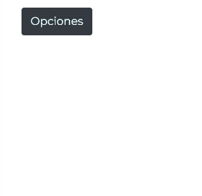
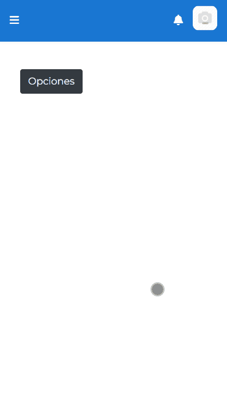

# Flotante genérico

[¿Qué son las directivas?](https://angular.dev/guide/directives)

El flotante genérico es una directiva que permite generar un recuadro posicionado de 4 formas posibles en base a un elemento HTML cualquiera, que puede configurarse para mostrarse al posicionar el mouse en el elemento, al darle click, o con un disparador externo.

!> Esta directiva es demasiado compleja, y sería mejor seccionar la lógica de manipulación de DOM a un componente y otras directivas más simples. Es algo que se debería hacer a futuro.

Importar el módulo de la directiva en el componente donde se desa usar.

```ts
@NgModule({
    declarations: [ComponenteTalComponent],
    imports: [
        CommonModule,
        FlotanteGenericoModule
        // ...
    ],
    exports: [ComponenteTalComponent],
    providers: [ComponenteTalComponent]
})
export class ComponenteTalModule {}
```

Explicación de las propiedades.

| PROPIEDAD                                   | I/O    | TIPO                                                              | VALORES ACEPTADOS                                                                                                               | DESCRIPCIÓN                                                                                                                                                                                                                                                                                                                  |
| ------------------------------------------- | ------ | ----------------------------------------------------------------- | ------------------------------------------------------------------------------------------------------------------------------- | ---------------------------------------------------------------------------------------------------------------------------------------------------------------------------------------------------------------------------------------------------------------------------------------------------------------------------- |
| `[flotante-generico]` / `flotante-generico` | INPUT  | string                                                            | Vacío o cualquier cadena.                                                                                                       | Es el selector que inserta la directiva en el elemnto. Se le puede pasar texto (o html como texto plano) ocasionando que el flotante actúe como tooltip.                                                                                                                                                                     |
| `[backgroundColor]`                         | INPUT  | string                                                            | Cadena de texto para definir [colores](./docs/carrduci-sys-desarrollo/css/colores-css.md). Por defecto `'rgba(0, 0, 0, .5)'`.   | Permite definir el color que tendrá el fondo del flotante.                                                                                                                                                                                                                                                                   |
| `[colorBorde]`                              | INPUT  | objeto                                                            | Objeto del tipo `{color: string, ancho: string, estilo: string}`.                                                               | Permite definir el color, ancho y estilo del borde del flotante.                                                                                                                                                                                                                                                             |
| `[textColor]`                               | INPUT  | string                                                            | Cadena de texto para definir [colores](./docs/carrduci-sys-desarrollo/css/colores-css.md). Por defecto `'white'`.               | Permite definir el color del texto del flotante.                                                                                                                                                                                                                                                                             |
| `[padding]`                                 | INPUT  | string                                                            | Cadena de texto para indicar [dimensión](./docs/carrduci-sys-desarrollo/css/valores-dimensiones-css.md). Por defecto `'5px'`.   | Indica el espacio interno entre el borde del contenedor y el contenido.                                                                                                                                                                                                                                                      |
| `[mostrarConClick]`                         | INPUT  | boolean                                                           | `true`, `false`.                                                                                                                | Si se usa como `true`, el flotante solo se mostrará hasta dar click en el elemento.                                                                                                                                                                                                                                          |
| `[noUsarHover]`                             | INPUT  | boolean                                                           | `true`, `false`.                                                                                                                | Si se marca como `true`, el flotante no se mostrará al pasar el mouse encima. Usar en combinación con `[mostrarConClick]`.                                                                                                                                                                                                   |
| `[maxWidth]`                                | INPUT  | string                                                            | Cadena de texto para indicar [dimensión](./docs/carrduci-sys-desarrollo/css/valores-dimensiones-css.md). Por defecto `'20dvw'`. | Indica el ancho máximo al que se puede expandir el flotante.                                                                                                                                                                                                                                                                 |
| `[minWidth]`                                | INPUT  | string                                                            | Cadena de texto para indicar [dimensión](./docs/carrduci-sys-desarrollo/css/valores-dimensiones-css.md). Por defecto `'20dvw'`. | Indica el ancho mínimo que puede tener el flotante.                                                                                                                                                                                                                                                                          |
| `[maxHeight]`                               | INPUT  | string                                                            | Cadena de texto para indicar [dimensión](./docs/carrduci-sys-desarrollo/css/valores-dimensiones-css.md). Por defecto `'20dvw'`. | Infica el alto máximo al que puede crecer el flotante.                                                                                                                                                                                                                                                                       |
| `[minHeight]`                               | INPUT  | string                                                            | Cadena de texto para indicar [dimensión](./docs/carrduci-sys-desarrollo/css/valores-dimensiones-css.md). Por defecto `'20dvw'`. | Indica el alto mínimo que tendrá el flotante.                                                                                                                                                                                                                                                                                |
| `[posicion]`                                | INPUT  | string                                                            | `'top'`, `'bottom'`, `'left'`, `'right'`.                                                                                       | Indica en qué lado del elemento padre se posicionará el flotante.                                                                                                                                                                                                                                                            |
| `[template]`                                | INPUT  | TemplateRef                                                       | Una referencia a una plantilla de Ángular.                                                                                      | Permite pasar una plantilla de Ángular para ser renderizada en el flotante.                                                                                                                                                                                                                                                  |
| `[contextoTemplate]`                        | INPUT  | objeto                                                            | Cualquier objeto.                                                                                                               | Es para enviar un objeto con cualquier información que se quiera usar en la plantilla que se inserta en el flotante.                                                                                                                                                                                                         |
| `[mostrarFlotante]`                         | INPUT  | [`truthy`](https://lenguajejs.com/javascript/tipos/falsy-truthy/) | Un valor que evalúe a verdadero o falso.                                                                                        | Se evalúa esta opción cada vez que cambia el valor que se usa. Si el valor evalúa a verdadero, se mostrará el flotante.                                                                                                                                                                                                      |
| `[ocultarFlotante]`                         | INPUT  | [`truthy`](https://lenguajejs.com/javascript/tipos/falsy-truthy/) | Un valor que evalúe a verdadero o falso.                                                                                        | Se evalúa esta opción cada vez que cambia el valor que se usa. Si el valor evalúa a verdadero, el flotante se ocultará.                                                                                                                                                                                                      |
| `[forzarFlotanteDentroDeContenedor]`        | INPUT  | boolean                                                           | `true`, `false`.                                                                                                                | Si es verdadero, el elemento `<div>` del flotante se generará adentro del elemento donde se colocó el selector de la directiva.                                                                                                                                                                                              |
| `[correccionZIndex]`                        | INPUT  | number                                                            | Cualquier número.                                                                                                               | El valor que se ingrese aquí se sumará al atributo [`z-index`](https://developer.mozilla.org/es/docs/Web/CSS/z-index) del flotante.                                                                                                                                                                                          |
| `[definirScrollMaximoAutomatico]`           | INPUT  | boolean                                                           | `true`, `false`.                                                                                                                | <span style="color: red; font-weight: 900">DEPRECADO</span>. Ya no se usa.                                                                                                                                                                                                                                                   |
| `[clasesRecuadro]`                          | INPUT  | string                                                            | Nombres de clases css separados por espacios.                                                                                   | Permite estilizar el flotante usando clases de css existentes en el contexto de la GUI.                                                                                                                                                                                                                                      |
| `[noEliminar]`                              | INPUT  | boolean                                                           | `true`, `false`.                                                                                                                | Cuando un flotante se oculta, el elemento se destruye. Si esta opción se activa, una vez que el flotante se genere al aparecer la primera vez, ya no se volverá a destruir. Esto puede ser útil cuando se tiene un formulario dentro del flotante y no se desea que se pierda la información escrita al ocultar el flotante. |
| `[leerCambiosManualmente]`                  | INPUT  | [`truthy`](https://lenguajejs.com/javascript/tipos/falsy-truthy/) | Un valor que evalúe a verdadero o falso.                                                                                        | Se evalúa esta opción cada vez que cambia el valor que se usa. Si el valor evalúa a verdadero, se detectarán los cambios del contenido.                                                                                                                                                                                      |
| `[dispararPosicionamiento]`                 | INPUT  | [`truthy`](https://lenguajejs.com/javascript/tipos/falsy-truthy/) | Un valor que evalúe a verdadero o falso.                                                                                        | Se evalúa esta opción cada vez que cambia el valor que se usa. Si el valor evalúa a verdadero, se ejecutará la función que posiciona el flotante.                                                                                                                                                                            |
| `[noCerrarConClicksExternos]`               | INPUT  | boolean                                                           | `true`, `false`.                                                                                                                | Si esta opción es verdadera, el flotante no se va a cerrar al dar click afuera del mismo, si no con un botón que dice "Cerrar" que aparecerá en el pié. Este pié siempre será visible aunque el scroll esté presente.                                                                                                        |
| `[encabezado]`                              | INPUT  | string                                                            | Cualquer cadena de texto.                                                                                                       | Se le puede pasar texto (o html como texto plano) que será renderizado como html. Esto genera un encabezado en el flotante, separado por una línea y que siempre será visible aunque el scroll esté presente. Siempre se debe usar junto a la opción `[usarEncabezado]`.                                                     |
| `[usarEncabezado]`                          | INPUT  | boolean                                                           | `true`, `false`.                                                                                                                | Indica si se va a mostrar o no el encabezado que se proveyó en `[encabezado]`.                                                                                                                                                                                                                                               |
| `(idContenedor)`                            | OUTPUT | string                                                            |                                                                                                                                 | Emite el id de HTML del contenedor flotante.                                                                                                                                                                                                                                                                                 |
| `(idContenido)`                             | OUTPUT | string                                                            |                                                                                                                                 | Emite el id de HTML del contenedor interno del flotante. Algo así como el body del flotante.                                                                                                                                                                                                                                 |
| `(flotanteDestruido)`                       | OUTPUT | void                                                              |                                                                                                                                 | Genera una emisión vacía cuando el flotante se destruye. No emite nada si la opción `[noEliminar]` es verdadera. Puede servir para ejecutar alguna lógica cuando se destruye el flotante.                                                                                                                                    |
| `(finDeAnimacion)`                          | OUTPUT | void                                                              |                                                                                                                                 | Genera una emisión vacía cuando termina la animación de apertura del flotante. Puede servir para ejecutar alguna lógica cuando se destruye el flotante.                                                                                                                                                                      |
| `(inicioDeAnimacion)`                       | OUTPUT | void                                                              |                                                                                                                                 | Genera una emisión vacía cuando comienza la animación de apertura del flotante. Puede servir para ejecutar alguna lógica cuando se destruye el flotante.                                                                                                                                                                     |
| `(esteFlotante)`                            | OUTPUT | FlotanteGenericoDirective                                         |                                                                                                                                 | Retorna la directiva misma (clase) del flotante para poder usar sus metodos o modificar sus propiedades fácilmente.                                                                                                                                                                                                          |
| `(resize)`                                  | OUTPUT | void                                                              |                                                                                                                                 | Genera una emisión vacía cuando el flotante se redimenciona.                                                                                                                                                                                                                                                                 |
| `(changeDetectionUpdate)`                   | OUTPUT | void                                                              |                                                                                                                                 | Genera una emisión vacía cuando se dispara una detección de cambios.                                                                                                                                                                                                                                                         |

## Tooltip

Este es el ejemplo más simple de un flotante.

```html
<span flotante-generico="Contenido del flotante">Contenido</span>
```


De esta manera el flotante actua como si fuera un tooltip.

## Popup

Para usar el flotante como un popup, se puede hacer que contenga una plantilla de angular.

```html
<button
    type="button"
    class="btn btn-dark"
    aria-describedby="button"
    flotante-generico
    [noUsarHover]="true"
    [mostrarConClick]="true"
    [definirScrollMaximoAutomatico]="true"
    [template]="Opciones"
    [usarEncabezado]="true"
    [encabezado]="'<h4>Menú de acciones</h4>'"
>
    Opciones
</button>

<ng-template #Opciones>
    <div class="hover hover-light p-1 rounded pointer">Opción 1</div>
    <hr class="hr-completo" />
    <div class="hover hover-light p-1 rounded pointer">Opción 2</div>
    <hr class="hr-completo" />
    <div class="hover hover-light p-1 rounded pointer">Opción 3</div>
</ng-template>
```



Este mismo popup se comporta de la siguiente manera en un dispositivo móvil.



## Detectar cambios

Para detectar los cambios de un componente que se insertó en el flotante, como un formulario o alguna mini vista, es necesario hacerlo a travez de la propiedad `[leerCambiosManualmente]`. De lo contrario, podrían no reflejarse los cambios inmediatamente.

Por ejemplo, este popup que tiene un formulario adentro no tiene la opción `[leerCambiosManualmente]`, por lo que los mensajes de validación o carga de imágenes no se reflejan instantaneamente de manera visual, lo que puede ser confuso.

```html
<button
    class="btn btn-success mr-1 mb-1"
    flotante-generico
    [mostrarConClick]="true"
    [noUsarHover]="true"
    [template]="formularioParaGenerarEmbarque"
    [maxWidth]="'600px'"
    [minWidth]="'600px'"
    [noEliminar]="true"
    [noCerrarConClicksExternos]="true"
    [definirScrollMaximoAutomatico]="true"
    encabezado="
        <div class='w-100 text-center'>
            <h3>
                Generar nuevo embarque
            </h3>
        </div>
    "
    [usarEncabezado]="true"
>
    <i class="fas fa-plus mr-1"></i>
    Crear
</button>
```


Como se observa se necesita dar click para que los cambios sean visibles. Para evitar esto, hay que escribir una pequeña función que actualize una variable, definiendo su valor como `true` y unos milisegundos después como `false` cada vez que algo se cambie en el formulario. Por ejemplo, en el controlador (`.ts`) de la vista.

```ts
@Component({
    selector: 'app-tal-componente',
    templateUrl: './tal-componente.component.html',
    styleUrls: ['./tal-componente.component.css']
})
export class TalComponente implements OnInit, OnDestroy {
    constructor(formBuilder: FormBuilder) {}

    ngOnInit() {
        this.crearFormulario();
    }

    ngOnDestroy() {
        if (this.subscripcionChangesFormulario) {
            this.subscripcionChangesFormulario.unsubscribe();
        }
    }

    actualizandoFormularioCreacion: boolean = false;
    formulario?: UntypedFormGroup;
    subscripcionChangesFormulario?: Subscription;

    crearFormulario() {
        this.formulario = this.formBuilder.group({
            // ... Formulario
        });
        this.formulario.valueChanges.subscribe((changes: any) => {
            this.actualizarFLotanteFormularioCreacion();
        });
    }

    // Esta es la función que actualiza la variable
    actualizarFLotanteFormularioCreacion() {
        this.actualizandoFormularioCreacion = true;
        setTimeout(() => {
            this.actualizandoFormularioCreacion = false;
        }, 0);
    }
}
```

Y en la vista `.html` agregar una nueva línea. En esa línea, cada vez que `actualizandoFormularioCreacion` sea `true`, se detectarán los cambios automáticamente.

```html
<button
    class="btn btn-success mr-1 mb-1"
    flotante-generico
    [mostrarConClick]="true"
    [noUsarHover]="true"
    [template]="formularioParaGenerarEmbarque"
    [maxWidth]="'600px'"
    [minWidth]="'600px'"
    [noEliminar]="true"
    [leerCambiosManualmente]="actualizandoFormularioCreacion"
    [noCerrarConClicksExternos]="true"
    [definirScrollMaximoAutomatico]="true"
    encabezado="
        <div class='w-100 text-center'>
            <h3>
                Generar nuevo embarque
            </h3>
        </div>
    "
    [usarEncabezado]="true"
>
    <i class="fas fa-plus mr-1"></i>
    Crear
</button>
```

La línea es `[leerCambiosManualmente]="actualizandoFormularioCreacion"`.

Y el resultado es este.


