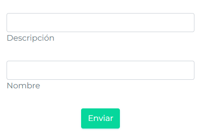
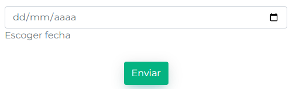
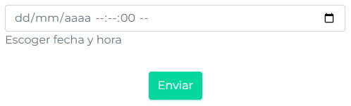
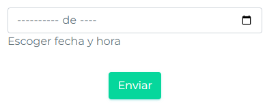
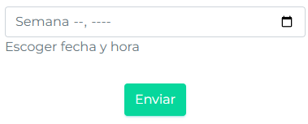
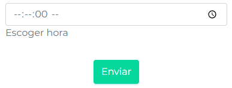
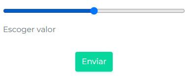
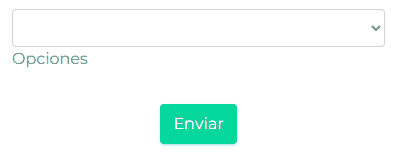

# Formulario dinámico

El formulario dinámico es una forma compacta de generar un formulario reactivo de ángular.

Para empezar, importarlo en el módulo del componente que se está trabajando.

```ts
@NgModule({
    declarations: [TalComponenteComponent],
    imports: [
        CommonModule,

        // Importación del módulo.
        FormularioDinamicoModule
    ],
    exports: [TalComponenteComponent],
    providers: [TalComponenteComponent]
})
export class TalComponenteModule {}
```

Para definir un formulario con este componente de la forma más sencilla, hay que crear un objeto. Opcionalmente, se
podrá usar una función para revisar el resultado del `submit` o `envío` del formulario.

En la vista (`.html`) del componente, se llama al componente de la siguiente forma.

```html
<app-formulario-dinamico
    [especificacionFormulario]="especificacionFormulario"
    (onSubmit)="onSubmit($event)"
></app-formulario-dinamico>
```

En el controlador (`.ts`) haríamos lo siguiente.

```ts
import { Component, OnInit } from '@angular/core';
import {
    CampoFormulario,
    EspecificacionFormularioDinamico
} from 'src/app/components/utiles/formulario-dinamico/formulario-dinamico.model';

@Component({
    selector: 'app-tal-componente',
    templateUrl: './tal-componente.component.html',
    styleUrls: ['./tal-componente.component.css']
})
export class TalComponente implements OnInit {
    constructor() {}

    ngOnInit() {
        this.crearFormulario();
    }

    especificacionFormulario!: EspecificacionFormularioDinamico<
        ReturnType<typeof this.camposFormulario>
    >;

    // Especificación de los campos que tendrá el formulario.
    camposFormulario = () => {
        return {
            nombre: new CampoFormulario({
                tipo: 'text',
                label: 'Nombre',
                claseColumna: 'col-12',
                orden: 0
            }),
            descripcion: new CampoFormulario({
                tipo: 'text',
                label: 'Descripción',
                claseColumna: 'col-12',
                orden: 0
            })
        };
    };

    crearFormulario() {
        this.especificacionFormulario = new EspecificacionFormularioDinamico(
            this.camposFormulario(),
            false,
            true,
            true,
            true
        );
    }

    onSubmit(formulario: any) {
        // Lógica para procesar el formulario
    }
}
```

Y esta es otra forma de hacerlo (se recomienda la primera).

```typescript
import { Component, OnInit } from '@angular/core';
import { FormularioDinamicoBuilder } from 'src/app/components/utiles/formulario-dinamico/formulario-dinamico.model';

@Component({
    selector: 'app-tal-componente',
    templateUrl: './tal-componente.component.html',
    styleUrls: ['./tal-componente.component.css']
})
export class TalComponente implements OnInit {
    constructor() {}

    ngOnInit() {
        this.crearFormulario();
    }

    especificacionFormulario!: EspecificacionFormularioDinamico<any>;

    crearFormulario() {
        this.especificacionFormulario = new FormularioDinamicoBuilder()
            .addCampo('nombre', {
                tipo: 'text',
                label: 'Nombre',
                claseColumna: 'col-12',
                orden: 0
            })
            .addCampo('descripcion', {
                tipo: 'text',
                label: 'Descripción',
                claseColumna: 'col-12',
                orden: 0
            })
            .setShowValidationOnInvalidSubmit(true);
            .build()
    }

    onSubmit(formulario: any) {
        // Lógica para procesar el formulario
    }
}
```

Lo cual resulta en algo como lo siguiente.



Esta es una explicación de los atributos del componente.

| PROPIEDAD                    | I/O    | TIPO                                    | VALORES ACEPTADOS                                      | DESCRIPCIÓN                                                                                                                                       |
| ---------------------------- | ------ | --------------------------------------- | ------------------------------------------------------ | ------------------------------------------------------------------------------------------------------------------------------------------------- |
| `[especificacionFormulario]` | INPUT  | `EspecificacionFormularioDinamico<any>` | Un objeto que conforma la especificació del formulario | Aquí se pasa la clase que determina los campos que tendrá el formulario junto a sus propiedades                                                   |
| `[enModal]`                  | INPUT  | boolean                                 | `true`, `false`.                                       | Estiliza el formulario para estar en un modal transparente.                                                                                       |
| `[enMovil]`                  | INPUT  | boolean                                 | `true`, `false`.                                       | Le indica al formulario que está en un dispositivo móvil. <span class='text-warning'>FALTA IMPLEMENTAR</span> (aún así puede funcionar en móvil). |
| `(controlesFormulario)`      | OUTPUT | ControlesFormularioDinamico<any>        |                                                        | Retorna un objeto con los controles del formulario. Esto evita tener que acceder a ellos usando `.get('campo')`.                                  |
| `(onSubmit)`                 | OUTPUT | ValorFormularioDinamico<any>            |                                                        | Emite el objeto que resulta del formulario cuando se presiona el botón de submit (enviar).                                                        |
| `(onReset)`                  | OUTPUT | ValorFormularioDinamico<any>            |                                                        | Emite el objeto que resulta del formulario cuando se presiona el botón de reset (limpiar).                                                        |
| `(form)`                     | OUTPUT | UntypedFormGroup                        |                                                        | Retorna el objeto del FormGroup.                                                                                                                  |
| `(valueChanges)`             | OUTPUT | objeto                                  |                                                        | Emite los cambios cada vez que estos ocurren en el formulario. Por cambios, se entiendo cualquier cambio de valor.                                |

Estas son las propiedades de la clase `EspecificacionFormularioDinamico`, que define por completo al formulario.

| PROPIEDAD                       | TIPO                                     | VALORES ACEPTADOS                                                        | DESCRPCIÓN                                                                                                               |
| ------------------------------- | ---------------------------------------- | ------------------------------------------------------------------------ | ------------------------------------------------------------------------------------------------------------------------ |
| `campos`                        | `{[type: string]: CampoFormulario<any>}` | Objeto donde la llave es el nombre del campo y el valor las propiedades. | Es un objeto que especifica los campos que tendrá el formulario, así como todas sus propiedades.                         |
| `mostrarBotonOnReset`           | boolean                                  | `true`, `false`.                                                         | Si es verdadero, se muestra un botón que limpia el formulario.                                                           |
| `mostrarBotonSubmit`            | boolean                                  | `true`, `false`.                                                         | Si es verdadero, se muestra un botón para enviar el formulario. Por defecto `true`.                                      |
| `resetOnSubmit`                 | boolean                                  | `true`, `false`.                                                         | Si es verdadero, el formulario se limpia al enviarlo. Por defecto `true`.                                                |
| `showValidationOnInvalidSubmit` | boolean                                  | `true`, `false`.                                                         | Si es verdader, al enviar el formulario y ser inválido, se muestran las validaciones de los campos. Por defecto `false`. |

Y estas son las propiedades generales de un `CampoFormulario`.

| PROPIEDAD           | OPCIONAL | TIPO                           | VALORES ACEPTADOS                                                                                                                                                                                                                                                   | DESCRPCIÓN                                                                                                                          |
| ------------------- | -------- | ------------------------------ | ------------------------------------------------------------------------------------------------------------------------------------------------------------------------------------------------------------------------------------------------------------------- | ----------------------------------------------------------------------------------------------------------------------------------- |
| `tipo`              | NO       | `TiposInputsFormDinamico`      | `'__COMPONENTE'`, `'checkbox'`, `'color'`, `'date'`, `'datetime-local'`, `'month'`, `'number'`, `'radio'`, `'range'`, `'text'`, `'time'`, `'week'`, `'ARREGLO_CHECKBOX'`, `'RANGO_FECHAS'`, `'DATALIST'`, `'ARCHIVO_EXCEL'`, `'IMAGENES'`, `'SELECT'`, `'TEXTAREA'` | Indica qué tipo de campo es.                                                                                                        |
| `label`             | NO       | string                         | Cualquier cadena de texto.                                                                                                                                                                                                                                          | Es la leyenda que se mostrará debajo del campo.                                                                                     |
| `componenteLabel`   | SI       | `TemplateRef<any>`             | Una plantilla de ángular cualquiera.                                                                                                                                                                                                                                | También funciona como la leyenda del campo, pero usando una plantilla.                                                              |
| `claseColumna`      | SI       | string                         | Clases de columna de bootstrap (`col-1` a `col-12`).                                                                                                                                                                                                                | El formulario se estructura usando columnas de bootstrap. Este campo indica el tamaño de columna que tendrá el campo.               |
| `validadores`       | SI       | `ValidatorFn[]`                | Un arreglo de validadores de ángular.                                                                                                                                                                                                                               | Aquí se pueden pasar las validaciones para el campo. Estas tienen repercusiones visibles y en la capacidad de enviar el formulario. |
| `claseEspecial`     | SI       | `ClasesEspeciales[TIPO_CAMPO]` | Un objeto cuyos campos varían según el `tipo`.                                                                                                                                                                                                                      | Sirve para especificar atributos específicos a un tipo de campo.                                                                    |
| `placeholder`       | SI       | string                         | Cualquier cadena de texto.                                                                                                                                                                                                                                          | Un texto de relleno que se muestra dentro del input.                                                                                |
| `orden`             | NO       | number                         | Cualquier número.                                                                                                                                                                                                                                                   | Indica en qué orden se acomodará el input.                                                                                          |
| `contextoAdicional` | SI       | objeto                         | Cualquier objeto.                                                                                                                                                                                                                                                   | Sirve para pasar valores a las plantillas que se usen en un campo.                                                                  |
| `valorPorDefecto`   | SI       | any                            | Cualquier valor.                                                                                                                                                                                                                                                    | Sirve para rellenar el campo con un valor.                                                                                          |
| `oculto`            | SI       | boolean                        | `true`, `false`.                                                                                                                                                                                                                                                    | Si es verdadero, el campo se sigue validando pero no se vé.                                                                         |
| `desactivado`       | SI       | boolean                        | `true`, `false`.                                                                                                                                                                                                                                                    | Si es verdadero, el campo se desactivará, no se podrá usar, no será validado y no generará valor.                                   |
| `soloLectura`       | SI       | boolean                        | `true`, `false`.                                                                                                                                                                                                                                                    | Si es verdadero, el campo solo no podrá ser modificado por el usuario.                                                              |

<hr class='hr-principal'>

# Tipos de campo

---

## Componente

Agrega una plantilla de ángular (HTML) a la estructura del formulario. Por ejemplo, se desea agregar un separador
horizontal al formulario (`<hr>`), entonces el campo se vería así.

```ts
@ViewChild('separadorHorizontal')
separadorHorizontal: TemplateRef<any>;

camposFormulario = () => {
    return {
        // otros campos

        separadorHorizontal: new CampoFormulario({
            tipo: '__COMPONENTE',
            claseColumna: 'col-12',
            orden: 10,
            claseEspecial: new CLASES_ESPECIALES_FORM_DINAMICO.__COMPONENTE({
                template: this.separadorHorizontal
            })
        })
    };
};
```

```html
<ng-template #separadorHorizontal>
    <hr />
</ng-template>
```

### Clase especial `ComponenteFormularioDinamico`

| PROPIEDAD   | OPCIONAL | TIPO               | VALORES ACEPTADOS                    | DESCRPCIÓN                                         |
| ----------- | -------- | ------------------ | ------------------------------------ | -------------------------------------------------- |
| `template ` | NO       | `TemplateRef<any>` | Una plantilla de ángular cualquiera. | La plantilla (HTML) a renderizar en el formulario. |

<hr class='hr-secundario'>

## Checkbox

Genera un checkbox que solo puede tener como valores `true` o `false`.

Ejemplo de campo de checkbox.

```ts
camposFormulario = () => {
    return {
        // otros campos

        campoCheckbox: new CampoFormulario({
            tipo: 'checkbox',
            claseColumna: 'col-12 col-lg-4',
            orden: 1,
            label: 'Un checkbox',
            soloLectura: true,
            valorPorDefecto: true
        })
    };
};
```

<hr class='hr-secundario'>

## Arreglo de checkbox

Genera un grupo de checkbox que pueden tener cualquier valor, pero apuntan a un solo campo, lo que ocasiona que se
genere un arreglo de los valores seleccionados al hacer submit (enviar).

Ejemplo de campo de arreglo de checkbox.

```ts
camposFormulario = () => {
    return {
        // otros campos

        arregloCheckbox: new CampoFormulario({
            tipo: 'ARREGLO_CHECKBOX',
            claseColumna: 'col-12',
            orden: 2,
            claseEspecial: new CLASES_ESPECIALES_FORM_DINAMICO.ARREGLO_CHECKBOX(
                {
                    posicion: 'horizontal',
                    inputs: [
                        {
                            label: 'Checkbox 1',
                            valor: 'VALOR_1'
                        },
                        {
                            label: 'Checkbox 2',
                            valor: 'VALOR_2'
                        },
                        {
                            label: 'Checkbox 3',
                            valor: 'VALOR_3'
                        }
                    ]
                }
            )
        })
    };
};
```

<figure>
  
  <figcaption>Se pueden seleccionar varios</figcaption>
</figure>

### Clase especial

| PROPIEDAD  | OPCIONAL | TIPO   | VALORES ACEPTADOS                                                | DESCRPCIÓN                                         |
| ---------- | -------- | ------ | ---------------------------------------------------------------- | -------------------------------------------------- |
| `posicion` | NO       | string | `'stacked'`, `'horizontal'`.                                     | La plantilla (HTML) a renderizar en el formulario. |
| `inputs`   | NO       | Array  | Un arreglo de objetos con las propiedades de la tabla siguiente. | Indica los checkbox a crear y sus propiedades.     |

Posibles valores de los objetos dentro del arreglo `inputs`:

| PROPIEDAD           | OPCIONAL | TIPO               | VALORES ACEPTADOS                    | DESCRPCIÓN                                                                           |
| ------------------- | -------- | ------------------ | ------------------------------------ | ------------------------------------------------------------------------------------ |
| `label`             | SI       | string             | Cualquier cadena de texto            | Texto a usar como label de checkbox.                                                 |
| `componenteLabel`   | SI       | `TemplateRef<any>` | Una plantilla de ángular cualquiera. | La plantilla (HTML) a renderizar en la label del checkbox.                           |
| `valor`             | SI       | any                | Cualquier valor.                     | El valor que tendrá el checkbox.                                                     |
| `contextoAdicional` | SI       | any                | Cualquier valor.                     | Algún objeto o valor extra para pasar a la plantilla usada en `componenteLabel`.     |
| `valorPorDefecto `  | SI       | any                | Cualquier valor.                     | <span class='text-warning'>NO USADO</span>.                                          |
| `soloLectura `      | SI       | boolean            | `true`, `false`.                     | Si es verdadero, el usuario no podrá usar el checbox, pero aún podrá tener un valor. |

<hr class='hr-secundario'>

## Radio (tipo de checkbox)

Genera un grupo de radios (checkbox circulares) que apuntan a un solo campo. Este campo solo puede tener uno de los
valores espcificados en el arreglo de inputs.

```ts
camposFormulario = () => {
    return {
        // otros campos

        campoRadio: new CampoFormulario({
            tipo: 'radio',
            claseColumna: 'col-12',
            orden: 3,
            claseEspecial: new CLASES_ESPECIALES_FORM_DINAMICO.radio({
                posicion: 'stacked',
                inputs: [
                    {
                        label: 'RADIO 1',
                        valor: 'VALOR_1'
                    },
                    {
                        label: 'RADIO 2',
                        valor: 'VALOR_2'
                    },
                    {
                        label: 'RADIO 3',
                        valor: 'VALOR_3'
                    }
                ]
            })
        })
    };
};
```

<figure>
  
  <figcaption>Solo se puede seleccionar uno a la vez</figcaption>
</figure>

### Clase especial

| PROPIEDAD  | OPCIONAL | TIPO   | VALORES ACEPTADOS                                                | DESCRPCIÓN                                         |
| ---------- | -------- | ------ | ---------------------------------------------------------------- | -------------------------------------------------- |
| `posicion` | NO       | string | `'stacked'`, `'horizontal'`.                                     | La plantilla (HTML) a renderizar en el formulario. |
| `inputs`   | NO       | Array  | Un arreglo de objetos con las propiedades de la tabla siguiente. | Indica los checkbox a crear y sus propiedades.     |

Posibles valores de los objetos dentro del arreglo `inputs`:

| PROPIEDAD           | OPCIONAL | TIPO               | VALORES ACEPTADOS                    | DESCRPCIÓN                                                                       |
| ------------------- | -------- | ------------------ | ------------------------------------ | -------------------------------------------------------------------------------- |
| `label`             | SI       | string             | Cualquier cadena de texto            | Texto a usar como label de checkbox.                                             |
| `componenteLabel`   | SI       | `TemplateRef<any>` | Una plantilla de ángular cualquiera. | La plantilla (HTML) a renderizar en la label del checkbox.                       |
| `valor`             | SI       | any                | Cualquier valor.                     | El valor que tendrá el checkbox.                                                 |
| `contextoAdicional` | SI       | any                | Cualquier valor.                     | Algún objeto o valor extra para pasar a la plantilla usada en `componenteLabel`. |

<hr class='hr-secundario'>

## Color

!> <span class='text-danger'>NO IMPLEMENTADO</span>

<hr class='hr-secundario'>

## Fecha

Genera un input que permite seleccionar una fecha sin hora.

Ejemplo de campo de fecha:

```ts
camposFormulario = () => {
    return {
        // otros campos

        fecha: new CampoFormulario({
            tipo: 'date',
            claseColumna: 'col-12',
            orden: 5,
            label: 'Escoger fecha'
        })
    };
};
```



<hr class='hr-secundario'>

## Fecha y hora (`datetime-local`)

Genera un input que permite seleccionar la fecha y la hora. Es el más recomendado para fechas.

Ejemplo de campo de fecha y hora:

```ts
camposFormulario = () => {
    return {
        // otros campos

        fechayHora: new CampoFormulario({
            tipo: 'datetime-local',
            claseColumna: 'col-12',
            orden: 6,
            label: 'Escoger fecha y hora'
        })
    };
};
```



<hr class='hr-secundario'>

## Mes

Genera un input que es para seleccionar un mes. Retorna el formato `YYYY-MM`, donde `YYYY` es el año seleccionado en 4
dígitos y `MM` es el mes en dos dígitos. Por ejemplo, febrero del 2025 sería `2025-02`.

Ejemplo de campo de mes:

```ts
camposFormulario = () => {
    return {
        // otros campos

        mes: new CampoFormulario({
            tipo: 'month',
            claseColumna: 'col-12',
            orden: 7,
            label: 'Escoger mes'
        })
    };
};
```



<hr class='hr-secundario'>

## Semana

Genera un input que es para seleccionar una semana. Retorna el formato `YYYY-WWW`, donde `YYYY` es el año seleccionado
en 4 dígitos y `WWW` es la semana en dos dígitos con una `W` al principio. Por ejemplo, la semana 01 del 2025 sería
`2025-W01`.

Ejemplo de campo de semana:

```ts
camposFormulario = () => {
    return {
        // otros campos

        semana: new CampoFormulario({
            tipo: 'week',
            claseColumna: 'col-12',
            orden: 7,
            label: 'Escoger semana'
        })
    };
};
```



<hr class='hr-secundario'>

## Hora

Genera un input que es para seleccionar una hora. Retorna el formato `HH:MM:SS`, donde `HH` son las horas en format de
24h, `MM` son los minutos del 0 al 59 y `SS` son los segundos del 0 al 59. Por ejemplo, las 2:15 PM sería `14:15:00`.

Ejemplo de campo de hora:

```ts
camposFormulario = () => {
    return {
        // otros campos

        hora: new CampoFormulario({
            tipo: 'time',
            claseColumna: 'col-12',
            orden: 7,
            label: 'Escoger hora'
        })
    };
};
```



<hr class='hr-secundario'>

## Rango Fechas

!> <span class='text-danger'>NO IMPLEMENTADO</span>

<!-- ### Clase especial -->

<hr class='hr-secundario'>

## Número

Un simple input de número.

<hr class='hr-secundario'>

## Rango

Genera una barra de selección de rango. Retorna un valor de 0 a 100.

Ejemplo:

```ts
camposFormulario = () => {
    return {
        // otros campos

        rango: new CampoFormulario({
            tipo: 'range',
            claseColumna: 'col-12',
            orden: 10,
            label: 'Escoger valor'
        })
    };
};
```



<hr class='hr-secundario'>

## Texto

Genera un input de texto. Hace uso de una directiva que permite modificar visualmente el contenido del input sin afectar
el resultado. Por ejemplo, si se desea que al ingresar un número aparezca un sufijo y no tenga decimales:

```ts
camposFormulario = () => {
    return {
        // otros campos

        texto: new CampoFormulario({
            tipo: 'text',
            claseColumna: 'col-12',
            orden: 11,
            label: 'Descripción',
            claseEspecial: new CLASES_ESPECIALES_FORM_DINAMICO.text({
                mask: 'separator.0',
                suffix: 'KG'
            })
        })
    };
};
```

<figure>
  
  <figcaption>No se pueden escribir decimales y se separan los miles</figcaption>
</figure>

### Data list (sugerencias)

Una opción especial del campo de texto es la habilidad de mostrar una lista de sugerencias no obligatorias.

```ts
camposFormulario = () => {
    return {
        // otros campos
        texto: new CampoFormulario({
            tipo: 'text',
            claseColumna: 'col-12',
            orden: 11,
            label: 'Descripción',
            claseEspecial: new CLASES_ESPECIALES_FORM_DINAMICO.text({
                datalistValues: [
                    {
                        value: 'Descripción genérica de producto',
                        subtitulo: 'Escoger esto si no se puede nada más'
                    },
                    {
                        value: 'N/A'
                    }
                ]
            })
        })
    };
};
```

<figure>
  
  <figcaption>Se puede escribir algo diferente a lo sugerido</figcaption>
</figure>

### Clase especial

Para ver la documentación completa de `NgxMask`, que es lo que permite tener el sufijo y separadores,
dirigirse [aquí](https://jsdaddy.github.io/ngx-mask/).

<hr class='hr-secundario'>

## Área de texto

Genera un recuadro de texto que puede tener saltos de líneas y crecer automáticamente.

Este es un ejemplo:

```ts
camposFormulario = () => {
    return {
        // otros campos

        textarea: new CampoFormulario({
            tipo: 'TEXTAREA',
            claseColumna: 'col-12',
            orden: 12,
            label: 'Explicación'
        })
    };
};
```

<figure>
  
  <figcaption>El recuadro crece automáticamente.</figcaption>
</figure>

<hr class='hr-secundario'>

## Seleccionable

Genera un input que solo permite seleccionar alguna de las opciones disponibles.

Ejemplo:

```ts
camposFormulario = () => {
    return {
        // otros campos

        select: new CampoFormulario({
            tipo: 'SELECT',
            claseColumna: 'col-12',
            orden: 13,
            label: 'Opciones',
            claseEspecial:
                new CLASES_ESPECIALES_FORM_DINAMICO.SELECT<ModeloCompleto>({
                    callbackSeleccionOpcion(objeto, iCampo) {
                        console.log(objeto);
                    },
                    opciones: [
                        {
                            leyendaAMostrar:
                                this.modeloCompleto2505.nombreCompleto,
                            value: this.modeloCompleto2505.sku,
                            objeto: this.modeloCompleto2505
                        },
                        {
                            leyendaAMostrar:
                                this.modeloCompleto4107.nombreCompleto,
                            value: this.modeloCompleto4107.sku,
                            objeto: this.modeloCompleto4107
                        }
                    ]
                })
        })
    };
};
```

?> Si se desea usar el callback de selección de opción, hay que indicar en la instancia de la clase `<SELECT>` el tipo
de objeto a retornar.

La interacción imprime el siguiente objeto en la consola.

```json
{
    "leyendaAMostrar": "Modelo 2505",
    "value": "BOT-2505",
    "objeto": {
        "modelo": {
            "editado": false,
            "convertido": false
        },
        "tamano": {
            "editado": false,
            "convertido": false
        },
        "color": {
            "editado": false,
            "convertido": false
        },
        "terminado": {
            "editado": false,
            "convertido": false
        },
        "laserAlmacen": {
            "editado": false,
            "convertido": false,
            "laser": "",
            "imagenes": []
        },
        "medias": false,
        "nombreCompleto": "Modelo 2505",
        "sku": "BOT-2505",
        "esBaston": false,
        "esTapon": false,
        "premium": false,
        "existencia": 0,
        "lotes": [],
        "stockMinimo": 0,
        "stockMaximo": 0,
        "procesosEspeciales": [],
        "mediasGeneradas": false,
        "parte": "ESP",
        "cargandoProduccionEnTransito": false
    }
}
```



### Clase especial

| PROPIEDAD                 | OPCIONAL | TIPO     | VALORES ACEPTADOS                                         | DESCRPCIÓN                                                                                                                                                       |
| ------------------------- | -------- | -------- | --------------------------------------------------------- | ---------------------------------------------------------------------------------------------------------------------------------------------------------------- |
| `callbackSeleccionOpcion` | SI       | function | Una función con los parámetros `objeto` e `iCampo`.       | Función que se ejecuta cada vez que se selecciona una opción, y recibe como argumentos el objeto correspondiente dentro de `opciones` y el índice en el arreglo. |
| `opciones`                | NO       | Array    | Un arreglo de objetos con las propiedades de cada opción. | Aquí se especifica cada opción que tendrá el select.                                                                                                             |

Estas son las propiedades de los objetos que van en `opciones`:

| PROPIEDAD         | OPCIONAL | TIPO    | VALORES ACEPTADOS         | DESCRPCIÓN                                                                                       |
| ----------------- | -------- | ------- | ------------------------- | ------------------------------------------------------------------------------------------------ |
| `value`           | NO       | any     | Cualquier valor.          | El valor que inserta la selección de la opción en el formulario.                                 |
| `leyendaAMostrar` | NO       | string  | Cualquier cadena de texto | El texto a mostrar en la opción.                                                                 |
| `hidden`          | SI       | boolean | `true`, `false`.          | Si es verdadero, la opción no se mostrará en la lista.                                           |
| `disabled`        | SI       | boolean | `true`, `false`.          | Si es verdadero, la opción no podrá ser seleccionada.                                            |
| `objeto`          | SI       | any     | Cualquier objeto.         | Un objeto extra a incluir en la opción para ser retornado en el callback de selección de opción. |

<hr class='hr-secundario'>

## Datalist (no confundir con el de `Texto`)

Este input proviene de dos componentes, uno llamado [
`data-list`](./docs/carrduci-sys-desarrollo/uso-componentes/data-list.md) y otro llamado [
`flotante-generico`](./docs/carrduci-sys-desarrollo/uso-componentes/flotante-generico.md) (para las opciones). Permite
usar una búsqueda de texto y seleccionar alguno de los resultados mostrados en un popup, a manera de dropdown.

Es el más complejo de los campos, pues requiere de una subscripción a algún servicio para alimentar la búsqueda.

?> Requiere especificar el tipo de objeto que se usará luego de llamar a la clase `.DATALIST<Tipo>`. Esto proporcionará
autocompletado a la hora de seleccionar rutas en los objetos como en los campos `campoSeleccionarElemento`,
`leyendaPrincipal`, etc.

Este es un ejemplo.

```ts
camposFormulario = () => {
    return {
        // otros campos

        datalist: new CampoFormulario({
            tipo: 'DATALIST',
            claseColumna: 'col-12',
            orden: 14,
            label: 'Modelo a usar',
            claseEspecial:
                new CLASES_ESPECIALES_FORM_DINAMICO.DATALIST<InsumoMetalizadoRecibir>(
                    {
                        autoSeleccionar: true,
                        campoSeleccionarElemento: '_id',
                        leyendaPrincipal: 'nombre',
                        descripcionPrincipal: 'descripcion',
                        observadorBusquedaElementos: (termino) => {
                            return this.insumoService.INSUMOS_obtenerInsumos(
                                new Paginacion(150, 0, -1, 'nombre'),
                                { termino }
                            );
                        },
                        callbackDeseleccionarElemento: () => {
                            console.log('ELEMENTO DESELECCIONADO');
                        },
                        callbackSeleccionarElemento: (elemento) => {
                            console.log(elemento);
                        }
                    }
                )
        })
    };
};
```

<figure>
  
  <figcaption>Si solo queda una opción, se autoselecciona</figcaption>
</figure>

### Clase especial

| PROPIEDAD                     | OPCIONAL | TIPO                 | VALORES ACEPTADOS                                                                                                   | DESCRIPCIÓN                                                                                                                   |
| :---------------------------- | :------- | :------------------- | :------------------------------------------------------------------------------------------------------------------ | :---------------------------------------------------------------------------------------------------------------------------- |
| callbackObservadorBusqueda    | SI       | function             | Una función que acepte un parámetro tipo `string` y retorne un observable del tipo que se provee a la clase.        | Este callback tiene que recibir el término que será usado en la búsquda de texto y retornar la subscripción a dicha búsqueda. |
| descripcionPrincipal          | SI       | `string`, `function` | Un campo del tipo provehido o una función que reciba un parámetro del tipo provehido y retorne una cadena de texto. | El campo a usar o el texto para la descripción principal.                                                                     |
| descripcionSecundaria         | SI       | `string`, `function` | Un campo del tipo provehido o una función que reciba un parámetro del tipo provehido y retorne una cadena de texto. | El campo a usar o el texto para la descripción secundaria.                                                                    |
| leyendaPrincipal              | NO       | `string`, `function` | Un campo del tipo provehido o una función que reciba un parámetro del tipo provehido y retorne una cadena de texto. | El campo a usar o el texto para la leyenda principal.                                                                         |
| leyendaSecundaria             | SI       | `string`, `function` | Un campo del tipo provehido o una función que reciba un parámetro del tipo provehido y retorne una cadena de texto. | El campo a suar o el texto para la leyenda secundaria.                                                                        |
| campoSeleccionarElemento      | NO       | string               | Un campo del tipo provehido.                                                                                        | Aquí se indica qué campo del documento seleccionado usar como valor para poner en el formualrio.                              |
| callbackSeleccionarElemento   | SI       | function             | Una función que recibe el elemento del tipo provehido.                                                              | Callback que recibe el elemento seleccinado. Se ejecuta con cada selección.                                                   |
| callbackDeseleccionarElemento | SI       | function             | Una función que no recibe nada.                                                                                     | Callback que se ejecuta al deseleccionar la selección actual.                                                                 |
| autoSeleccionar               | SI       | boolean              | `true`, `false`.                                                                                                    | Si es verdadero y solo hay un resultado en la búsqueda, será seleccionado automáticamente.                                    |
| mensajeInputTextoDesactivado  | SI       | string               | Cualquier cadena de texto.                                                                                          | Es el mensaje que se muestra en el input de texto cuando la opción `soloLectura` es verdadera en el campo.                    |

<hr class='hr-secundario'>

## Archivo de excel (como JSON)

!> <span class='text-danger'>NO IMPLEMENTADO</span>

<!-- ### Clase especial -->

<hr class='hr-secundario'>

## Imágenes

!> <span class='text-danger'>NO IMPLEMENTADO</span>

<!-- ### Clase especial -->
