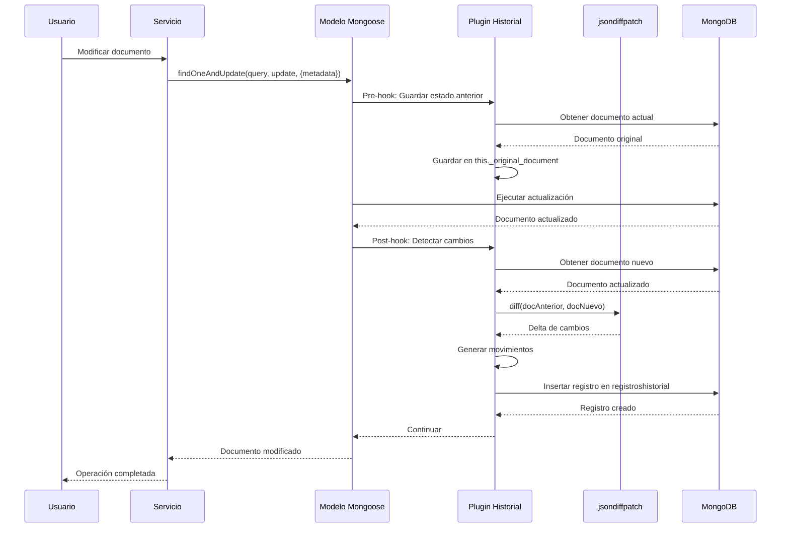
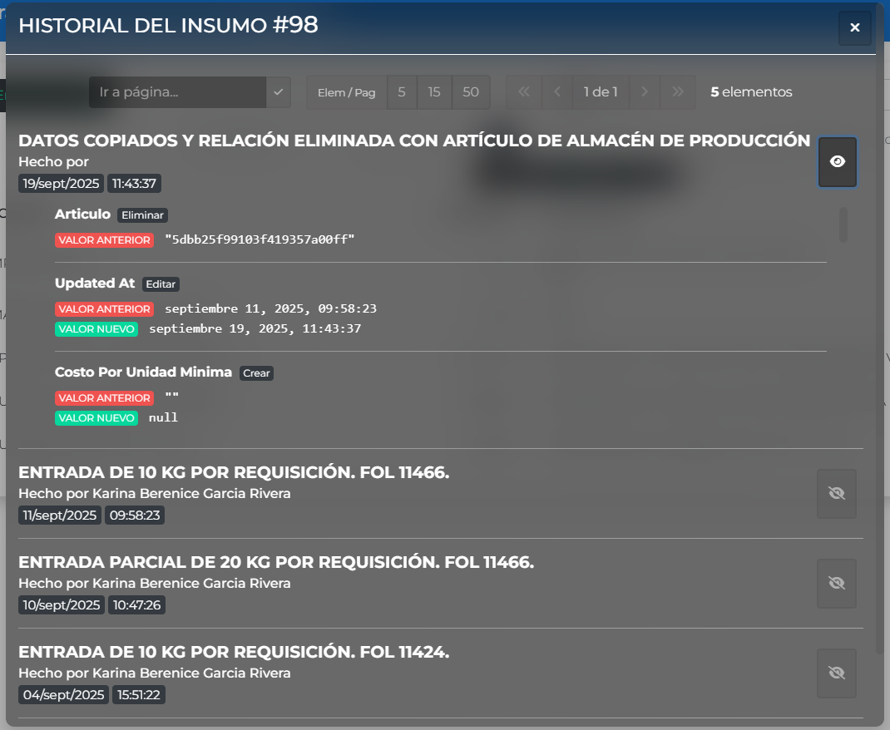

# Historial de Cambios

## Descripción

El **Sistema de Historial** es un mecanismo automático que registra todos los cambios realizados en los documentos de MongoDB. Utiliza un **plugin de Mongoose** que detecta las modificaciones y crea registros detallados en la colección `registroshistorial`.

### Características principales

-   **Automático**: Registra cambios sin código adicional en cada operación
-   **Detallado**: Captura campo por campo qué cambió (valor anterior y nuevo)
-   **Librería jsondiffpatch**: Calcula diferencias precisas entre estados
-   **Plugin de Mongoose**: Hooks en save, findOneAndUpdate y updateOne
-   **Metadata personalizada**: Descripción y usuario por operación
-   **Paginado en GUI**: Componente Angular con paginación automática
-   **Trazabilidad completa**: Quién, cuándo y qué cambió
-   **Notación de punto**: Campos anidados con ruta completa

<hr class='hr-principal'>

## Arquitectura del Sistema

### Componentes

```
Sistema de Historial
├── Backend (API)
│   ├── Plugin de Mongoose (historial.plugin.js)
│   ├── Modelo RegistroHistorial
│   ├── Librería jsondiffpatch
│   └── Servicio de consulta
└── Frontend (GUI)
    ├── Componente historial-elemento
    ├── Servicio HistorialElementoService
    └── Modelos TypeScript
```

### Flujo de Funcionamiento



<hr class='hr-principal'>

## Ubicación de Archivos

### Backend (API)

```
carrduci-sys-api/
├── plugins/historial/
│   └── historial.plugin.js              # Plugin principal
├── models/historial/
│   └── registroHistorial.model.js       # Modelo del registro
└── services/historial/
    └── consultaHistorial.service.js     # Servicio de consulta
```

### Frontend (GUI)

```
carrduci-sys-gui/src/app/components/utiles/historial/
├── historial-elemento/
│   ├── historial-elemento.component.ts
│   ├── historial-elemento.component.html
│   ├── historial-elemento.component.css
│   ├── historial-elemento.service.ts
│   └── historial-elemento.model.ts
└── -pipes-para-historial/
    └── pipes personalizados
```

<hr class='hr-principal'>

## Uso en el Backend (API)

### Paso 1: Agregar Plugin al Modelo

El plugin debe agregarse al esquema de Mongoose:

```javascript
// models/miModelo.model.js
const mongoose = require('mongoose');
const {
    hystory_log_plugin
} = require('../../plugins/historial/historial.plugin');

const miEsquema = new mongoose.Schema(
    {
        nombre: String,
        cantidad: Number,
        precio: Number,
        activo: Boolean,
        detalles: {
            color: String,
            tamano: String
        }
    },
    { collection: 'micoleccion' }
);

// Agregar el plugin de historial
miEsquema.plugin(hystory_log_plugin);

module.exports = mongoose.model('MiModelo', miEsquema);
```

### Paso 2: Usar con .save() - Documentos Nuevos

Para documentos nuevos que se crean con `.save()`:

```javascript
// services/miServicio.service.js
const MiModelo = require('../models/miModelo.model');

class MiServicio {
    async crearDocumento(req) {
        const nuevoDoc = new MiModelo({
            nombre: req.body.nombre,
            cantidad: req.body.cantidad,
            precio: req.body.precio,
            activo: true
        });

        // Agregar metadata ANTES de save()
        nuevoDoc.metadata = {
            idUsuario: req.user._id,
            descripcion: 'documento creado',
            descripcionLarga: `Se creó el documento ${req.body.nombre}`
        };

        // El plugin registrará automáticamente el cambio
        const GUARDADO = await nuevoDoc.save();

        return GUARDADO;
    }
}

module.exports = MiServicio;
```

!> **IMPORTANTE**: La metadata se agrega directamente al documento ANTES de llamar a `.save()`.

### Paso 3: Usar con .findOneAndUpdate() - Actualizaciones

Para actualizar documentos existentes (FORMA CORRECTA):

```javascript
class MiServicio {
    async actualizarDocumento(req) {
        const { _id, ...datosActualizar } = req.body;

        const ACTUALIZADO = await MiModelo.findOneAndUpdate(
            { _id },
            { $set: datosActualizar },
            {
                lean: true,
                new: true,
                runValidators: true,
                context: 'query',
                // IMPORTANTE: Pasar metadata en options
                metadata: {
                    idUsuario: req.user._id,
                    descripcion: 'documento modificado',
                    descripcionLarga: `Se modificó el documento con ID ${_id}`
                }
            }
        );

        return ACTUALIZADO;
    }
}
```

?> **NOTA**: Con `findOneAndUpdate` y `updateOne`, la metadata se pasa en el tercer parámetro (options), NO en el documento.

### Paso 4: Usar con .updateOne()

Similar a findOneAndUpdate:

```javascript
class MiServicio {
    async desactivarDocumento(req) {
        await MiModelo.updateOne(
            { _id: req.body._id },
            { $set: { activo: false } },
            {
                context: 'query',
                metadata: {
                    idUsuario: req.user._id,
                    descripcion: 'documento desactivado'
                }
            }
        );
    }
}

module.exports = MiServicio;
```

### Paso 5: Omitir Registro de Historial

Si por alguna razón NO quieres registrar un cambio:

```javascript
await MiModelo.findOneAndUpdate(
    { _id },
    { $set: datosActualizar },
    {
        metadata: {
            noRegistrarHistorial: true // ← Omite el registro
        }
    }
);
```

<hr class='hr-principal'>

## Propiedades de Metadata

### Estructura Completa

```typescript
metadata: {
    // REQUERIDO (uno de los dos)
    idUsuario: string,           // ID del usuario que hace el cambio
    esUsuarioExterno: boolean,   // true si es usuario externo (sin ID)

    // OPCIONAL
    descripcion: string,         // Descripción corta del cambio
    descripcionLarga: string,    // Descripción detallada
    noRegistrarHistorial: boolean // true para omitir registro
}
```

### Ejemplos de Descripciones

```javascript
// Corta y directa
metadata: {
    idUsuario: req.user._id,
    descripcion: 'folio modificado'
}

// Con descripción larga
metadata: {
    idUsuario: req.user._id,
    descripcion: 'entrada de material registrada',
    descripcionLarga: `Entrada de ${cantidad} kg de ${material.nombre}`
}

// Usuario externo (cambio del sistema)
metadata: {
    esUsuarioExterno: true,
    descripcion: 'actualización automática del sistema'
}

// Con contexto específico y valores dinámicos
metadata: {
    idUsuario: req.user._id,
    descripcion: `salida para folio de producción #${folio}`,
    descripcionLarga: `Salieron ${cantidad} ${unidad} desde almacén para producción`
}

// Ejemplo con operación compleja
metadata: {
    idUsuario: req.user._id,
    descripcion: `cantidad facturable de linea #${lineaNum} ajustada`,
    descripcionLarga: `Se ajustó al liberar reserva de ${cantidadReservada} unidades`
}
```

<hr class='hr-principal'>

## Librería jsondiffpatch

### ¿Qué es?

`jsondiffpatch` es una librería JavaScript que calcula diferencias entre dos objetos JavaScript y genera un "delta" de cambios. Es la base del sistema de historial.

### Características

-   **Detecta cambios profundos**: En objetos anidados y arrays
-   **Tipos de operaciones**: add, replace, remove, move
-   **Arrays inteligentes**: Detecta reordenamientos
-   **Formato JSON Patch**: Salida estándar RFC 6902

### Configuración en el Plugin

```javascript
const jsondiffpatch = require('jsondiffpatch');

const JSONDIFFPATCH_INSTANCE = jsondiffpatch.create({
    arrays: {
        detectMove: true, // Detecta reordenamientos
        includeValueOnMove: true // Incluye valor al mover
    },
    objectHash: function (obj, index) {
        // Identifica objetos en arrays por campos únicos
        return (
            obj.servicio ||
            obj.lista ||
            obj._id ||
            obj.referenciaInmediata ||
            '$$index:' + index
        );
    }
});
```

### Tipos de Operaciones

El plugin traduce las operaciones de jsondiffpatch:

| Operación jsondiffpatch | Traducción  | Descripción                         |
| ----------------------- | ----------- | ----------------------------------- |
| `add`                   | `crear`     | Se agregó un campo o elemento nuevo |
| `replace`               | `editar`    | Se modificó un campo existente      |
| `remove`                | `eliminar`  | Se eliminó un campo o elemento      |
| `move`                  | `reordenar` | Se reordenó un elemento en array    |

### Ejemplo de Uso Interno

```javascript
// Documento anterior
const docAnterior = {
    nombre: 'Producto X',
    precio: 100,
    categorias: ['a', 'b']
};

// Documento nuevo
const docNuevo = {
    nombre: 'Producto X',
    precio: 150,
    categorias: ['a', 'b', 'c']
};

// jsondiffpatch calcula el delta
const DELTA = JSONDIFFPATCH_INSTANCE.diff(docAnterior, docNuevo);

// Genera JSON Patch
const JSON_PATCH = jsonpatch.format(DELTA);
// Resultado:
// [
//   { op: "replace", path: "/precio", value: 150 },
//   { op: "add", path: "/categorias/2", value: "c" }
// ]
```

<hr class='hr-principal'>

## Resultado en Base de Datos

### Colección: registroshistorial

Cada cambio crea un documento en MongoDB:

```javascript
{
    _id: ObjectId("65a5b3c7e8f9a1b2c3d4e5f6"),
    fecha: ISODate("2024-01-15T10:30:00.000Z"),
    usuario: ObjectId("507f1f77bcf86cd799439011"),
    esUsuarioExterno: false,
    nombreColeccion: "foliosvendedor",
    idElementoModificado: ObjectId("65a5b3a1e8f9a1b2c3d4e5f1"),
    tipoAccion: "folio modificado",
    tipoOperacion: "findOneAndUpdate",
    descripcionLarga: "Se modificó el estado del folio #123",
    movimientos: [
        {
            nombreCampo: "estado",
            valorAnterior: "BORRADOR",
            valorNuevo: "APROBADO",
            indiceAnterior: null,
            tipoMovimiento: "editar"
        },
        {
            nombreCampo: "folioLineas.0.cantidad",
            valorAnterior: 100,
            valorNuevo: 150,
            indiceAnterior: null,
            tipoMovimiento: "editar"
        },
        {
            nombreCampo: "fechaAprobacion",
            valorAnterior: undefined,
            valorNuevo: ISODate("2024-01-15T10:30:00.000Z"),
            indiceAnterior: null,
            tipoMovimiento: "crear"
        }
    ]
}
```

### Campos del Registro

| Campo                  | Tipo     | Descripción                                            |
| ---------------------- | -------- | ------------------------------------------------------ |
| `fecha`                | Date     | Timestamp del cambio (automático con Date.now)         |
| `usuario`              | ObjectId | Referencia al usuario (populate automático con nombre) |
| `esUsuarioExterno`     | Boolean  | Si es cambio del sistema sin usuario                   |
| `nombreColeccion`      | String   | Nombre de la colección de MongoDB modificada           |
| `idElementoModificado` | ObjectId | ID del documento que cambió                            |
| `tipoAccion`           | String   | Descripción corta del cambio                           |
| `tipoOperacion`        | String   | save / findOneAndUpdate / updateOne / bulkWrite        |
| `descripcionLarga`     | String   | Descripción detallada (opcional)                       |
| `movimientos`          | Array    | Lista de campos modificados con detalles               |

### Estructura de Movimientos

Cada elemento en el array `movimientos`:

```typescript
{
    nombreCampo: string,        // Ruta del campo (con notación punto)
    valorAnterior: any,         // Valor antes del cambio
    valorNuevo: any,            // Valor después del cambio
    indiceAnterior: string,     // Índice anterior (para reordenamientos)
    tipoMovimiento: string      // crear / editar / eliminar / reordenar
}
```

### Ejemplo de Notación de Punto

```javascript
// Documento original
{
    nombre: "Producto X",
    precio: 100,
    detalles: {
        color: "rojo",
        tamano: "grande",
        dimensiones: {
            alto: 10,
            ancho: 5
        }
    },
    categorias: ["a", "b", "c"],
    lineas: [
        { id: 1, cantidad: 10 },
        { id: 2, cantidad: 20 }
    ]
}

// Movimientos registrados después de cambios
[
    {
        nombreCampo: "precio",              // Campo raíz
        valorAnterior: 100,
        valorNuevo: 150,
        tipoMovimiento: "editar"
    },
    {
        nombreCampo: "detalles.color",      // Campo anidado nivel 1
        valorAnterior: "rojo",
        valorNuevo: "azul",
        tipoMovimiento: "editar"
    },
    {
        nombreCampo: "detalles.dimensiones.alto",  // Campo anidado nivel 2
        valorAnterior: 10,
        valorNuevo: 15,
        tipoMovimiento: "editar"
    },
    {
        nombreCampo: "categorias.1",        // Elemento en array por índice
        valorAnterior: "b",
        valorNuevo: "x",
        tipoMovimiento: "editar"
    },
    {
        nombreCampo: "categorias.3",        // Nuevo elemento en array
        valorAnterior: undefined,
        valorNuevo: "d",
        tipoMovimiento: "crear"
    },
    {
        nombreCampo: "lineas.0.cantidad",   // Campo en objeto dentro de array
        valorAnterior: 10,
        valorNuevo: 15,
        tipoMovimiento: "editar"
    }
]
```

### Índices en MongoDB

El modelo tiene índices para optimizar consultas:

```javascript
// Índice para buscar por documento
registroHistorialSchema.index(
    { idElementoModificado: 1 },
    { name: 'filtro_por_elemento' }
);

// Índice para buscar por usuario
registroHistorialSchema.index({ usuario: 1 }, { name: 'filtro_por_usuario' });
```

<hr class='hr-principal'>

## Uso en el Frontend (GUI)

### Preparación: Importar Módulos Necesarios

Para usar el componente de historial, necesitas importar el módulo del componente:

```typescript
import { HistorialElementoModule } from 'src/app/components/utiles/historial/historial-elemento/historial-elemento.module';
import { ModalModule } from 'src/app/pages/utilidadesPages/utilidades-tipo-crud-para-GUI/plantillas/modal.module';

@NgModule({
    declarations: [MiComponenteComponent],
    imports: [
        // ... otros módulos
        HistorialElementoModule,
        ModalModule // Si usarás el componente en modales
    ]
})
export class MiModuloModule {}
```

### Componente: app-historial-elemento

El componente tiene **dos modos de uso**:

Pasando directamente el array de registros:

```typescript
// ❌ NO RECOMENDADO - Sin paginación
registrosHistorial: RegistroHistorial[] = [...];

// En el template
<app-historial-elemento
    [registroHistorial]="registrosHistorial"
    [enModal]="true"
></app-historial-elemento>
```

#### Modo 2: Con Paginación (CORRECTO) ✅

Pasando el ID del documento:

```html
<!-- ✅ RECOMENDADO - Con paginación automática -->

<!-- Dentro de un modal -->
<app-historial-elemento [idElemento]="documento._id"></app-historial-elemento>
<!-- [enModal]="true" es el valor por defecto -->

<!-- Directamente en la página (sin modal) -->
<app-historial-elemento
    [idElemento]="documento._id"
    [enModal]="false"
></app-historial-elemento>
```

?> **IMPORTANTE**: Usa `[idElemento]` para obtener paginación automática. Es la forma recomendada, más eficiente y escalable.

### Implementación Completa

#### Paso 1: Importar en el Componente

```typescript
// mi-componente.component.ts
import { Component, OnInit } from '@angular/core';
import { ActivatedRoute } from '@angular/router';

@Component({
    selector: 'app-mi-componente',
    templateUrl: './mi-componente.component.html'
})
export class MiComponente implements OnInit {
    // ID del documento del que queremos ver el historial
    idDocumentoActual: string;

    constructor(private route: ActivatedRoute) {}

    ngOnInit() {
        // Obtener ID del documento desde la ruta
        this.idDocumentoActual = this.route.snapshot.params['id'];

        // O desde un servicio
        // this.miServicio.obtener(id).subscribe(doc => {
        //     this.idDocumentoActual = doc._id;
        // });
    }
}
```

#### Paso 2: Agregar en el Template

```html
<!-- mi-componente.component.html -->
<div class="card">
    <div class="card-header">
        <h5>
            <i class="fas fa-history"></i>
            Historial de Cambios
        </h5>
    </div>
    <div class="card-body">
        <app-historial-elemento
            [idElemento]="idDocumentoActual"
            [enModal]="false"
            [modelo]="'micoleccion'"
        ></app-historial-elemento>
    </div>
</div>
```

#### Paso 3: Dentro de un Modal (Forma Correcta)

?> **IMPORTANTE**: El sistema usa el componente `app-modal` con secciones de contenido. Usar `[enModal]="true"` (o no especificar ya que es el valor por defecto) para ajustar estilos.

```typescript
// mi-componente.component.ts
import { Component, ViewChild } from '@angular/core';
import { ModalComponent } from 'src/app/pages/utilidadesPages/utilidades-tipo-crud-para-GUI/plantillas/modal.component';

@Component({
    selector: 'app-mi-componente',
    templateUrl: './mi-componente.component.html'
})
export class MiComponente {
    idDocumentoActual: string;
    documentoRevisandoHistorial: any; // El documento cuyo historial queremos ver

    // Referencia al modal
    @ViewChild('modalHistorial') modalHistorial: ModalComponent;

    // Abrir modal
    abrirModalHistorial(documento: any) {
        this.documentoRevisandoHistorial = documento;
        this.modalHistorial.mostrarModal();
    }

    // Cerrar modal
    cerrarModalHistorial() {
        this.documentoRevisandoHistorial = null;
        this.modalHistorial.ocultarModal();
    }
}
```

```html
<!-- mi-componente.component.html -->

<!-- Botón para abrir modal -->
<button
    class="btn btn-info"
    (click)="abrirModalHistorial(miDocumento)"
>
    <i class="fas fa-history"></i>
    Ver Historial
</button>

<!-- Modal -->
<app-modal
    #modalHistorial
    [medida]="'extraGrande'"
    [usarModalFalso]="true"
>
    <ng-container encabezado>
        <h5>
            <i class="fas fa-history"></i>
            Historial de Cambios
        </h5>
    </ng-container>

    <ng-container
        contenido
        *ngIf="documentoRevisandoHistorial"
    >
        <app-historial-elemento
            [idElemento]="documentoRevisandoHistorial._id"
        ></app-historial-elemento>
        <!-- [enModal]="true" es el valor por defecto, no es necesario especificarlo -->
    </ng-container>
</app-modal>
```

### Propiedades del Componente

| Propiedad           | Tipo                  | Descripción                                                                                  | Por Defecto |
| ------------------- | --------------------- | -------------------------------------------------------------------------------------------- | ----------- |
| `idElemento`        | `string`              | ID del documento (activa paginación)                                                         | -           |
| `registroHistorial` | `RegistroHistorial[]` | Array de registros (sin paginación)                                                          | -           |
| `enModal`           | `boolean`             | Si está dentro de un modal. Ajusta estilos de botones (oscuros si `true`, claros si `false`) | `true`      |
| `modelo`            | `string`              | Nombre del modelo (opcional)                                                                 | -           |

?> **NOTA**: La propiedad `[enModal]` solo afecta los estilos visuales. Se recomienda:

-   `[enModal]="true"` (o no especificar): Cuando está dentro de `<app-modal>`
-   `[enModal]="false"`: Cuando está directamente en la página sin modal

### Comportamiento Interno

```typescript
// historial-elemento.component.ts (simplificado)
export class HistorialElementoComponent {
    @Input('idElemento') set _idElemento(value: string) {
        this.idElemento = value;
        this.usarPaginacion = true; // ← Activa paginación
        this.obtenerHistorialElemento();
    }

    @Input('registroHistorial') set _registroHistorial(
        value: RegistroHistorial[]
    ) {
        this.registroHistorial = value;
        this.usarPaginacion = false; // ← Desactiva paginación
    }

    paginacionRegistros: Paginacion = new Paginacion(
        5, // límite: 5 registros por página
        0, // desde: inicio
        -1, // ordenDir: descendente (más reciente primero)
        '_id' // ordenCampo
    );

    obtenerHistorialElemento() {
        this.cargandoRegistros = true;
        this.historialService
            .obtener(this.paginacionRegistros, this.idElemento)
            .subscribe({
                next: (registros: RegistroHistorial[]) => {
                    this.registroHistorial = registros;
                    this.totalRegistros =
                        this.historialService.TOTAL_REGISTROS_HISTORIAL;
                    this.cargandoRegistros = false;
                }
            });
    }
}
```

### Ejemplo



<hr class='hr-principal'>

## Resumen

El **Sistema de Historial** proporciona:

✅ **Trazabilidad completa** de todos los cambios  
✅ **Plugin automático** con hooks de Mongoose  
✅ **jsondiffpatch** para detección precisa de cambios  
✅ **Metadata personalizada** por operación  
✅ **Componente GUI** con paginación automática  
✅ **Sin middleware** - uso directo con metadata  
✅ **Base de datos optimizada** con índices  
✅ **Notación de punto** para campos anidados  
✅ **Populate automático** de usuarios  
✅ **Tipos de cambio** claramente identificados

Este sistema es fundamental para auditoría, debugging y cumplimiento normativo en CARRDUCI.
