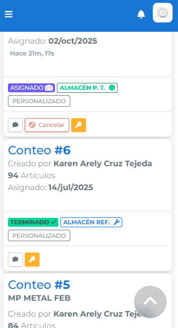

# Modal

## Descripción

El componente **Modal** provee una envoltura reutilizable para cuadros de diálogo en la GUI de CARRDUCI. Envuelve contenido a través de _slots_ (`encabezado`, `contenido`, `pie`) y expone métodos para mostrar u ocultar la ventana desde el controlador. Internamente puede renderizar un modal real de Bootstrap o un **modal falso** que emula el comportamiento desde Angular puro.

Características principales:

-   **Preferencia por modalFalso**: al colocar `[usarModalFalso]="true"` el modal usa la implementación Angular para evitar dependencias con jQuery, mejorar el control de estilos y soportar móviles.
-   **Contenido estructurado**: admite encabezado, cuerpo y pie a través de `ng-content` con selectores claros.
-   **Compatibilidad móvil**: ajusta automáticamente la medida a `pantallaCompleta` cuando se detecta un dispositivo móvil.
-   **Control total mediante código**: métodos `mostrarModal()` y `ocultarModal()` expuestos vía `ViewChild`.
-   **Configuración extensible**: permite ajustar dimensiones, overflow, animaciones y comportamiento del backdrop.

## Ubicación de Archivos

```
carrduci-sys-gui/src/app/pages/utilidadesPages/utilidades-tipo-crud-para-GUI/plantillas/
├── modal.component.ts    # Lógica del componente Angular
├── modal.component.html  # Plantilla con variantes real/falso
├── modal.component.css   # Estilos base
└── modal.module.ts       # Declaración y exportación
```

## Slots de Contenido

-   `encabezado`: `<ng-content select="[encabezado]"></ng-content>`
-   `contenido`: `<ng-content select="[contenido]"></ng-content>`
-   `pie`: `<ng-content select="[pie]"></ng-content>`

Cada slot es opcional (según `ocultarEncabezado` y `ocultarPie`).

## API del Componente

### Entradas (`@Input`)

| Propiedad                           | Tipo                                                                                                 | Defecto                    | Descripción                                                                |
| ----------------------------------- | ---------------------------------------------------------------------------------------------------- | -------------------------- | -------------------------------------------------------------------------- |
| `medida`                            | `'chico'`, `'mediano'`, `'grande'`, `'extraGrande'`, `'gigante'`, `'variable'`, `'pantallaCompleta'` | `'mediano'`                | Tamaño lógico del modal. En móvil se fuerza a `pantallaCompleta`.          |
| `usarModalFalso`                    | `boolean`                                                                                            | `false`                    | Activa el _modal falso_. **Siempre preferir `true`.**                      |
| `mostrarContenido`                  | `boolean`                                                                                            | `true`                     | Controla el `*ngIf` interno del contenido (deprecado, mantener en `true`). |
| `ocultarEncabezado`                 | `boolean`                                                                                            | `false`                    | Oculta la sección de encabezado.                                           |
| `ocultarPie`                        | `boolean`                                                                                            | `true`                     | Oculta la sección de pie.                                                  |
| `permitirCerrarFueraDeModal`        | `boolean`                                                                                            | `true`                     | Permite cerrar haciendo clic fuera. `Escape` siempre funciona.             |
| `animacionUsar`                     | `string`                                                                                             | `'animated fadeIn faster'` | Clase animación para el contenedor externo.                                |
| `animacionUsarInterno`              | `string`                                                                                             | `'animated fadeIn faster'` | Animación aplicada al contenido.                                           |
| `centrarModal`                      | `boolean`                                                                                            | `true`                     | Centra verticalmente el modal (real y falso).                              |
| `noScrollVertical`                  | `boolean`                                                                                            | `false`                    | Quita el scroll vertical del modal real.                                   |
| `noScrollHorizontal`                | `boolean`                                                                                            | `false`                    | Quita el scroll horizontal del modal real.                                 |
| `desactivarBarraScrollEnModalFalso` | `boolean`                                                                                            | `false`                    | Forza a ocultar barras de scroll en modal falso.                           |
| `scrollSoloEnBody`                  | `boolean`                                                                                            | `false`                    | Aplica scroll al body del modal (versión real).                            |
| `ocultarBotonCerrar`                | `boolean`                                                                                            | `false`                    | Oculta el botón X en el encabezado.                                        |
| `overflow-y`                        | `'auto'\| 'hidden'\| 'scroll'`                                                                       | `'auto'`                   | Overflow Y cuando se usa modal falso.                                      |
| `overflow-x`                        | `'auto'\| 'hidden'\| 'scroll'`                                                                       | `'hidden'`                 | Overflow X cuando se usa modal falso.                                      |
| `altoModalFalso`                    | `string`                                                                                             | `fit-content`              | Altura explícita del contenedor en modal falso.                            |
| `maximoAltoModalFalso`              | `string`                                                                                             | `95vh`                     | Altura máxima cuando `usarModalFalso` es `true`.                           |
| `minimoAltoModalFalso`              | `string`                                                                                             | `10vh`                     | Altura mínima del modal falso.                                             |
| `anchoModalFalso`                   | `string`                                                                                             | Según `medida`             | Ancho fijo del modal falso.                                                |
| `maximoAnchoModalFalso`             | `string`                                                                                             | Según `medida`             | Ancho máximo permitido.                                                    |
| `minimoAnchoModalFalso`             | `string`                                                                                             | `25vw`                     | Ancho mínimo del modal falso.                                              |
| `correccionZIndex`                  | `number`                                                                                             | `0`                        | Suma un offset al `z-index` para apilar múltiples modales falsos.          |

### Salidas (`@Output`)

| Evento                 | Emisión      | Descripción                                                                        |
| ---------------------- | ------------ | ---------------------------------------------------------------------------------- |
| `cerrar`               | `void`       | Se dispara al dar clic en cerrar (botón, backdrop o métodos programáticos).        |
| `areaScrolleableModal` | `ElementRef` | Devuelve el contenedor que tiene scroll para ajustes externos (ej. `scrollToTop`). |

### Métodos Públicos

| Método           | Descripción                                                                                              |
| ---------------- | -------------------------------------------------------------------------------------------------------- |
| `mostrarModal()` | Abre el modal. Con `usarModalFalso = true` invoca `mostrarModalFalso()` para aplicar estilos calculados. |
| `ocultarModal()` | Cierra el modal y restablece banderas internas.                                                          |

> Nota: los métodos `mostrarModalFalso()` y `ocultarModalFalso()` están disponibles internamente; Es la forma estandar de invocar u ocultar el modal.

## ¿Por qué preferir `modalFalso`?

El **modal falso** elimina la dependencia de jQuery/Bootstrap y proporciona un control de estilos 100% Angular. Ventajas principales:

-   **Compatibilidad móvil**: adapta el tamaño al viewport y aplica animaciones específicas (`slideInUp`).
-   **Control granular**: Inputs como `minimoAltoModalFalso`, `anchoModalFalso` o `correccionZIndex` permiten ajustar el contenedor sin lidiar con clases Bootstrap.
-   **Evita fugas de scroll**: `desactivarBarraScrollEnModalFalso` y `scrollSoloEnBody` previenen que el body de la página se desplace cuando el modal está abierto.
-   **Integración simple con componentes personalizados**: el backdrop se genera en Angular, permitiendo aplicar directivas o estilos según sea necesario.

Usar el modal real queda reservado para escenarios que dependen explícitamente de plugins Bootstrap legados.

## Ejemplo: Supervisión de Conteos

HTML principal (`carrduci-sys-gui/src/app/components/conteos/vista-supervision-conteos/vista-supervision-conteos.component.html`):

```html
<app-modal
	#modalDetalleConteo
	[medida]="'gigante'"
	[centrarModal]="false"
	[permitirCerrarFueraDeModal]="false"
	[usarModalFalso]="true"
	[minimoAltoModalFalso]="'95vh'"
	(cerrar)="accionesDeCerrarDetalle()"
>
	<div encabezado>
		<h3>
			Detalles del conteo
			<span>#{{ conteoSeleccionadoEnTabla?.folio }}</span>
		</h3>
	</div>
	<app-conteos-detalle
		contenido
		[conteo]="conteoSeleccionadoEnTabla"
		[mostrarAccionesSupervision]="true"
	></app-conteos-detalle>
</app-modal>
```

Controlador (`vista-supervision-conteos.component.ts`):

```typescript
@ViewChild('modalDetalleConteo', { static: false })
modalDetalleConteo!: ModalComponent;

abrirDetalle(conteo: ConteoRecibir) {
    this.conteoSeleccionadoEnTabla = conteo;
    this.modalDetalleConteo.mostrarModal();
}

accionesDeCerrarDetalle() {
    this.conteoSeleccionadoEnTabla = null;
}
```

Este patrón se repite para los modales de estatus, comentarios y autorizaciones, todos con `[usarModalFalso]="true"`.

## Ejemplo: Folios de Vendedor

`carrduci-sys-gui/src/app/components/folios-vendedor/folios-vendedor.component.html` muestra diversos diálogos con modal falso:

```html
<app-modal
	#modalFormularioCreacion
	[medida]="'gigante'"
	[permitirCerrarFueraDeModal]="false"
	[usarModalFalso]="true"
>
	<div encabezado>
		<h3>Nuevo folio de vendedor</h3>
	</div>
	<app-formulario-creacion-folio-vendedor
		contenido
		(lineasCreadas)="scrollModalesToTop()"
	></app-formulario-creacion-folio-vendedor>
</app-modal>
```

En el TypeScript correspondiente (`folios-vendedor.component.ts`) se obtiene la referencia vía `ViewChild` y se llama `mostrarModal()` / `ocultarModal()` según la acción del usuario.

## Patrón en Vista Genérica (Familias de Costos)

Los módulos basados en `vista-generica` reutilizan el modal para formularios e historial. Ejemplo en `carrduci-sys-gui/src/app/components/utiles/layout/vista-generica/vista-generica.component.html`:

```html
<app-modal
	#modalHistorial
	[usarModalFalso]="true"
	[medida]="'mediano'"
	[permitirCerrarFueraDeModal]="false"
>
	<div encabezado>
		<h2>Historial de la entidad</h2>
	</div>
	<app-historial-elemento
		contenido
		[coleccion]="_historial_coleccion"
		[idElemento]="elementoMostrarHistorial?._id"
	></app-historial-elemento>
</app-modal>
```

Cualquier vista que extienda `vista-generica` (por ejemplo, `vista-administracion-familias-de-costos`) hereda este patrón, obteniendo modales consistentes para formularios e historial sin volver a declararlos.

## Buenas Prácticas

-   **Siempre activa `usarModalFalso`** a menos que exista una dependencia específica de Bootstrap.
-   **Maneja el evento `cerrar`** para limpiar formularios o restablecer estados.
-   **Utiliza `areaScrolleableModal`** para reposicionar el scroll cuando insertas contenido dinámico (ej. después de cargar una tabla).
-   **Evita lógica en el template**: usa `ViewChild` y métodos públicos en lugar de manipular directamente propiedades internas.

## Relacionados

-   [`Selector de fechas modal`](./selector-fechas-generico.md): ejemplo especializado que reutiliza este componente.
-   [`Vista Genérica`](./vista-generica.md): patrón que integra modal falso para formularios e historial.
-   [`Gestor de impresiones`](./gestor-de-impresiones.md): referencia adicional sobre manejo de overlays y z-index.

## Resumen

-   El modal es la pieza estándar para cuadros de diálogo y se recomienda operarlo siempre con `modalFalso`.
-   Existen numerosos ajustes finos para tamaño, scroll y animaciones, lo que permite adaptarlo a distintos contextos (conteos, folios, mantenimientos, etc.).
-   La interacción se realiza desde el controlador mediante `ViewChild` y los métodos `mostrarModal()` / `ocultarModal()`, garantizando un flujo consistente en toda la aplicación.

## Ejemplos

### En vista de escritorio

Aquí se muestra que el modal puede cambiar de tamaño dinámicamente según se indique en el input `medida`. En este ejemplo cambia a uno de pantalla completa.


### En vista móvil

Cuando se usa el modal falso en móvil, el modal se adapta al viewport y se muestra con una animación de slide-in-up.


