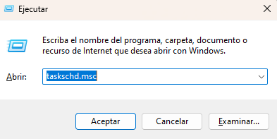
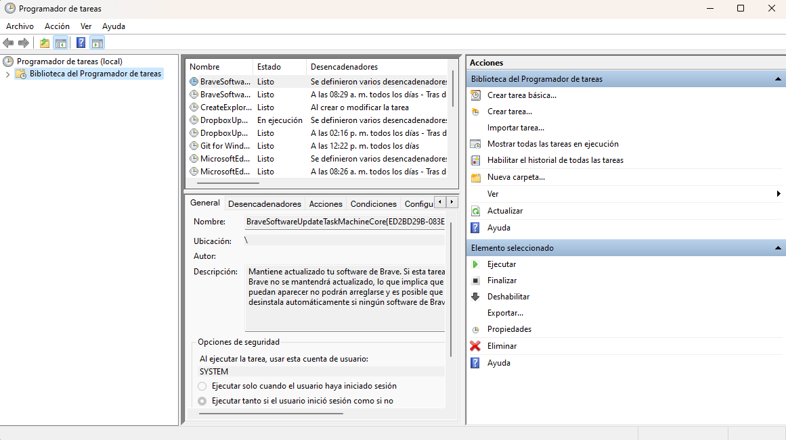
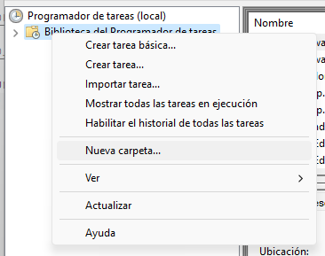
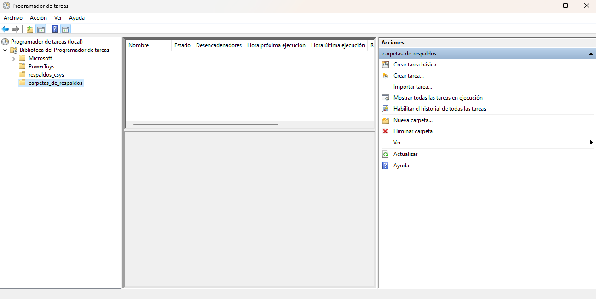
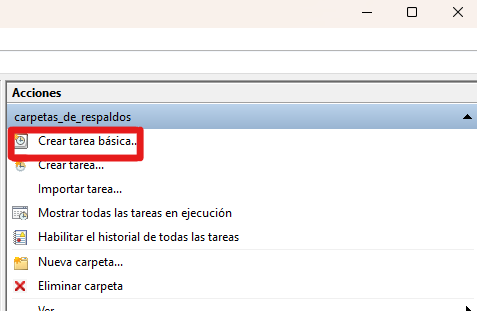
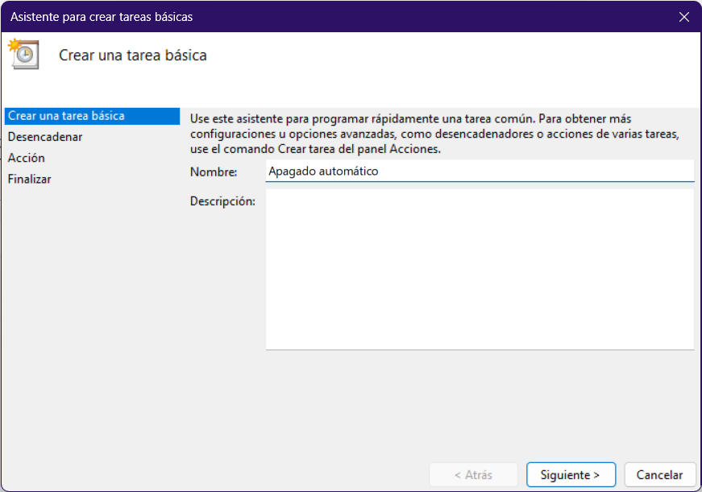
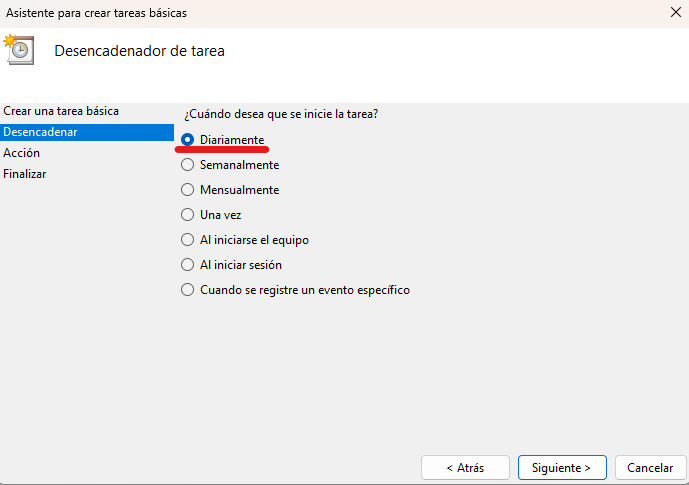
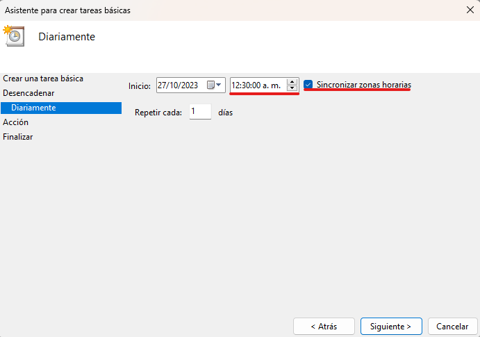
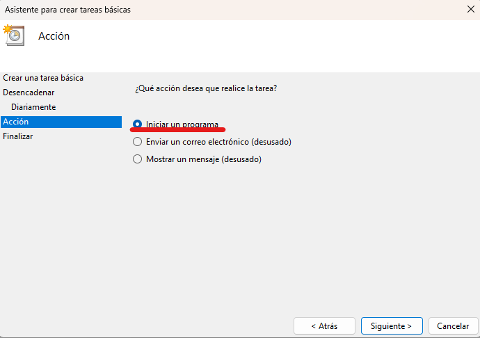
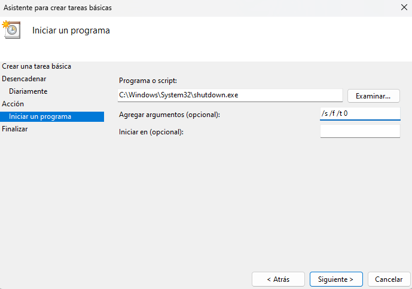

## Administración de respaldos

### Configuración de combinación de colecciones con imágenes

?> _NOTA_ Las siguientes configuraciones se aplican automáticamente al ejecutar la script de actualización, pero en caso de ser necesario, se explica como hacerlo manualmente.

Cuando se ejecuta la script de actualización, empieza a trabajar la imágen de docker `mgob` que es un servicio de respaldo atomático para mongodb, sin embargo esta solo respalda las colecciones de mongo pero no las imágenes. Para tener el respaldo completo con imágenes y colecciones, hay que hacer uso de una herramienta de linux llamada `cron`, para programar una tarea que combine el respaldo de las colecciones y las imágenes, escribiendo en un archivo llamado [`crontab`](https://www.man7.org/linux/man-pages/man5/crontab.5.html).

En el servidor de carrducisys (asumiendo que ya se estableció la conexión ssh), ejecutar el siguiente comando:

```sh
crontab -e
```

Esto va a abrir el archivo donde se indican qué tareas va a ejecutar cron y en qué momento. Ahí, pegar lo siguiente usando la combinación `Ctrl` + `Shift` + `V`:

```
10 0,10,12,15,18 * * * ~/utilidades_carrduci_sys/mongo/obtener-ultimo-respaldo-y-guardar-con-imagenes.sh
30 21 25 * * rm -r ~/respaldos_csys/*
```

Luego presionar `Ctrl` + `X` y en seguida `y`.

La primera línea indica que a las 0, 10, 12, 15 y 18 horas con 10 minutos, todos los días del mes, todos los meses, todos los días de la semana, se va a ejecutar la script `obtener-ultimo-respaldo-y-guardar-con-imagenes.sh`. Esta script genera la carpeta `~/respados_csys` en el servidor y guarda ahí cada respaldo combinado (de colecciones e imágenes) que se vaya generando. De aquí es de donde podremos copiar respaldos a nuestro entorno local, o subirlos a la nube (aún no implementado).

La segunda línea indica que a las 21 horas con 30 minutos, el día 25 de cada mes, se va a limpiar la carpeta de `~/respaldos_csys/` (todo su contenido), es decir, que los respaldos se purgan los 25 de cada mes. Esto es para evitar que se llene de respaldos el servidor.

### Sincronización con almacenamiento local

?> Si se desea sincronizar los archivos en un almacenamiento local, hay que hacerlo a travez de un cron, por lo tanto, se require el [subsistema de linux](./docs/carrduci-sys-desarrollo/1-instalacion-wsl.md)

!> _**ADVERTENCIA**_ Para que esto funcione, la computadora debe estar configurada para iniciar sesión automáticamente al encenderse, es decir, que no debe tener contraseña. Esto es inseguro, así que se debe tener cuidado con las personas que tengan acceso a la computadora en cuestión.

Es necesario generar una llave ssh para poder copiar los respaldos sin tener que ingresar la contraseña cada vez, luego se definirá el cron.

#### 1.1. Programar encendido automático

Ver [búsqueda de cómo programar auto-encendido](https://www.google.com.mx/search?q=BIOS+auto+encendido&sca_esv=577233357&source=hp&ei=nAg8ZaexKOrHkPIPtZO_sAg&iflsig=AO6bgOgAAAAAZTwWrDgB9y9a7h8c-l2c7rcZrgTAduIl&ved=0ahUKEwin76HT9JaCAxXqI0QIHbXJD4YQ4dUDCAo&uact=5&oq=BIOS+auto+encendido&gs_lp=Egdnd3Mtd2l6IhNCSU9TIGF1dG8gZW5jZW5kaWRvMgUQIRigATIFECEYoAFI3lZQ8wRYqTdwA3gAkAEAmAHTAaABzRiqAQYwLjIwLjG4AQPIAQD4AQGoAgrCAhAQABgDGI8BGOUCGOoCGIwDwgIQEC4YAxiPARjlAhjqAhiMA8ICBRAuGIAEwgIREC4YgAQYsQMYgwEYxwEY0QPCAgsQABiABBixAxiDAcICCBAAGIAEGLEDwgIIEC4YgAQYsQPCAgsQABiKBRixAxiDAcICCxAuGIoFGLEDGIMBwgIFEAAYgATCAgQQABgDwgIIEAAYigUYsQPCAg0QABiABBixAxiDARgKwgIHEAAYgAQYCsICBhAAGBYYHg&sclient=gws-wiz)

> Depende del modelo y marca de la placa base.
>
> Está fuertemente recomendado que la hora de encendido sea ANTES de las 12:30 a. m.

#### 1.2. Programar apagado automático

En Windows, abrir el programador de tareas presionando `Win` + `R` y pegar el siguiente nombre:

```
taskschd.msc
```





Crear una nueva carpeta dando clic en `Biblioteca del Programador de tareas` y poner el nombre que se desee:



Lo que debe resultar en algo parecido a esto



Presionar `Crear tarea básica...` en el panel lateral izquierdo



Luego agregar un nombre a la tarea:



Establecer entonces que se ejecute a diario:



Y marcar en la casilla de hora lo siguiente (también seleccionar sincronizar zonas horarias):



Asegurarse de que sea la misma hora y no tocar las otras casillas.

Seleccionar la acción que se desea realizar:



Después va a solicitar la línea de comando. Poner los siguientes valores en sus casillas correspondientes:

##### Programa o script

```
C:\Windows\System32\shutdown.exe
```

##### Agregar argumentos (opcional)

> No es que sea opcional, así se llama el campo

```
/s /f /t 0
```



#### 2. Generar llave ssh

Ver [¿cómo generar llaves ssh?](./docs/ubuntu-server/llave-ssh.md)

#### 2. Establecer el cron

Una vez que se tienen las llaves ssh generadas, en la computadora local en la que se van a estar copiando los respaldos, hay que agregar varios cron para que estén copiando los respaldos.

Ejecutar:

```
crontab -e
```

Una vez dentro del editor, revisar si no existen ya lineas parecidas a las siguientes. Si no existen, pegarlas usando `Ctrl` + `Shift` + `V`.

?> Reemplazar `<usuario>` por el usuario que está en el servidor e `<ip_servidor>` por la dirección ip del servidor. En `<llave_privada>` poner la ruta de la llave ssh que se generó en el paso anterior, incluyendo al final de la ruta el archivo **(que no termina en `.pub`)**. Reemplazar `<disco_1>` y `<disco_2>` con las rutas del subsistema de los discos que se vayan a usar, o si se tiene solo un disco, omitir la segunda línea de cada bloque.

```
# BLOQUE DE LA MADRUGADA -----------------------------------------

# Primera sincronizacion desde el servidor
# Esta requiere el encendido automatico
30 0 * * * /home/sistemas/carrduci-dev/carrduci_sys_workspace/utilidades_carrduci_sys/copia-automatica-respaldos/ubuntu-22.04/sincronizar_archivos.sh <usuario>@<ip_servidor>:~/respaldos_csys/* <disco_1>/respaldos_csys <disco_1>/logs_respaldos <llave_privada>

# Primera copia del disco 1 al disco 2
0 1 * * * /home/sistemas/carrduci-dev/carrduci_sys_workspace/utilidades_carrduci_sys/copia-automatica-respaldos/ubuntu-22.04/sincronizar_archivos_local.sh <disco_1>/respaldos_csys/ <disco_2>/respaldos_csys <disco_2>/logs_respaldos


# BLOQUE DE LA TARDE ---------------------------------------------

# Segunda sincronizacion desde el servidor
0 12 * * * /home/sistemas/carrduci-dev/carrduci_sys_workspace/utilidades_carrduci_sys/copia-automatica-respaldos/ubuntu-22.04/sincronizar_archivos.sh <usuario>@<ip_servidor>:~/respaldos_csys/* <disco_1>/respaldos_csys <disco_1>/logs_respaldos <llave_privada>

# Segunda copia del disco 1 al disco 2
0 13 * * * /home/sistemas/carrduci-dev/carrduci_sys_workspace/utilidades_carrduci_sys/copia-automatica-respaldos/ubuntu-22.04/sincronizar_archivos_local.sh <disco_1>/respaldos_csys/ <disco_2>/respaldos_csys <disco_2>/logs_respaldos
```

Finalizar presionando `Ctrl` + `X` y en seguida `Y`.

La primera línea, sincroniza todos los respaldos de la carpeta `~/respaldos_csys` del servidor, con la carpeta `.../respaldos_csys` del disco 1.

?> En subsistema, para hacer referencia a los discos de la computadora, se tiene que usar la ruta `/mnt/<letra_disco_minuscula>/`, donde `<letra_disco_minuscula>` es la letra que windows le asigna al disco, pero en minúscula y sin los dos puntos `:` al final.

La segunda línea solo sincroniza la misma carpeta del disco 1, al disco 2 (en caso de que se tenga más de un disco). Si se desea, se puede copiar a un tercer, cuarto, o n disco replicando la segunda línea tanto en el bloque de la madrugada como en el de la tarde.

### Sincronización a la nube

> # PENDIENTE
