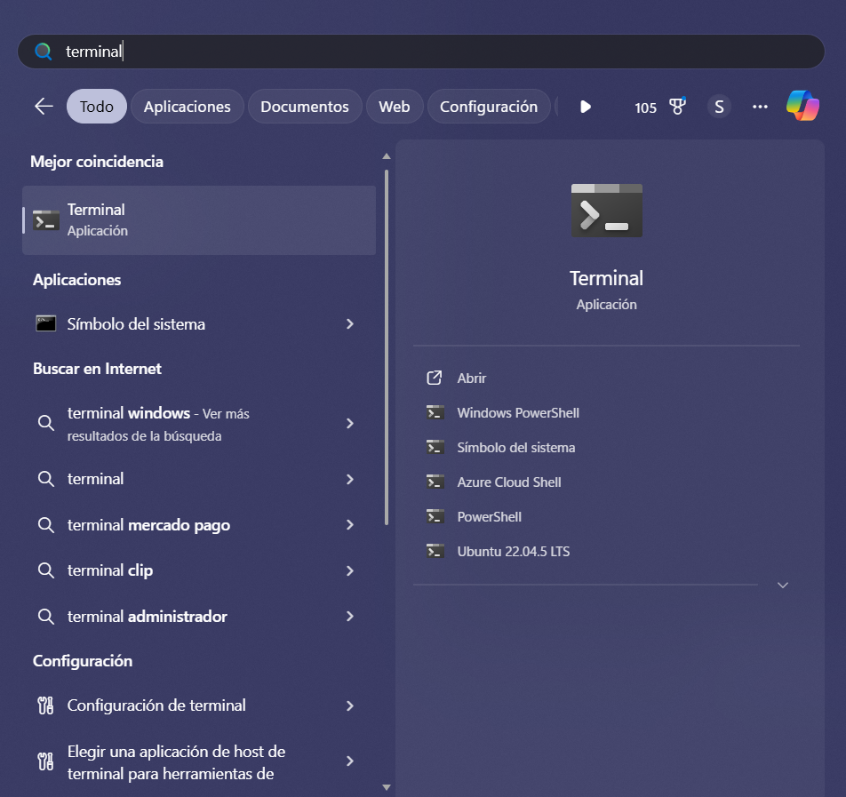
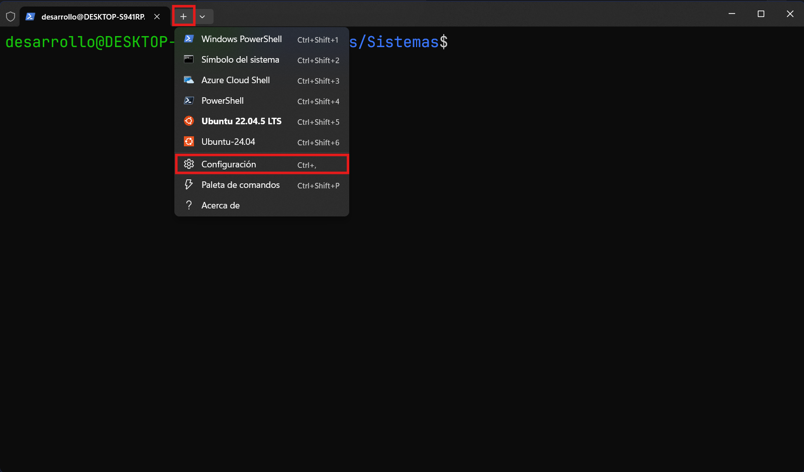
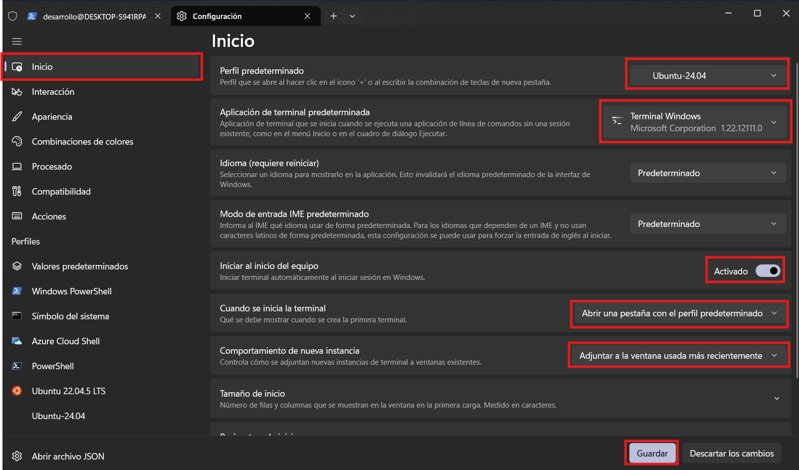
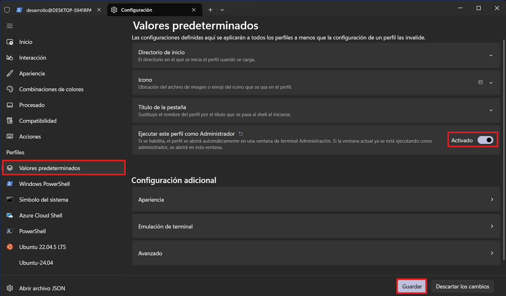
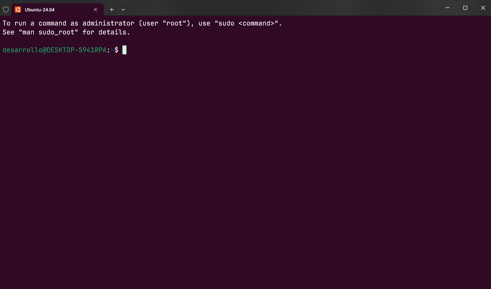

# Instalación del SubSistema de Linux en Windows

Para instalar el subsistema en Windows, hay que abrir la terminal
de windows.



Ahí, hay que ejecutar el comando.

```
wsl --update
```

Después, hay que instalar una distribución de `Ubuntu`. Ejecutar el siguiente comando

```
wsl --install Ubuntu-24.04
```

Después de un rato, solicitará crear un nuevo usuario y contraseña. En el usuario poner `desarrollo` y en la contraseña `P@$$w0rD.`.


Ahora hay que configurar la distribución como principal y la terminal como administrador.



Asegurarse que las opciones de inicio estén como se muestran en la siguiente imágen y dar click en "Guardar".



Activar la opción "Ejecutar este perfil como Administrador" en el apartado "Valores predeterminados" y dar click en "Guardar".



Cerrar la terminal e intentar abrirla de nuevo desde el menú de inicio de Windows.

Debería solicitar permiso de administrador, y al abrirse, debería mostrar una pestaña diréctamente en el subsistema.

