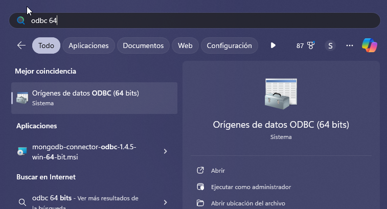
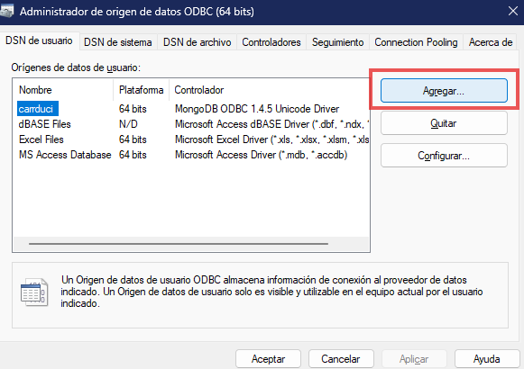
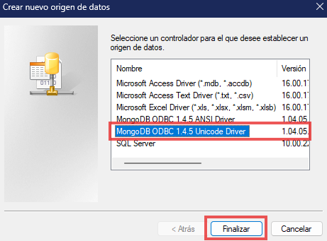
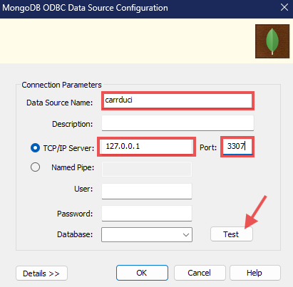
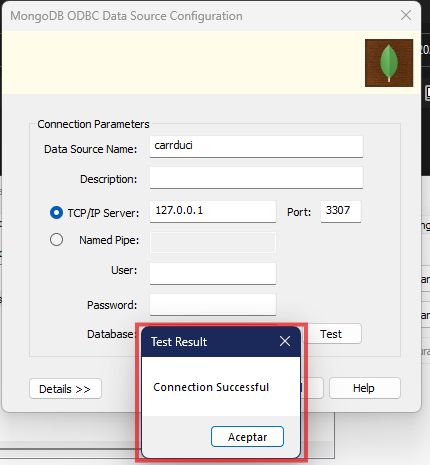
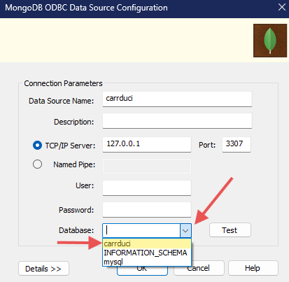
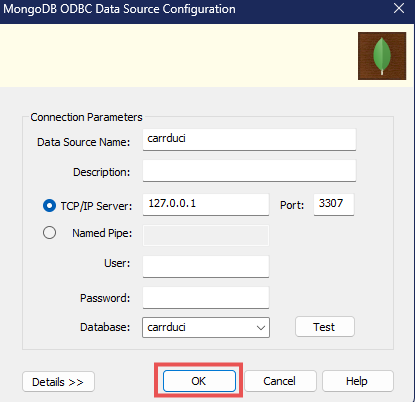
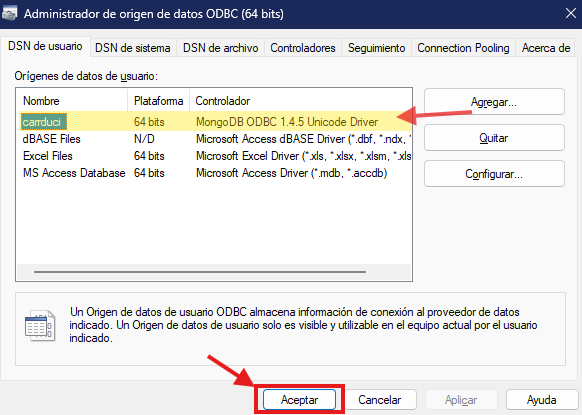

### [< Directorio](../directorio.md)
# Conectar un ODBC al conector BI de Mongo, en un servidor remoto de Linux


## 1. Instalar el controlador ODBC de mongo en Windows

Mongo cuenta con un controlador ODBC oficial. Para instalarlo, se debe descargar un archivo, pegando la siguiente url en la barra de direcciones del navegador:
```
https://info-mongodb-com.s3.amazonaws.com/mongodb-bi/v2/mongodb-bi-win32-x86_64-v2.14.14.zip
```
Extraer el zip y solo instalar los siguientes dos archivos:
- `vc_redist.x64.exe`
- `mongodb-connector-odbc-1.4.5-win-64-bit.msi`

## 2. Instalar OpenSSH
Para generar un ODBC que va a permitir leer la información de una base de datos de Mongo en Excel, el primer paso es instalar una librería que se llama Open SSH. Esta librería permite usar el protocolo SSH desde Windows, lo que se necesita para redirigir el puerto remoto del servidor de Linux en el que se encuentra el conector BI (ver [instalación de conector en servidor linux](1-instalar-conector-bi-mongo-en-linux.md)).

Para instalar esta librería, hay que abrir PowerShell como administrador y ejecutar el siguiente comando:
```
Get-WindowsCapability -name openssh.client* -online | Add-WindowsCapability –Online
```
## 3. Redirigir el puerto del conector BI desde Linux a uno local

En la misma terminal de PowerShell, ejecutar el siguiente comando que es para redirigir el puerto 3307 desde el servidor donde está la base de datos, hacia el mismo puerto en la computadora donde se desea obtener la información.

```
ssh -f <usuario>@<host> -L <puerto_local>:localhost:<puerto_rempoto> <comando>
```
En este caso, un ejemplo práctico con la ip y puerto del servidor configurados al momento de hacer esta documentación, se ve así:
```
ssh -f carrduci@192.168.1.149 -L 3307:localhost:3307 ls
```
En la parte de "\<comando\>" se necesita enviar algo para que la instrucción completa se pueda ejecutar en segundo plano. Como no se quiere mandar ningún comando, se puede enviar cualquier cosa que no afecte el servidor de donde traemos el puerto, por ejemplo, el comando `ls` que solo lee archivos; es por eso que al final del comando dice eso.
## 4. Creación del ODBC

1. Primero, abrir el editor de orígenes de datos ODBC de 64 bits, para agregar un nuevo origen de datos.

2. Se abrirá el siguiente menú. Entonces hay que dar clic en agregar:

3. Seleccionar el controlador de Mongo.

4. Agregar los siguientes datos al nuevo ODBC. Luego dar clic en **Test**.

5. Debe aparecer el siguiente recuadro:

6. Seleccinar **carrduci** en el campo **Database**:

7. Y dar clic en **Ok**.

8. Luego en el recuadro de administrador de orígenes, debe aparecer el nuevo **ODBC**, llamado **carrduci**. Dar clic en aceptar.
