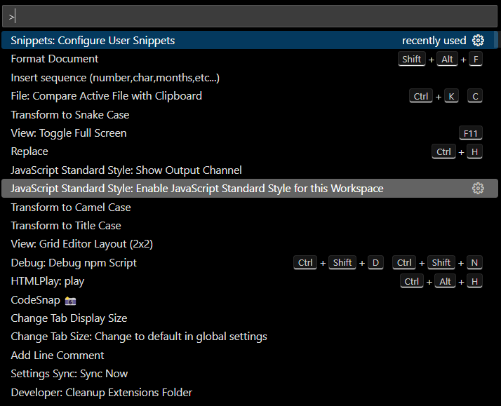
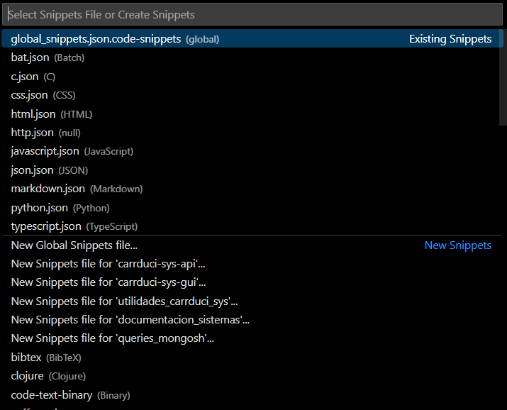
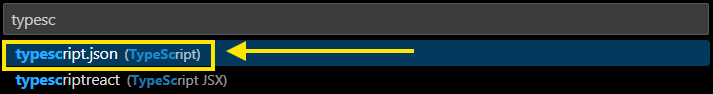
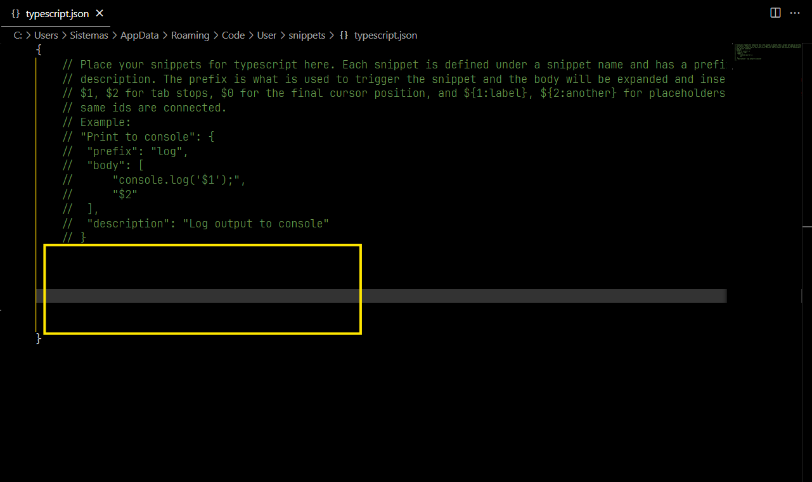
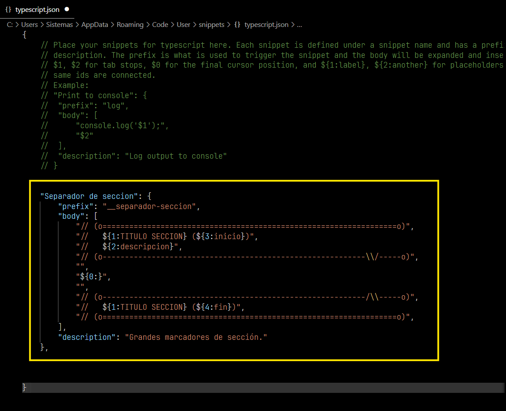
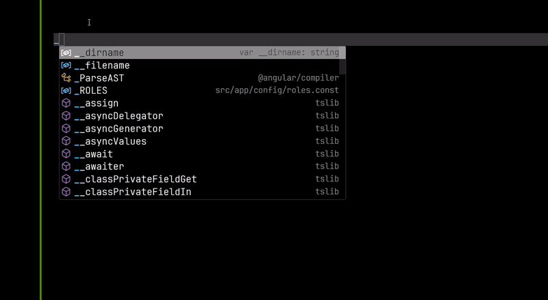

[< Regresar a 3-estructuras-de-documentacion](../carrduci-sys-desarrollo/3-estructuras-de-documentacion.md)
# Snippets en Visual Studio Code
Los snippets son una herramienta muy útil que permite autocompletar la frase que se desee con una estructura de texto determinada. Por ejemplo, al escribir "funcion", y tener una snippet con ese prefijo, Visual Studio mostrará un menú contextual en el que aparecerá la opción de autocompletar con la snippet que se haya creado para ese mismo prefijo, al darle enter podría insertar la estructura básica de una función de cualquier lenguaje y ahorrar algo de tiempo de escritura.
## ¿Cómo agregarlos?
Primero hay que saber donde encontrarlos, para ello hay que abrir la barra de comandos en Visual Studio Code, presionando `Ctrl` + `Shift` + `P`, que va a mostrar algo como esto en la parte superior de la ventana:



Ahí hay que escribir **`snippets`** para que se desplieguen las opciones disponibles, y dar clic en la que dice **Snippets: Configure User Snippets**:


Entonces se van a a mostrar una serie de posibles archivos de extensión `.json` a modificar. Estos están asignados a cada lenguaje disponible, y uno es para uso global:



Luego simplemente hay que escribir el nombre del lenguaje que al que se desea agregar una snippet (si se desea que esté disponible en todos los lenguajes, escoger la opción `global_snippets.json.code-snippets`). Por ejemplo, si se desea agregar una snippet para **Typescript**, escribir ese nombre y seleccionar la opción que dice el mismo nombre con la extensión `.json`:



Entonces se abrirá el siguiente archivo. Dentro de él es donde se agregan las snippets en formato `JSON`.



Es en el espacio en blanco, marcado con el recuadro amarillo, donde se deben agregar los snippets, **DENTRO** de las llaves, usando el esquema \<llave> : \<valor>.

Por ejemplo, para agregar una snippet que se llame **Separador de seccion**, que se sugiera al escribir `__separador-seccion` en el editor de código (recordando que en este caso es solo para los archivos de typescript o `.ts`), y resulte en la siguiente estructura:

```
// (o==================================================================o)
//   <TITULO SECCION> (<inicio>)
//   <descripcion>
// (o-----------------------------------------------------------\\/-----o)

<CONTENIDO>

// (o-----------------------------------------------------------/\\-----o)
//   <TITULO SECCION> (<fin>)
// (o==================================================================o)
```

Primero se necesita poner el nombre como una llave, y de contenido debe haber otras tres llaves:
- **prefix**: Es para indicar que frase va a disparar la sugerencia de autocompletado.
- **body**: Es el contenido o estructura de texto que se va a insertar.
- **description**: Es una oración breve para describir la snippet. Se muestra en el menú contextual que se dispara al escribir la frase del campo **prefix**.

La **llave** - **valor** se vería así:
```
"Separador de seccion": {

	// Frase que va a disparar el autocompletado
    "prefix": "__separador-seccion",

	// Contenido a insertar
    "body": [
        "// (o==================================================================o)",
        "//   ${1:TITULO SECCION} (${3:inicio})",
        "//   ${2:descripcion}",
        "// (o-----------------------------------------------------------\\/-----o)",
        "",
        "${0:}",
        "",
        "// (o-----------------------------------------------------------/\\-----o)",
        "//   ${1:TITULO SECCION} (${4:fin})",
        "// (o==================================================================o)",
    ],
    
	// Descripción
    "description": "Grandes marcadores de sección."
},
```
Como se puede notar, hay algunos nombres que tiene la siguiente sintaxis 
```
${<orden>:<nombre_temporal_opcional>}
```
Estos son indicadores posicionales por los que puede pasar el cursos a la hora de ir apretando tabulador. Opcionalmente muestran lo que se ponga después de los dos puntos, pero puede ser reemplazado al pasar el cursos por ahí.

El `${1:}` es el comienzo de las posiciones, y el `${0:}` indica el final del ciclo de tabulación, y donde va a terminar el proceso. Cuando se llega ahí, ya no se queda a la espera de tabulaciones. Mientras no se llegue al 0, se puede usar `Shift` + `Tab` para regresar una posición.

Así se vería el ejemplo anterior en el json:



Y así se ve al ser llamada en un archivo de typescript:


## Sintaxis para contenido de snippets

Hay una especificación completa de lo que se puede hacer con las snippets. Para profundizar más en el tema, ver la [documentación oficial de Microsoft](https://code.visualstudio.com/docs/editor/userdefinedsnippets) al respecto.


