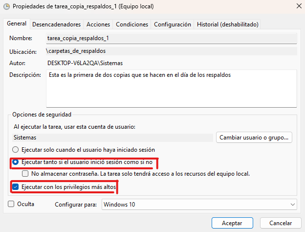

### [< Directorio](../directorio.md)

# Establecer copia automática de respaldo en Windows

Para que los respaldos se puedan copiar automáticamente desde cualquier ubicación,
se recomieda generar una tarea automatizada que haga uso de scripts que se
mencionarán más adelante.

También es importante recalcar que, para llevar a cabo el procedimiento, se debe
configurar el BIOS para que encienda la computadora donde se planea guardar el
respaldo (en caso de que sea una computadora y no un servidor y que esta se apague 
regularmente).

## Requisitos (clickeable)

<details>
  <summary>
    <span style="
      display:inline-block;
    "> 
      1. Programar auto-encendido en BIOS (opcional)
    </span>
  </summary>

  Ver [búsqueda de cómo programar auto-encendido](https://www.google.com.mx/search?q=BIOS+auto+encendido&sca_esv=577233357&source=hp&ei=nAg8ZaexKOrHkPIPtZO_sAg&iflsig=AO6bgOgAAAAAZTwWrDgB9y9a7h8c-l2c7rcZrgTAduIl&ved=0ahUKEwin76HT9JaCAxXqI0QIHbXJD4YQ4dUDCAo&uact=5&oq=BIOS+auto+encendido&gs_lp=Egdnd3Mtd2l6IhNCSU9TIGF1dG8gZW5jZW5kaWRvMgUQIRigATIFECEYoAFI3lZQ8wRYqTdwA3gAkAEAmAHTAaABzRiqAQYwLjIwLjG4AQPIAQD4AQGoAgrCAhAQABgDGI8BGOUCGOoCGIwDwgIQEC4YAxiPARjlAhjqAhiMA8ICBRAuGIAEwgIREC4YgAQYsQMYgwEYxwEY0QPCAgsQABiABBixAxiDAcICCBAAGIAEGLEDwgIIEC4YgAQYsQPCAgsQABiKBRixAxiDAcICCxAuGIoFGLEDGIMBwgIFEAAYgATCAgQQABgDwgIIEAAYigUYsQPCAg0QABiABBixAxiDARgKwgIHEAAYgAQYCsICBhAAGBYYHg&sclient=gws-wiz)
  > Depende del modelo y marca de la placa base.
  >
  > Está fuertemente recomendado que la hora de encendido sea ANTES de las 12:30 a. m.
</details>
<details>
  <summary>
    <span style="
      display:inline-block;
    "> 
      2. El repositorio bwripts
    </span>
  </summary>

  Ver [bwripts](https://github.com/Carrduci/bwripts)
  > Al ser un repositorio privado, se requiere una cuenta de github, que esta esté en la organización 
  > [Carrduci](https://github.com/orgs/Carrduci) y tener un token de github generado (github no permite iniciar 
  > sesión en la terminal con contraseña). En caso de no tener acceso, solicitarselo al administrador de la organización.
</details>

## Procedimiento

Se da por hecho que ya se configuró el auto-arranque en el BIOS. También que ya 
se tiene un usuario de Github con sesión iniciada y que está incluido en la
organización.

### 1. Obtener el repositorio

Clonar el repositorio en el lugar que se desee con el siguiente comando:

```
git clone https://github.com/Carrduci/bwripts
```

### 2. Establecer las tareas automáticas en Windows

Abrir el programador de tareas presionando `Win` + `R` y pegar el siguiente nombre:

```
taskschd.msc
```


Crear una nueva carpeta para crear una serie de tareas dando click en `Biblioteca del Programador de tareas` y poner el nombre que se desee:


Lo que debe resultar en algo pareceido a esto


Presionar `Crear tarea básica...` en el panel lateral izquierdo


Luego agregar un nombre a la tarea:


Establecer entonces que se ejecute a diario:


Y marcar en la casilla de hora lo siguiente (también seleccionar sincronizar zonas horarias):


Asegurarse de que sea la misma hora y no tocar las otras casillas.

Seleccionar la acción que se desea realizar:


Despues va a solicitar la linea de comando. Poner los siguientes valores en sus casillas correspondientes:

#### Programa o script
```
C:\Windows\System32\WindowsPowerShell\v1.0\powershell.exe
```
#### Agregar argumentos (opcional) 
> No es que sea opcional, así se llama el campo
```
-NoLogo -NonInteractive -File "<ruta_del_repositorio>\bwripts\pwsh\respaldos_carrduci_sys_copia_windows\copiar_respaldo_csys.ps1"
```
Asegurarse de reemplazar `<ruta_del_repositorio>` con la ruta donde se clonó bwripts.


Seleccionar la siguiente casilla en el panel que sale en `Finalizar`:


También marcar las siguientes casillas en el panel que se abre para que la script se pueda ejecutar 
aunque no esté iniciada la sesión



Y finalmente asegurarse que en la parte inferior (Configurar para:) diga `Windows 10`.

El resultado se debe ver como el siguiente:


### IMPORTANTE

Se debe repetir el procedimiento anterior para crear una segunda tarea con la única diferencia
de que esté programada a las 12:30:00 p. m.

> La ejecución de la script de copia va a buscar dos discos para realizar la tarea, el `D:\RESPALDOS_CSYS\` y el `F:\RESPALDOS_CSYS\`